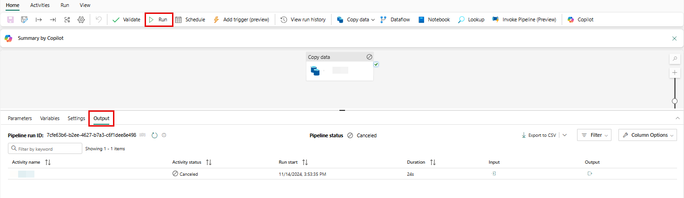
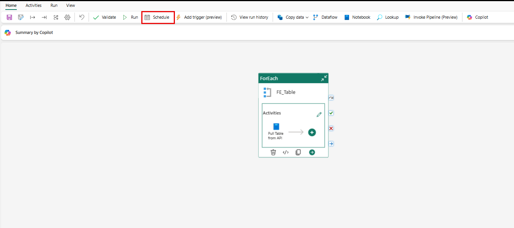
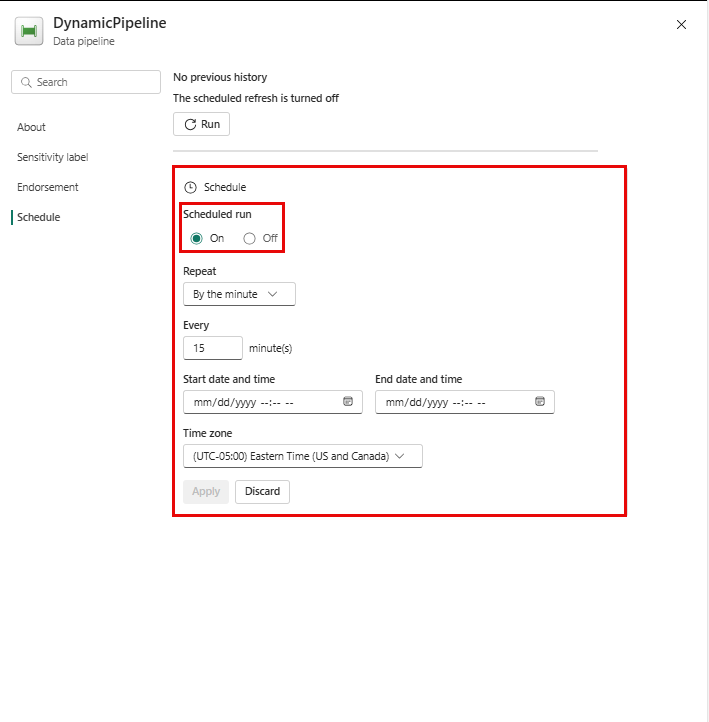
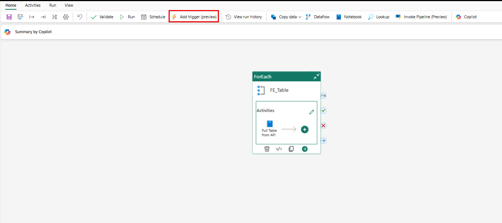

## Scheduling and event-based triggers

Within Fabric, you have several options that include both traditional and proactive in nature to schedule jobs. Most are even-driven and we see with items, such as pipeline runs which have on-demand and scheduled ***runs***. The more proactive ***runs*** are triggered by an event, such as a file arriving in a location and can allow your data and information to be processed based on your business needs and events rather than having to wait for the next schedule to run.

## Pipeline runs

A **data pipeline run** happens when you start a data pipeline. This action means all the tasks in the pipeline are carried out until they're finished. 

For example, if you have a task to **copy data**, running the pipeline performs that task and copy your data. Each time you run a pipeline, it gets a special identifier called a **pipeline run ID**.

You can start a data pipeline in two ways:

1. **On-demand**: You manually trigger it whenever you need it.
2. **Scheduled**: You set it to run automatically at specific times and frequencies that you choose.

### On-demand pipeline runs

Just as you would expect, on-demand, or ad-hoc runs happen by browsing to the specific pipeline and selecting the **Run** button. You're prompted to save your changes, but the pipeline receives a ***pipeline run ID*** and you can then view the status of the ***run*** by selecting the ***Output*** tab.

### Scheduling pipeline runs

When you schedule a data pipeline run, you can choose the frequency at which your pipeline operates.

1. **Select Schedule**: 
   - This option is found in the top banner of the **Home** tab to view your scheduling options.

    

1. **Default Setting**:
   - By default, your data pipeline has no schedule defined.
   - Select the **On** radio button under the **Scheduled Run** header

    

1. **Schedule Configuration**:
   - On the **Schedule configuration page**, you can specify:
     - **Schedule frequency**
     - **Start and end dates and times**
     - **Time zone**
2. **Apply Your Schedule**:
   - Once you configure your settings, select **Apply** to set your schedule.
3. **Editing Your Schedule**:
   - You can view or edit the schedule at any time by selecting the **Schedule** button again.

## Storage Event Triggers in Fabric Data Factory pipelines

Storage event triggers are a powerful feature in Data Factory pipelines that allow you to automate your data pipelines based on events occurring in your storage accounts.

## What Are Storage Event Triggers?

One of the most common scenarios for using event triggers is to activate a data pipeline when:

- **A file arrives**:  This event action means a new file is added to your storage.
- **A file is deleted**: This event occurrence indicates a file is removed from your storage.

For users moving from Azure Data Factory (ADF) to Microsoft Fabric, it's common to work with events from Azure Data Lake Storage (ADLS) or Blob storage. If you're new to Fabric and ADF, you might be more familiar with file events from **OneLake**.

## How Triggers Work in Fabric

In Fabric Data Factory, triggers utilize advanced platform features, including:

- **Event Streams**: These triggers allow you to listen for specific events in real-time.
- **Reflex Triggers**: These triggers are designed to respond quickly to events.

### Creating a Trigger

To create a trigger in the Fabric Data Factory:

1. Open the **pipeline design canvas**.
2. Look for the **Trigger** button, which allows you to create a Reflex trigger for your pipeline.
3. Alternatively, you can create triggers directly from the [**Data Activator**](/fabric/data-activator/data-activator-get-started) experience.
