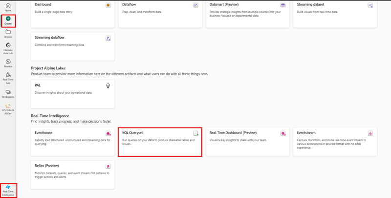
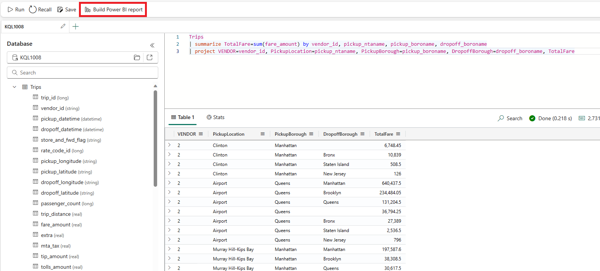
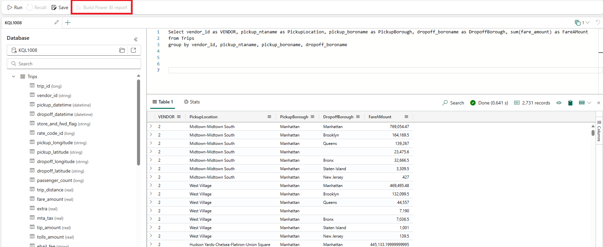
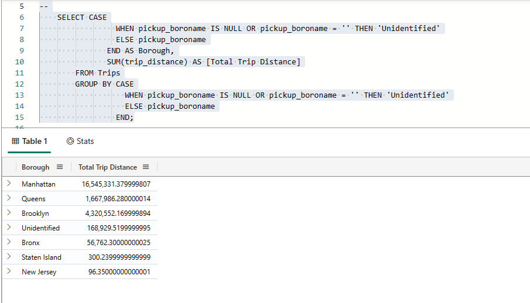
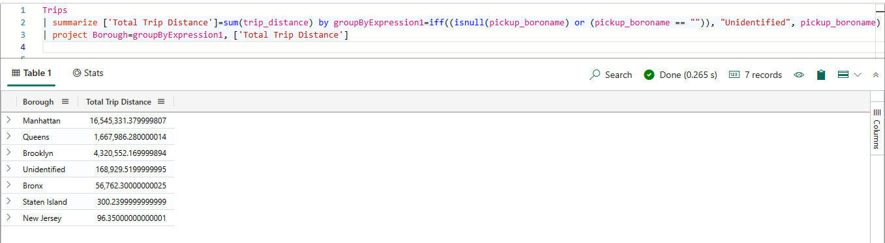
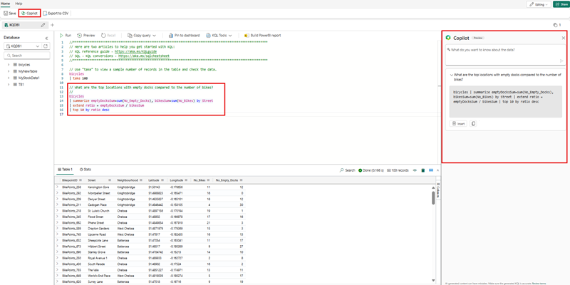
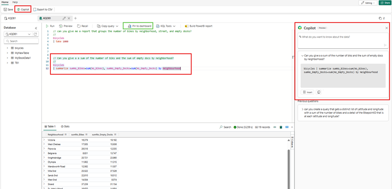
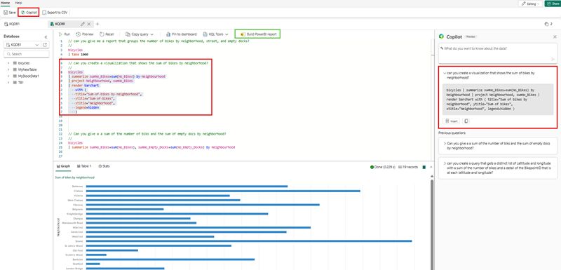

## Creating KQL Querysets in Microsoft Fabric

1. **Setup**: To start using KQL, you need to have an Azure account and set up Azure Data Explorer.
1. **Create KQL Queryset**: A KQL queryset is a tool that allows you to execute queries, modify, and display query results from a KQL database. It's used in Microsoft Fabric for Real-Time Intelligence.
1. **KQL Queryset limitations**: 
    1. Each tab in the KQL queryset can be associated with a different KQL database, and lets you save queries for later use or share them with others for data analysis
    1. The KQL Queryset uses the Kusto Query Language (KQL) for creating queries, and also supports many SQL functions 

    > [!NOTE]
    > The use of SQL or SQL Functions within a KQL Queryset removes the ability to build Power BI Reports with it

1. To create a KQL Queryset, you can go to any section within Microsoft Fabric and select the **Create button** and then scroll to **Create KQL Queryset** as shown in the example, which starts from the **Data Engineering** section.
[ ](../media/create-kql-queryset-large.png#lightbox)
    - **Basic Query**: A basic KQL query follows the pattern: `<table_name> | where <condition> | project <columns>`.
    - **Functions and Operators**: KQL supports various operators for arithmetic, comparison, logical operations, and string manipulations.
    - **Advanced Querying**: Once you have a good grasp of the basics, you can move on to more advanced querying techniques such as aggregations, joins, and subqueries.
    -  **Practical Exercises**: To get hands-on experience with KQL, you can try out some practical exercises provided by Microsoft Learn.

Here are some introductory queries to help you get started:

- To retrieve all records from a table: `TableName`
- To retrieve specific columns from a table: `TableName | project Column1, Column2`
- To filter records based on a condition: `TableName | where Column1 == "value"`
- To sort records in ascending order: `TableName | sort by Column1 asc`
- To sort records in descending order: `TableName | sort by Column1 desc`

You can use these queries to practice and get comfortable with the basics of KQL.

## Advantages of KQL and T-SQL

Within Microsoft Fabric KQL Database, you can use the primary language of Kusto Query Language (KQL) or Transact-Structured Query Language (T-SQL), and you can use the data to build Power BI Reports. 

[ ](../media/kql-queryset-pbi-build-expanded.png#lightbox)

However, there are advantages to each and in the case of a KQL database, KQL is the preferred language. More comparisons follow:

1. **Simplicity**: KQL is a simpler language than T-SQL, making it easier to learn and use.
2. **Performance**: KQL is optimized for performance and can handle large amounts of data more efficiently than T-SQL.
3. **Flexibility**: KQL is more flexible than T-SQL, allowing users to perform complex queries with ease.
4. **Integration**: KQL is integrated with other Microsoft products, such as Azure Monitor and Azure Sentinel.
                    However, T-SQL has its own advantages over KQL, including:

## Advantages of T-SQL over KQL

One major disadvantage of using T-SQL over KQL is that it's not the native language of the engine and has to go through a transformer. This language difference prevents it from being published to Power BI directly from the Queryset.

  [  ](../media/tsql-queryset-pbi-build-expanded.png#lightbox)

As mentioned, T-SQL can be run to a limit extent against a Microsoft Fabric KQL database and provides a few advantages:

1. **Compatibility**: T-SQL is a widely used language and is compatible with many different database systems.
2. **Functionality**: T-SQL has a wider range of functions and features than KQL.
3. **Procedural programming**: T-SQL supports procedural programming, which allows developers to write complex scripts and stored procedures.

    >[!NOTE] 
    >If you’re familiar with SQL and want to learn KQL, you can translate SQL queries into KQL using the `-- explain syntax`
    
    For example: 

    ```tsql
        
       --
        Explain
        SELECT CASE
                 WHEN pickup_boroname IS NULL OR pickup_boroname = '' THEN 'Unidentified'
                 ELSE pickup_boroname
               END AS Borough,
               SUM(trip_distance) AS [Total Trip Distance]
        FROM Trips
        GROUP BY CASE
                   WHEN pickup_boroname IS NULL OR pickup_boroname = '' THEN 'Unidentified'
                   ELSE pickup_boroname
                 END;
    ```
     generates the following KQL Syntax. This function is a powerful feature within the KQL Engine
p
    ```kusto
    
    Trips
    | summarize ['Total Trip Distance']=sum(trip_distance) by groupByExpression1=iff((isnull(pickup_boroname) or (pickup_boroname == "")), "Unidentified", pickup_boroname)
    | project Borough=groupByExpression1, ['Total Trip Distance']
    
    ```
     
[  ](../media/tsql-same-results-expanded.png#lightbox)
  

     Which produces the same outcome:

    
[  ](../media/kql-same-results-expanded.png#lightbox)
    
## Using Copilot to assist with queryset queries
One new feature within the Microsoft Real-Time Intelligence tooling is the ability to use [Copilot for Real-Time Intelligence](/fabric/get-started/copilot-real-time-analytics?branch=main). Copilot gives you the ability to write natural language prompts instead of writing or having to quickly learn KQL queries. 

When your administrator enables Copilot, you see the option in the top menubar of your querysets. When you ask a question about your data, Copilot generates the KQL Code to answer your question. You can create several queries within the queryset using this no-code approach to gather useful information for user consumption.

[ ](../media/copilot-large.png#lightbox)

Once you have queries within the queryset, you can then Pin them to an existing dashboard or create a new dashboard. To accomplish this, select the queries you want pinned, and then select the **Pin to dashboard**. This gives you a window to perform other actions by:
 - Selecting the Copilot button on the menubar.
 - Typing your question in the Copilot prompt and selecting the execute button.
 - Selecting the insert button below the results in Copilot.
 - Selecting the **Pin to dashboard** button in the menubar.

[  ](../media/copilot-pin-to-dashboard-large.png#lightbox)

> [!NOTE]
> You can see in the query that was typed above the resulting Copilot query that there were typographical errors and it recognized the source tables names which didn't directly align to your question as it was able to understand the utterances by the user.


You also have the ability to add a queryset query to a Power BI Report by highlighting your preferred query and then selecting the **Build PowerBI report**. This provides you with an empty Power BI report with the query from your selected queryset by:
 - Selecting the Copilot button on the menubar.
 - Typing your question in the Copilot prompt and selecting the execute button.
 - Selecting the insert button below the results in Copilot.
 - Selecting the **Build PowerBI report** button in the menubar.

[ ](../media/copilot-build-powerbi-report-large.png#lightbox)

> [!NOTE]
> You can only select one query at a time using the **Pin to Dashboard** or the **Build PowerBI report** but you can append dashboard elements to existing dashboards.

Here are some extra resources:

- Use example queries in [Real-Time Intelligence - Microsoft Fabric.](/fabric/real-time-analytics/query-table)
- [Query data in a KQL queryset](/fabric/real-time-analytics/kusto-query-set).