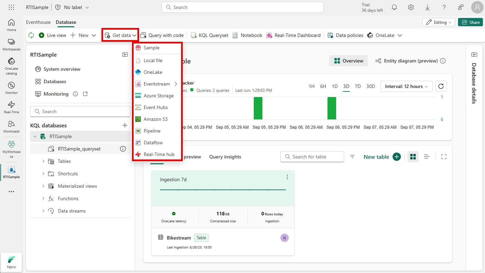

To create an eventhouse, you must be working on a workspace with a Fabric capacity that supports the Real-Time Intelligence Fabric capability. You can then create one or more eventhouses for your data.


An eventhouse contains one or more KQL databases, in which you can create tables, stored procedures, materialized views, and other items to manage your data. After creating an eventhouse, you can use the default KQL database or create a new one.

To get your data into a KQL database in an eventhouse, you typically import it from a static location (such as a local file, OneLake, Azure storage, or a sample dataset) or from a real-time source (such as Azure Event Hubs or a Fabric eventstream).



> [!NOTE]
> You can enable the **OneLake** option for a database or for individual tables it contains, making the data from these tables available in OneLake.

## Querying tables in a KQL database

To query data in the tables in a KQL database, you can write Kusto Query Language (KQL) code or use a restricted subset of Structured Query Language (SQL) statements.

To make it easier to develop queries, eventhouses include support for one or more *KQL Queryset*, which simplify query development by providing sample syntax and coding utilities. A default queryset is provided, and you can create more if needed.

KQL syntax is intuitive and concise, and includes a wide range of functions and expressions that make it easy to perform complex data analysis efficiently.

The simplest KQL query consists simply of a table name. For example, to retrieve all of the data from a table named **Automotive**, you could run the following query:

```kql
Automotive
```

This KQL query is the equivalent of the SQL expression `SELECT * FROM Automotive`.

Given the potentially huge size of tables based on unbounded streams of real-time data, using a simple table name query is unusual. If you want to retrieve a sample of data from the table, you can use the **take** keyword, as shown here:

```kql
Automotive
| take 100
```

This query returns 100 rows from the Automotive table (similarly to the SQL `SELECT TOP 100 * FROM Automotive`). Note the use of the **|** character on each new line to separate the clauses of the query.

Here are some common queries and their SQL equivalents

### Retrieve specific columns

```kql
  Automotive
  | project  trip_id, pickup_datetime, fare_amount
```

```sql
  SELECT  trip_id, pickup_datetime, fare_amount
  FROM Automotive
```

### Filter rows

```kql
Automotive
| where fare_amount > 20
| project  trip_id, pickup_datetime, fare_amount
```

```sql
SELECT  trip_id, pickup_datetime, fare_amount
FROM Automotive
WHERE fare_amount > 20
```

### Sort results

```kql
Automotive
| where fare_amount > 20
| project trip_id, pickup_datetime, fare_amount
| sort by pickup_datetime desc
```

```sql
SELECT  trip_id, pickup_datetime, fare_amount
FROM Automotive
WHERE fare_amount > 20
ORDER BY pickup_datetime DESC
```

### Group and aggregate

```kql
Automotive
| summarize trip_count = count() by vendor_id
| project vendor_id, trip_count
```

```sql
SELECT vendor_id, COUNT(*) AS trip_count
FROM Automotive
GROUP BY vendor_id
```

> [!NOTE]
> In all of the examples above, you can use either the KQL query or the equivalent SQL query to retrieve data from a table in a KQL database. There are advantages to each language and in the case of a KQL database, KQL is the preferred language for the following reasons:
>
> - **Simplicity**: KQL is a simpler language than SQL, making it easier to learn and use.
> - **Performance**: KQL is optimized for performance and can handle large amounts of data more efficiently than SQL.
> - **Flexibility**: KQL is more flexible than SQL, allowing users to perform complex queries with ease.
> - **Integration**: KQL is integrated with other Microsoft products, such as Azure Monitor and Azure Sentinel.
>
> One major disadvantage of using SQL over KQL is that it's not the native language of the engine and has to go through a transformer. This language difference prevents it from being published to Power BI directly from the Queryset. 
>
> However, in some cases, SQL may be a good choice for the following reasons:
>
> - **Compatibility**: SQL is a widely used language and is compatible with many different database systems.
> - **Functionality**: SQL has a wider range of functions and features than KQL.
> - **Procedural programming**: SQL supports procedural programming, which allows developers to write complex scripts and stored procedures.

## Visualizing query results in a queryset

While ultimately you may want to create real-time dashboards or Power BI reports based on your queries, it can be useful while exploring the data in a queryset to create quick data visualizations. In common with many common *notebook* development environments, KQL querysets include the capability to render the results of a query as a chart.


## Using Copilot to assist with queries

For AI-based assistance with KQL querying, you can use [Copilot for Real-Time Intelligence](/fabric/get-started/copilot-real-time-intelligence).

When your administrator has enabled Copilot, you see the option in queryset menu bar. Copilot opens as a pane to the side of the main query interface. When you ask a question about your data, Copilot generates the KQL code to answer your question.


