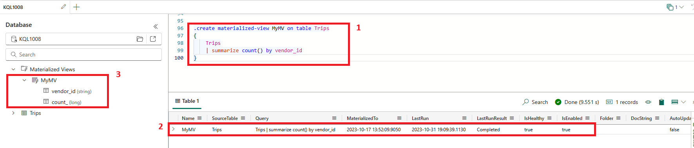
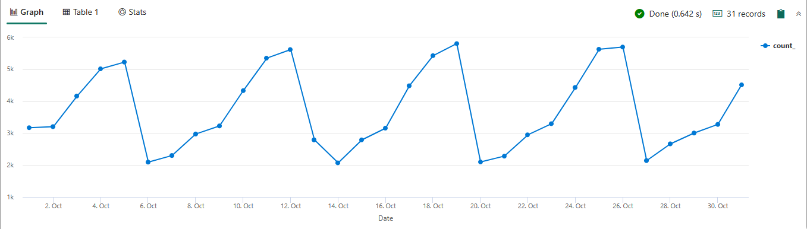
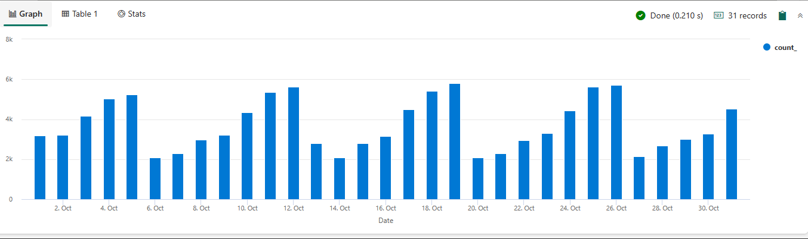

The following examples are some advanced features of KQL queries in Microsoft Fabric:

**Materialized view**: A materialized view is a summary of data from a source table or another materialized view.

There are two types of materialized views:

1. ***Empty materialized view*** which uses the `.set-or-append` command to add records ingested after view creation. It's immediately available for query.
1. ***Materialized View based on existing records in the source table***: The creation might take a long while to complete, depending on the number of records in the source table and the rules applied to its creation query.

```kusto

.create materialized-view MyMV on table Trips
{
    Trips
    | summarize count() by vendor_id
}

```

[ ](../media/materialized-view-expanded.png#lightbox)

- **Custom Functions**: You can create your own custom functions in KQL to perform specific data analysis tasks.
- **Data Visualization**: KQL supports various data visualization techniques such as `render timechart`, `render columnchart`, and a more **advanced function** visualization that is beyond the scope of this module named`render anomalychart` and allow for anomaly detection and forecast prediction using the `series_decompose_anomalies()` and the `series_decompose_forecast()` functions respectively.

An example of a `render timechart` between two dates can be shown by defining x and y values.

```kusto

Trips
| where pickup_datetime >= datetime("2014-10-01") and pickup_datetime < datetime("2014-11-01")
| summarize count() by bin(pickup_datetime, 1d)
| render timechart with (ytitle="Number of Trips", xtitle="Date")

```

[ ](../media/render-timechart-expanded.png#lightbox)

An example of a `render columnchart` between two dates and total trips can be shown by defining x and y values.

```kusto

Trips
| where pickup_datetime >= datetime("2014-10-01") and pickup_datetime < datetime("2014-11-01")
| summarize count() by bin(pickup_datetime, 1d)
| render columnchart with (ytitle="Number of Trips", xtitle="Date")

```

[ ](../media/render-columnchart-expanded.png#lightbox)

- **Data Ingestion**: KQL allows you to ingest data from various sources such as Azure Event Hubs, Azure IoT Hub, and Azure Storage.
- **Data Export**: You can export query results from KQL to various destinations such as Azure Blob Storage, Azure Data Lake Storage, and Azure Event Hubs.

Here are some other resources:

- [Microsoft Fabric terminology - Microsoft Fabric.](/fabric/get-started/fabric-terminology)
- [Query data in a KQL queryset - Microsoft Fabric.](/fabric/real-time-analytics/kusto-query-set)