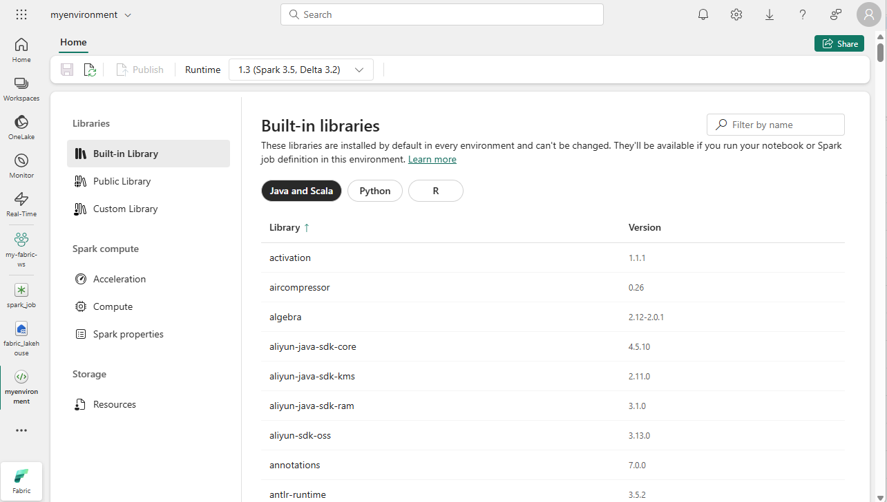

Apache Spark is a distributed data processing framework that enables large-scale data analytics by coordinating work across multiple processing nodes in a cluster, known in Microsoft Fabric as a *Spark pool*. Put more simply, Spark uses a "divide and conquer" approach to processing large volumes of data quickly by distributing the work across multiple computers. The process of distributing tasks and collating results is handled for you by Spark.

Spark can run code written in a wide range of languages, including Java, Scala (a Java-based scripting language), Spark R, Spark SQL, and PySpark (a Spark-specific variant of Python). In practice, most data engineering and analytics workloads are accomplished using a combination of PySpark and Spark SQL.

## Spark pools

A Spark pool consists of compute *nodes* that distribute data processing tasks. The general architecture is shown in the following diagram.


As shown in the diagram, a Spark pool contains two kinds of node:

1. A *head* node in a Spark pool coordinates distributed processes through a *driver* program.
2. The pool includes multiple *worker* nodes on which *executor* processes perform the actual data processing tasks.

The Spark pool uses this distributed compute architecture to access and process data in a compatible data store - such as a data lakehouse based in OneLake.

### Spark pools in Microsoft Fabric

Microsoft Fabric provides a *starter pool* in each workspace, enabling Spark jobs to be started and run quickly with minimal setup and configuration. You can configure the starter pool to optimize the nodes it contains in accordance with your specific workload needs or cost constraints.

Additionally, you can create custom Spark pools with specific node configurations that support your particular data processing needs.

> [!NOTE]
> The ability to customize Spark pool settings can be disabled by Fabric administrators at the Fabric Capacity level. For more information, see **[Capacity administration settings for Data Engineering and Data Science](/fabric/data-engineering/capacity-settings-overview)** in the Fabric documentation.

You can manage settings for the starter pool and create new Spark pools in the **Data Engineering/Science** section of the workspace settings.


Specific configuration settings for Spark pools include:

- **Node Family**: The type of virtual machines used for the Spark cluster nodes. In most cases, *memory optimized* nodes provide optimal performance.
- **Autoscale**: Whether or not to automatically provision nodes as needed, and if so, the initial and maximum number of nodes to be allocated to the pool.
- **Dynamic allocation**: Whether or not to dynamically allocate *executor* processes on the worker nodes based on data volumes.

If you create one or more custom Spark pools in a workspace, you can set one of them (or the starter pool) as the default pool to be used if a specific pool is not specified for a given Spark job.

> [!TIP]
> For more information about managing Spark pools in Microsoft Fabric, see **[Configuring starter pools in Microsoft Fabric](/fabric/data-engineering/configure-starter-pools)** and **[How to create custom Spark pools in Microsoft Fabric](/fabric/data-engineering/create-custom-spark-pools)** in the Microsoft Fabric documentation.

## Runtimes and environments

The Spark open source ecosystem includes multiple versions of the Spark *runtime*, which determines the version of Apache Spark, Delta Lake, Python, and other core software components that are installed. Additionally, within a runtime you can install and use a wide selection of code libraries for common (and sometimes very specialized) tasks. Since a great deal of Spark processing is performed using PySpark, the huge range of Python libraries ensures that whatever the task you need to perform, there's probably a library to help.

In some cases, organizations may need to define multiple *environments* to support a diverse range of data processing tasks. Each environment defines a specific runtime version as well as the libraries that must be installed to perform specific operations. Data engineers and scientists can then select which environment they want to use with a Spark pool for a particular task.

### Spark runtimes in Microsoft Fabric

Microsoft Fabric supports multiple Spark runtimes, and will continue to add support for new runtimes as they are released. You can use the workspace settings interface to specify the Spark runtime that is used by default environment when a Spark pool is started.

> [!TIP]
> For more information about Spark runtimes in Microsoft Fabric, see **[Apache Spark Runtimes in Fabric](/fabric/data-engineering/runtime)** in the Microsoft Fabric documentation.

### Environments in Microsoft Fabric

You can create custom environments in a Fabric workspace, enabling you to use specific Spark runtimes, libraries, and configuration settings for different data processing operations.



When creating an environment, you can:

- Specify the Spark runtime it should use.
- View the built-in libraries that are installed in every environment.
- Install specific public libraries from the Python Package Index (PyPI).
- Install custom libraries by uploading a package file.
- Specify the Spark pool that the environment should use.
- Specify Spark configuration properties to override default behavior.
- Upload resource files that need to be available in the environment.

After creating at least one custom environment, you can specify it as the default environment in the workspace settings.

> [!TIP]
> For more information about using custom environments in Microsoft Fabric, see **[Create, configure, and use an environment in Microsoft Fabric](/fabric/data-engineering/create-and-use-environment)** in the Microsoft Fabric documentation.

## Additional Spark configuration options

Managing Spark pools and environments are the primary ways in which you can manage Spark processing in a Fabric workspace. However, there are some additional options that you can use to make further optimizations.

### Native execution engine

The *native execution engine* in Microsoft Fabric is a vectorized processing engine that runs Spark operations directly on lakehouse infrastructure. Using the native execution engine can significantly improve the performance of queries when working with large data sets in Parquet or Delta file formats.

To use the native execution engine, you can enable it at the environment level or within an individual notebook. To enable the native execution engine at the environment level, set the following Spark properties in the environment configuration:

- **spark.native.enabled**: true
- **spark.shuffle.manager**: org.apache.spark.shuffle.sort.ColumnarShuffleManager

To enable the native execution engine for a specific script or notebook, you can set these configuration properties at the beginning of your code, like this:

```json
%%configure 
{ 
   "conf": {
       "spark.native.enabled": "true", 
       "spark.shuffle.manager": "org.apache.spark.shuffle.sort.ColumnarShuffleManager" 
   } 
}
```

> [!TIP]
> For more information about the native execution engine, see **[Native execution engine for Fabric Spark](/fabric/data-engineering/native-execution-engine-overview)** in the Microsoft Fabric documentation.

### High concurrency mode

When you run Spark code in Microsoft Fabric, a Spark session is initiated. You can optimize the efficiency of Spark resource usage by using *high concurrency mode* to share Spark sessions across multiple concurrent users or processes. When high concurrency mode is enabled for Notebooks, multiple users can run code in notebooks that use the same Spark session, while ensuring isolation of code to avoid variables in one notebook being affected by code in another notebook. You can also enable high concurrency mode for Spark jobs, enabling similar efficiencies for concurrent non-interactive Spark script execution.

To enable high concurrency mode, use the **Data Engineering/Science** section of the workspace settings interface.

> [!TIP]
> For more information about high concurrency mode, see **[High concurrency mode in Apache Spark for Fabric](/fabric/data-engineering/high-concurrency-overview)** in the Microsoft Fabric documentation.

### Automatic MLFlow logging

MLFlow is an open source library that is used in data science workloads to manage machine learning training and model deployment. A key capability of MLFlow is the ability to log model training and management operations. By default, Microsoft Fabric uses MLFlow to implicitly log machine learning experiment activity without requiring the data scientist to include explicit code to do so. You can disable this functionality in the workspace settings.

### Spark administration for a Fabric capacity

Administrators can manage Spark settings at a Fabric capacity level, enabling them to restrict and override Spark settings in workspaces within an organization.

> [!TIP]
> For more information about managing Spark configuration at the Fabric capacity level, see **[Configure and manage data engineering and data science settings for Fabric capacities](/fabric/data-engineering/capacity-settings-management)** in the Microsoft Fabric documentation.

