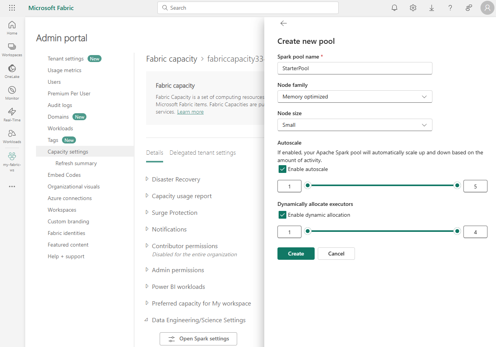

---
ms.custom:
  - build-2023
---
Apache Spark is a distributed data processing framework that enables large-scale data analytics by coordinating work across multiple processing nodes in a cluster. Put more simply, Spark uses a "divide and conquer" approach to processing large volumes of data quickly by distributing the work across multiple computers. The process of distributing tasks and collating results is handled for you by Spark. You submit a data processing job in the form of some code that initiates a *driver* program, which uses a cluster management object called the *SparkContext* to manage the distribution of processing in the Spark cluster. In most cases, these details are abstracted - you just need to write the code required to perform the data operations you need.

Spark can run code written in a wide range of languages, including Java, Scala (a Java-based scripting language), Spark R, Spark SQL, and PySpark (a Spark-specific variant of Python). Most data engineering and analytics workloads are accomplished using a combination of PySpark and Spark SQL.

## Spark settings

In Microsoft Fabric, each workspace is assigned a Spark cluster. An administrator can manage settings for the Spark cluster in the **Data Engineering/Science** section of the workspace settings.

Specific configuration settings include:

- **Node Family**: The type of virtual machines used for the Spark cluster nodes. In most cases, **memory optimized** nodes provide optimal performance.
- **Runtime version**: The version of Spark (and dependent subcomponents) to be run on the cluster.
- **Spark Properties**: Spark-specific settings that you want to enable or override in your cluster. You can see a list of properties in the [Apache Spark documentation](https://spark.apache.org/docs/latest/configuration.html#available-properties).

> [!NOTE]
> In most scenarios, the default settings provide an optimal configuration for Spark in Microsoft Fabric.

## Libraries

The Spark open source ecosystem includes a wide selection of code libraries for common (and sometimes very specialized) tasks. Since a great deal of Spark processing is performed using PySpark, the huge range of Python libraries ensures that whatever the task you need to perform, there's probably a library to help.

By default, Spark clusters in Microsoft Fabric include many of the most commonly used libraries, but if you need to install other libraries, you can do so on the **Library management** page in the workspace settings.

> [!TIP]
> For more information about library management, see [Manage Apache Spark libraries in Microsoft Fabric](https://learn.microsoft.com/fabric/data-engineering/library-management) in the Microsoft Fabric documentation.
