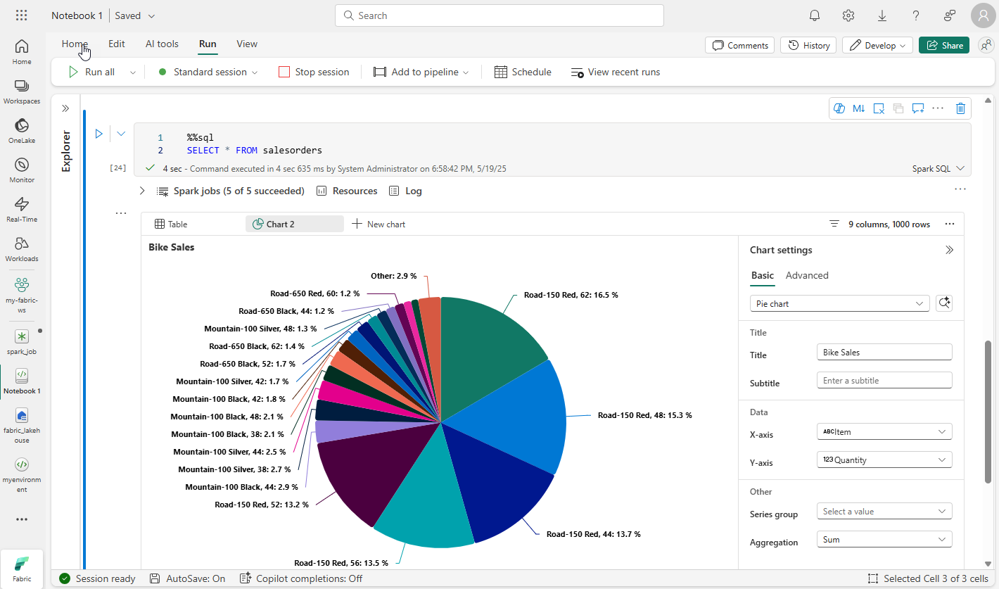
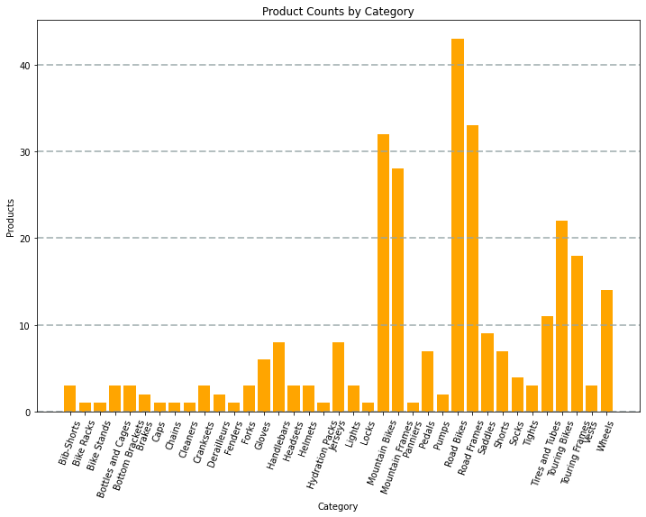

---
ms.custom:
  - build-2023
---
One of the most intuitive ways to analyze the results of data queries is to visualize them as charts. Notebooks in Microsoft Fabric provide some basic charting capabilities in the user interface, and when that functionality doesn't provide what you need, you can use one of the many Python graphics libraries to create and display data visualizations in the notebook.

## Using built-in notebook charts

When you display a dataframe or run a SQL query in a Spark notebook, the results are displayed under the code cell. By default, results are rendered as a table, but you can also change the results view to a chart and use the chart properties to customize how the chart visualizes the data, as shown here:



The built-in charting functionality in notebooks is useful when you want to quickly summarize the data visually. When you want to have more control over how the data is formatted, you should consider using a graphics package to create your own visualizations.

## Using graphics packages in code

There are many graphics packages that you can use to create data visualizations in code. In particular, Python supports a large selection of packages; most of them built on the base **Matplotlib** library. The output from a graphics library can be rendered in a notebook, making it easy to combine code to ingest and manipulate data with inline data visualizations and markdown cells to provide commentary.

For example, you could use the following PySpark code to aggregate data from the hypothetical products data explored previously in this module, and use Matplotlib to create a chart from the aggregated data.

```python
from matplotlib import pyplot as plt

# Get the data as a Pandas dataframe
data = spark.sql("SELECT Category, COUNT(ProductID) AS ProductCount \
                  FROM products \
                  GROUP BY Category \
                  ORDER BY Category").toPandas()

# Clear the plot area
plt.clf()

# Create a Figure
fig = plt.figure(figsize=(12,8))

# Create a bar plot of product counts by category
plt.bar(x=data['Category'], height=data['ProductCount'], color='orange')

# Customize the chart
plt.title('Product Counts by Category')
plt.xlabel('Category')
plt.ylabel('Products')
plt.grid(color='#95a5a6', linestyle='--', linewidth=2, axis='y', alpha=0.7)
plt.xticks(rotation=70)

# Show the plot area
plt.show()
```

The Matplotlib library requires data to be in a Pandas dataframe rather than a Spark dataframe, so the **toPandas** method is used to convert it. The code then creates a figure with a specified size and plots a bar chart with some custom property configuration before showing the resulting plot.

The chart produced by the code would look similar to the following image:



You can use the Matplotlib library to create many kinds of chart; or if preferred, you can use other libraries such as **Seaborn** to create highly customized charts.
