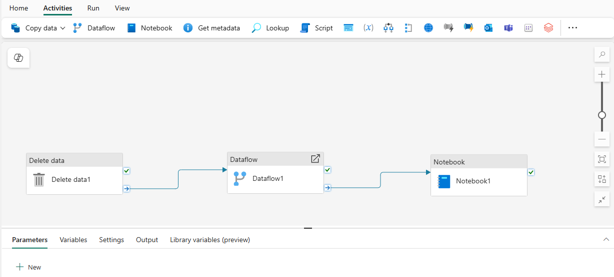

---
ms.custom:
  - build-2023
---
Pipelines in Microsoft Fabric encapsulate a sequence of *activities* that perform data movement and processing tasks. You can use a pipeline to define data transfer and transformation activities, and orchestrate these activities through control flow activities that manage branching, looping, and other typical processing logic. The graphical pipeline *canvas* in the Fabric user interface enables you to build complex pipelines with minimal or no coding required.

## Core pipeline concepts

Before building pipelines in Microsoft Fabric, you should understand a few core concepts.

### Activities

Activities are the executable tasks in a pipeline. You can define a flow of activities by connecting them in a sequence. The outcome of a particular activity (success, failure, or completion) can be used to direct the flow to the next activity in the sequence.

There are two broad categories of activity in a pipeline.

- **Data transformation activities** - activities that encapsulate data transfer operations, including simple **Copy Data** activities that extract data from a source and load it to a destination, and more complex **Data Flow** activities that encapsulate dataflows (Gen2) that apply transformations to the data as it is transferred. Other data transformation activities include **Notebook** activities to run a Spark notebook, **Stored procedure** activities to run SQL code, **Delete data** activities to delete existing data, and others.

- **Control flow activities** - activities that you can use to implement loops, conditional branching, or manage variable and parameter values. The wide range of control flow activities enables you to implement complex pipeline logic to orchestrate data ingestion and transformation flow.

> [!TIP]
> For details about the complete set of pipeline activities available in Microsoft Fabric, see [Activity overview](https://learn.microsoft.com/fabric/data-factory/activity-overview) in the Microsoft Fabric documentation.

### Parameters

Pipelines can be parameterized, enabling you to provide specific values to be used each time a pipeline is run. For example, you might want to use a pipeline to save ingested data in a folder, but have the flexibility to specify a folder name each time the pipeline is run.

Using parameters increases the reusability of your pipelines, enabling you to create flexible data ingestion and transformation processes.

### Pipeline runs

Each time a pipeline is executed, a *data pipeline run* is initiated. Runs can be initiated on-demand in the Fabric user interface or scheduled to start at a specific frequency. Use the unique run ID to review run details to confirm they completed successfully and investigate the specific settings used for each execution.
