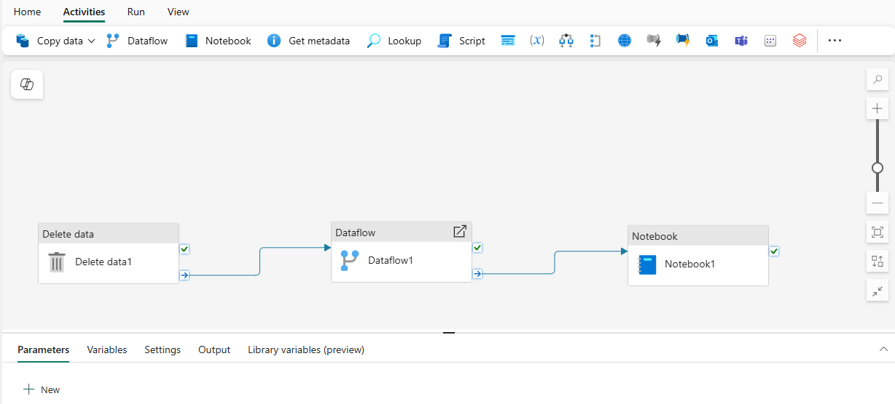

::: zone pivot="video"

>[!VIDEO https://learn-video.azurefd.net/vod/player?id=97381fc3-760d-4b1f-b30b-6afa7e38d6a3]

> [!TIP]
> See the **Text and images** tab for more details!

::: zone-end

::: zone pivot="text"

Pipelines in Microsoft Fabric encapsulate a sequence of *activities* that perform data movement and processing tasks. You can use a pipeline to define data transfer and transformation activities, and orchestrate these activities through control flow activities that manage branching, looping, and other typical processing logic. The graphical pipeline *canvas* in the Fabric user interface enables you to build complex pipelines with minimal or no coding required.

## Core pipeline concepts

Before building pipelines in Microsoft Fabric, you should understand a few core concepts.

### Activities

Activities are the executable tasks in a pipeline. You can define a flow of activities by connecting them in a sequence. The outcome of a particular activity (success, failure, or completion) can be used to direct the flow to the next activity in the sequence.

There are three broad categories of activity in a pipeline.

- **Data movement activities** - activities that move data between supported sources and destinations. For example, a **Copy Data** activity can extract data from an external source and load it into a lakehouse, warehouse, SQL database, or another supported destination.

- **Data transformation activities** - activities that process and transform data. These activities include **Dataflow Gen2** activities that run dataflows, **Notebook** activities that run Spark code, **Stored procedure** activities that run SQL code, and **Delete data** activities that delete existing data.

- **Control flow activities** - activities that you can use to implement loops, conditional branching, or manage variable and parameter values. The wide range of control flow activities enables you to implement complex pipeline logic to orchestrate data ingestion and transformation flow.

> [!TIP]
> For details about the complete set of pipeline activities available in Microsoft Fabric, see [Activity overview](/fabric/data-factory/activity-overview) in the Microsoft Fabric documentation.

### Parameters

Pipelines can be parameterized, enabling you to provide specific values to be used each time a pipeline is run. For example, you might want to use a pipeline to save ingested data in a folder, but have the flexibility to specify a folder name each time the pipeline is run.

Using parameters increases the reusability of your pipelines, enabling you to create flexible data ingestion and transformation processes.

### Pipeline runs

Each time a pipeline is executed, a *data pipeline run* is initiated. You can start a run on demand in the Fabric user interface, on a schedule, or in response to an event. Use the unique run ID to review run details, confirm that activities completed successfully, and investigate the settings used for each execution.

::: zone-end