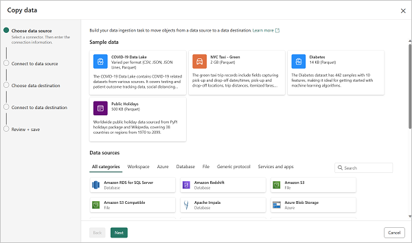
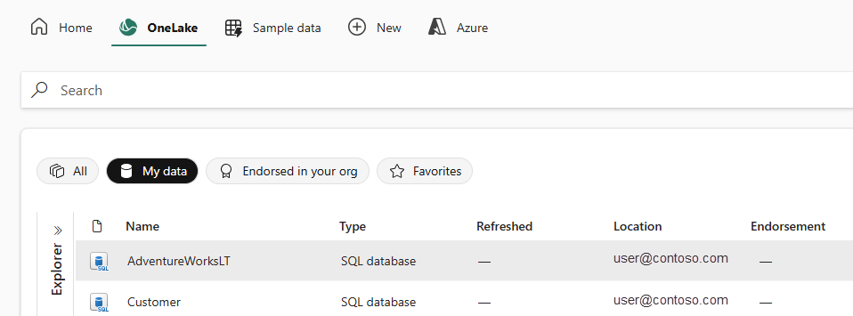
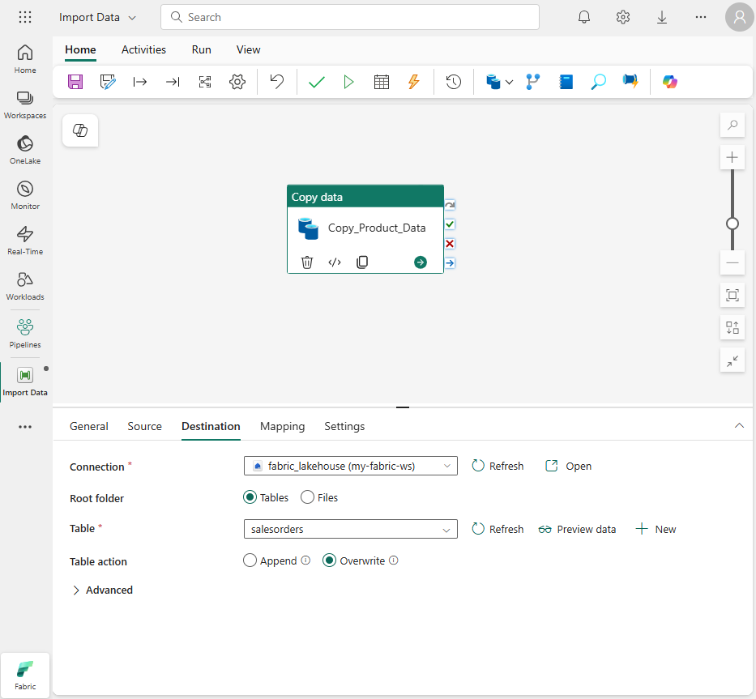

::: zone pivot="video"

>[!VIDEO https://learn-video.azurefd.net/vod/player?id=8a60e60d-1d48-4e4d-a638-d8922dc1cf92]

> [!TIP]
> See the **Text and images** tab for more details!

::: zone-end

::: zone pivot="text"

The **Copy Data** activity moves data between supported data stores as part of a pipeline. For example, you can use it to ingest data from an external source into a lakehouse file or table before other pipeline activities process the data.

You can combine the **Copy Data** activity with other activities to create a repeatable data ingestion process. For example, use a **Delete data** activity to remove existing data, a **Copy Data** activity to replace the data from an external source, and a **Notebook** activity to transform the data and load it into a table.

## The Copy Data tool

When you add a **Copy Data** activity to a pipeline, a graphical tool takes you through the steps required to configure the data source and destination for the copy operation. A wide range of source connections is supported, making it possible to ingest data from most common sources. In OneLake, this includes support for lakehouse, warehouse, SQL Database, and others.

## Copy Data activity settings

After you've added a **Copy Data** activity to a pipeline, you can select it in the pipeline canvas and edit its settings in the pane underneath.

## When to use the Copy Data activity

Choose a data movement option based on how you need to process and orchestrate the data.

| Option | Use when |
| --- | --- |
| **Copy job** | You need a simplified experience for a copy-only workload, including bulk, incremental, or change data capture movement. |
| **Copy Data** activity | You need to move data as one step in a pipeline or require detailed control over the copy operation. |
| **Dataflow Gen2** activity | You need to transform data with Power Query or combine data from multiple sources. |

When you use a **Copy Data** activity, you can apply transformations in later pipeline activities. For example, add a **Dataflow Gen2** activity to run a dataflow that contains multiple Power Query transformation steps.

> [!TIP]
> To learn more about Dataflow (Gen2) in Microsoft Fabric to ingest data, consider completing the [Ingest Data with Dataflows Gen2 in Microsoft Fabric](/training/modules/use-dataflow-gen-2-fabric) module. 

::: zone-end
