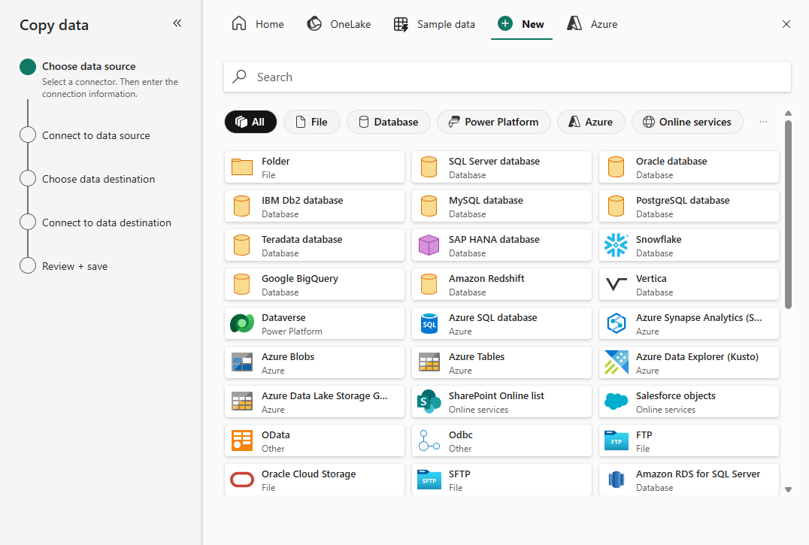

---
ms.custom:
  - build-2023
---
The **Copy Data** activity is one of the most common uses of a data pipeline. Many pipelines consist of a single **Copy Data** activity that is used to ingest data from an external source into a lakehouse file or table.

You can also combine the **Copy Data** activity with other activities to create a repeatable data ingestion process - for example by using a **Delete data** activity to remove existing data, a **Copy Data** activity to replace the deleted data with a file containing data from an external source, and a **Notebook** activity to run Spark code that transforms the data in the file and loads it into a table.

## The Copy Data tool

 <!-- Update screenshot for release -->

When you add a **Copy Data** activity to a pipeline, a graphical tool takes you through the steps required to configure the data source and destination for the copy operation. A wide range of source connections is supported, making it possible to ingest data from most common sources.

## Copy Data activity settings

After you've added a **Copy Data** activity to a pipeline, you can select it in the pipeline canvas and edit its settings in the pane underneath.

 <!-- Update screenshot for release -->

## When to use the Copy Data activity

Use the **Copy Data** activity when you need to copy data directly between a supported source and destination without applying any transformations, or when you want to import the raw data and apply transformations in later pipeline activities.

If you need to apply transformations to the data as it is ingested, or merge data from multiple sources, consider using a **Data Flow** activity to run a dataflow (Gen2). You can use the Power Query user interface to define a dataflow (Gen2) that includes multiple transformation steps, and include it in a pipeline.

> [!TIP]
> To learn more about Dataflow (Gen2) in Microsoft Fabric to ingest data, consider completing the [Ingest Data with Dataflows Gen2 in Microsoft Fabric](https://learn.microsoft.com/training/modules/use-dataflow-gen-2-fabric) module. 
