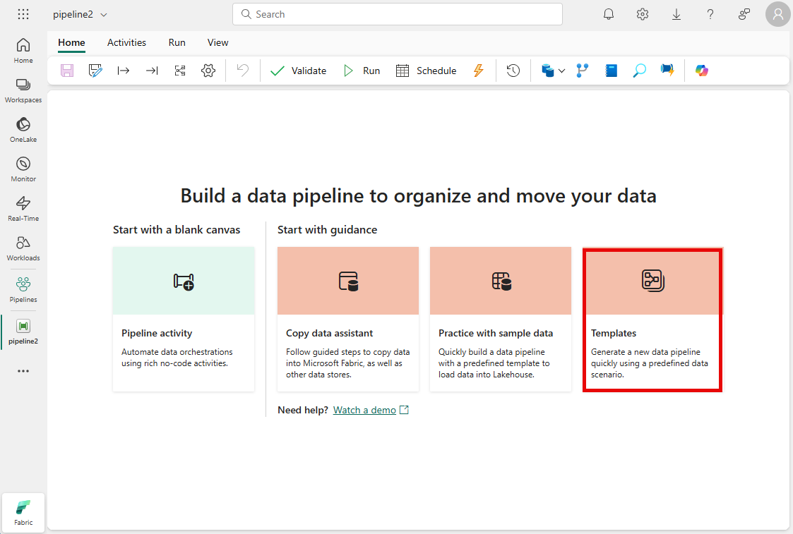
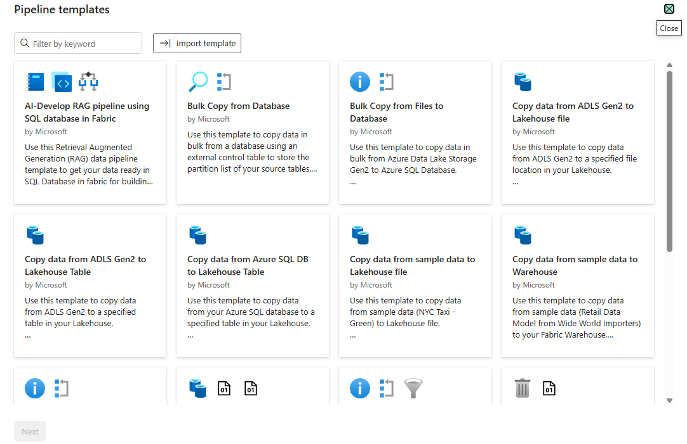

---
ms.custom:
  - build-2023
---
You can define pipelines from any combination of activities you choose, enabling to create custom data ingestion and transformation processes to meet your specific needs. However, there are many common pipeline scenarios for which Microsoft Fabric includes predefined pipeline templates that you can use and customize as required.

To create a pipeline based on a template, select the **Choose a task to start** tile in a new pipeline as shown here.

 <!-- Update screenshot for release -->

Selecting this option displays a selection of pipeline templates, as shown here.

 <!-- Update screenshot for release -->

You can select the most appropriate template for your needs, and then edit the pipeline in the pipeline canvas to customize it to your needs.
