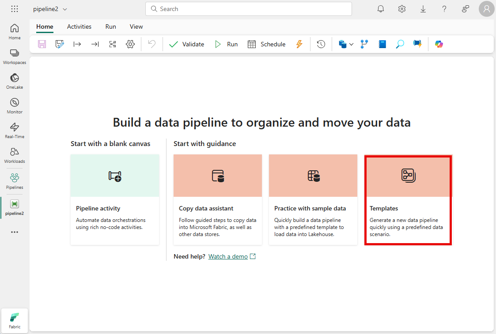
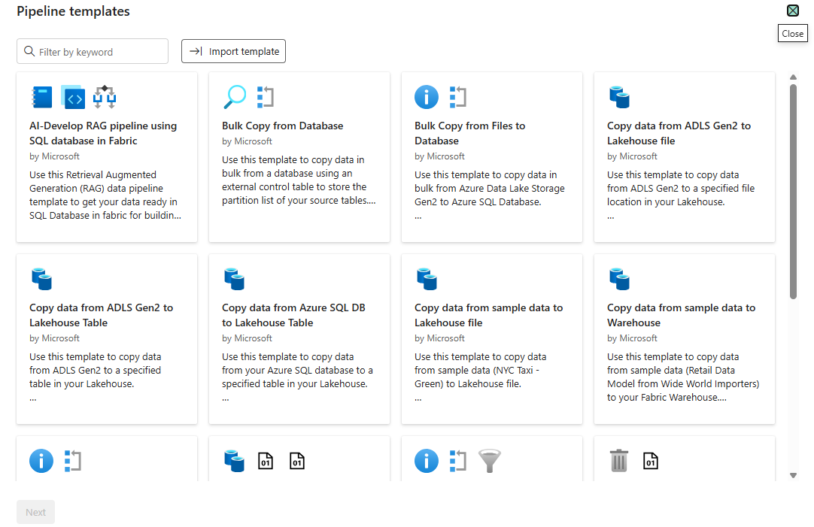

::: zone pivot="video"

>[!VIDEO https://learn-video.azurefd.net/vod/player?id=3811c2e9-12e4-4e41-8dd1-c7183bb15b94]

> [!TIP]
> See the **Text and images** tab for more details!

::: zone-end

::: zone pivot="text"

You can combine activities to create custom data ingestion and transformation processes. For common scenarios, Microsoft Fabric includes predefined pipeline templates that you can configure and customize.

## Start with a predefined template

To create a pipeline based on a template, select the **Templates** tile in a new pipeline as shown here.

 

Selecting this option displays a selection of pipeline templates, as shown here.

You can select the most appropriate template for your needs, and then edit the pipeline in the pipeline canvas to customize it to your needs.

## Reuse a custom pipeline template

The template gallery also supports custom pipeline templates. To reuse a pipeline, select **Export** on the **Home** tab to save the pipeline as a `.zip` template file. You can then import the file from the **Home** tab or select **Import template** in the template gallery.

When you import a template, review its activities and select the required connections before you use it. This approach helps you apply a consistent pipeline structure across workspaces while keeping connection settings specific to each environment.

::: zone-end

