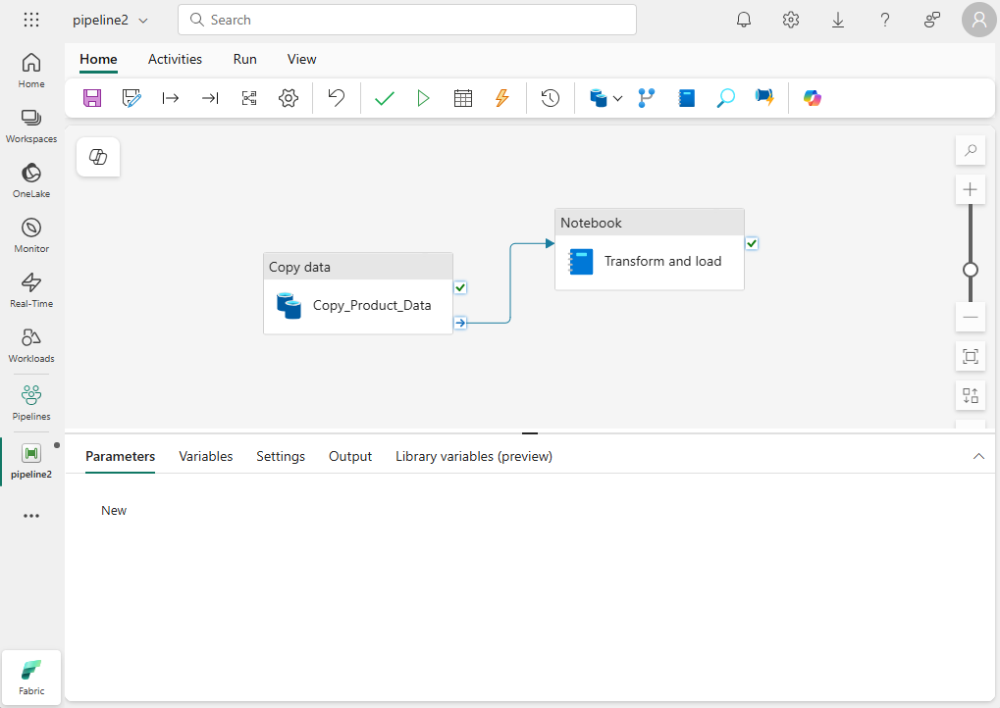
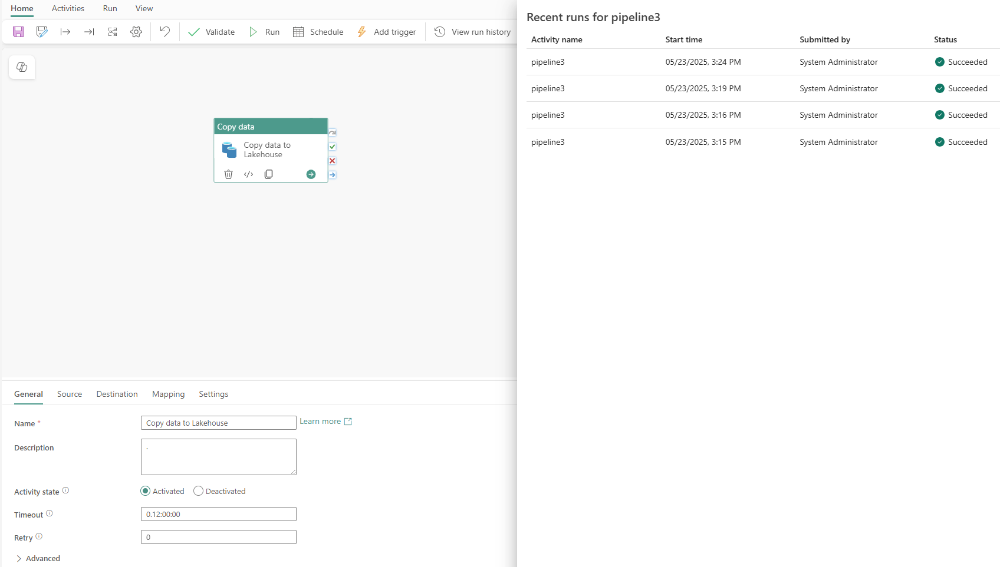

::: zone pivot="video"

>[!VIDEO https://learn-video.azurefd.net/vod/player?id=be735e6e-3f9a-4f09-a0be-c821459976dc]

> [!TIP]
> See the **Text and images** tab for more details!

::: zone-end

::: zone pivot="text"

After you complete a pipeline, use **Validate** to check its configuration. You can then run the pipeline on demand, add one or more schedules, or configure an event trigger.

## Choose how to start a pipeline

Fabric supports three ways to start a pipeline run:

- **On-demand run**: Select **Run** on the **Home** tab to start the pipeline immediately. Fabric prompts you to save changes before the run starts.
- **Scheduled run**: Select **Schedule** to define when the pipeline runs. A schedule includes start and end dates, a frequency, and a time zone. A pipeline can have multiple schedules.
- **Event-based run**: Select **Trigger** to start the pipeline in response to file, job, or workspace events. For example, a storage event can start a pipeline when a file arrives in OneLake or Azure Blob Storage.

Pipeline parameters let you pass values for each run. For scheduled runs, the parameter names in the schedule must match the parameter names defined in the pipeline.

## View run history

You can view recent runs from the pipeline canvas or select **View run history** from the pipeline item in the workspace. Run history displays the status of each run. Select a run to review its run ID, activity durations, inputs, outputs, and error details.

For a broader view, select **Go to monitor** to open the Monitoring hub. There, you can filter pipeline and activity runs, export monitoring data, and open performance details. The Gantt view helps you compare run durations and identify delays or overlapping runs.

When a run fails, use its activity details to investigate the error. After you correct the issue, you can rerun the entire pipeline or rerun from the failed activity.

> [!TIP]
> For log-level analysis across all pipelines in a workspace, enable workspace monitoring. Fabric stores workspace execution logs in a monitoring eventhouse that you can query with Kusto Query Language (KQL).

::: zone-end