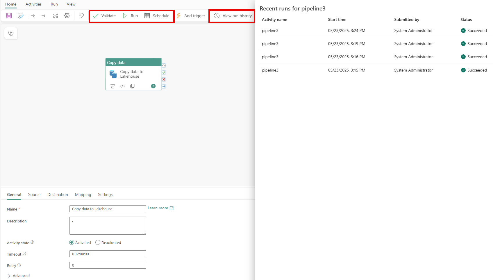

---
ms.custom:
  - build-2023
---
When you have completed a pipeline, you can use the **Validate** option to check that is configuration is valid, and then either run it interactively or specify a schedule.

 <!-- Update screenshot for release -->

## View run history

You can view the run history for a pipeline to see details of each run, either from the pipeline canvas or from the pipeline item listed in the page for the workspace.

 <!-- Update screenshot for release -->

When you view a pipeline run history from the workspace page, you can select the **Run start** value to see the details of an individual run; including the option to view the individual execution time for each activity as a Gantt chart.

 <!-- Update screenshot for release -->
