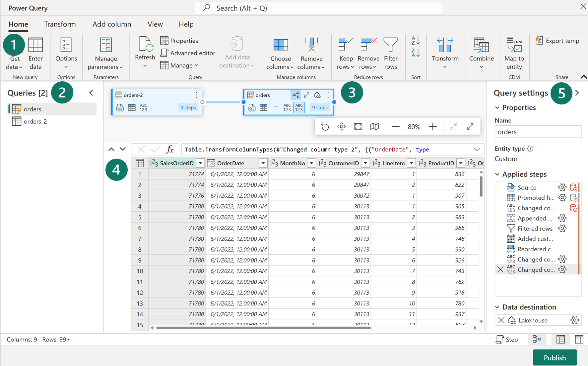
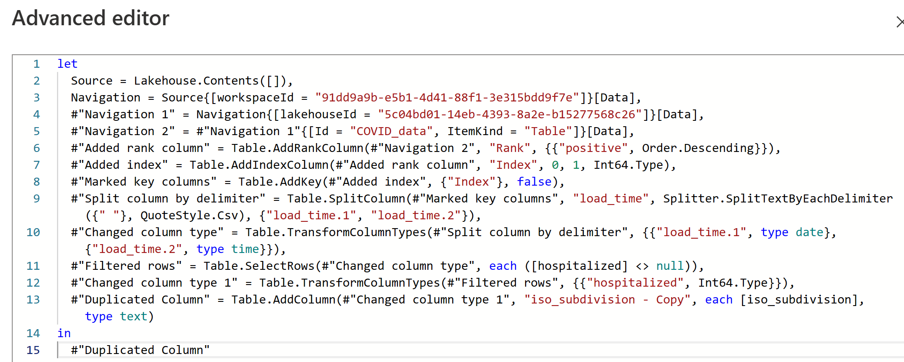
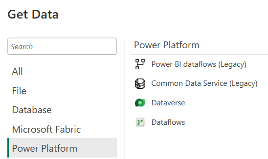

---
ms.custom:
  - build-2023
---
In Microsoft Fabric, you can create a Dataflow (Gen2) in the Data Factory workload or Power BI workspace, or directly in the lakehouse. Since our scenario is focused on data ingestion, let's look at the **Data Factory** workload experience. Dataflows (Gen2) use Power Query Online to visualize transformations. See an overview of the interface:

### 1. Power Query ribbon

Dataflows (Gen2) support a wide variety of data source connectors. Common sources include cloud and on-premises relational databases, Excel or flat files, SharePoint, SalesForce, Spark, and of course Fabric Lakehouses. Then there are numerous data transformations possible, such as:

- Filter and Sort rows
- Pivot and Unpivot
- Merge and Append queries
- Split and Conditional split
- Replace values and Remove duplicates
- Add, Rename, Reorder, or Delete columns
- Rank and Percentage calculator
- Top N and Bottom N

### 2. Queries pane

The Queries pane shows you the different data sources - now called *queries*. Rename, duplicate, reference, and enable load are some of the options available.

### 3. Diagram view

The Diagram View allows you to visually see how the data sources are connected and the different applied transformations.

### 4. Data Preview pane

The Data Preview pane only shows a subset of data to allow you to see which transformations you should make and how they affect the data. You can also interact with the preview pane by dragging and dropping columns to change order or right-clicking on columns to filter or make changes.

### 5. Query Settings pane

The Query Settings pane primarily includes **Applied Steps**. Each transformation you do is tied to a step, some of which are automatically applied when you connect the data source. Depending on the complexity of the transformations, you may have several applied steps for each query.

While this visual interface is helpful, you can also view the M code through **Advanced editor**.

In the Query settings pane, you can see a **Data Destination** field where you can set the Lakehouse as your destination.

> [!TIP]
> If made available, data analysts can also connect to the dataflow through Power BI Desktop.
>
> 
