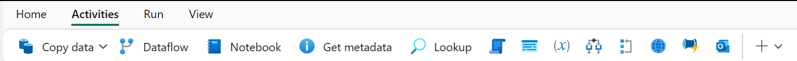
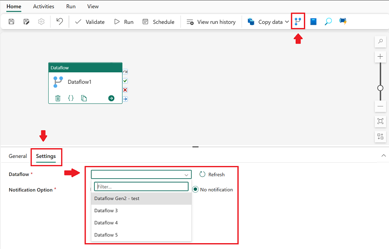

---
ms.custom:
  - build-2023
---
Dataflows (Gen2) provide an excellent option for data transformations in Microsoft Fabric. The combination of dataflows and pipelines is useful when you need to perform additional operations on the transformed data.

Data pipelines are easily created in the Data Factory and Data Engineering workloads. Pipelines are a common concept in data engineering and offer a wide variety of activities to orchestrate. Some common activities include:

- Copy data
- Incorporate Dataflow
- Add Notebook
- Get metadata
- Execute a script or stored procedure

Pipelines provide a visual way to complete activities in a specific order. You can use a dataflow for data ingestion and transformation, and landing into a Lakehouse using dataflows. Then incorporate the dataflow into a pipeline to orchestrate extra activities, like execute scripts or stored procedures after the dataflow has completed.

