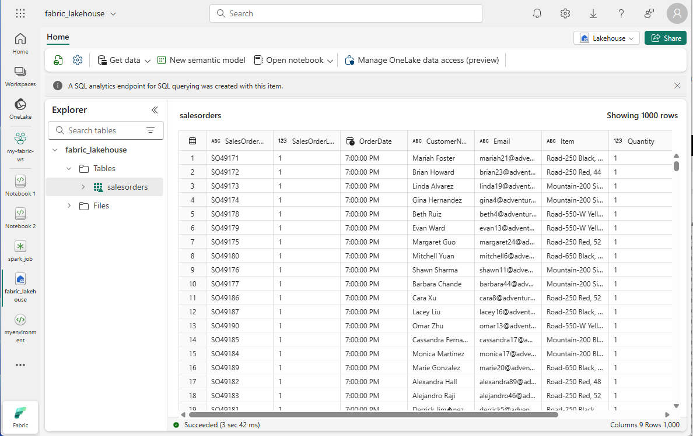
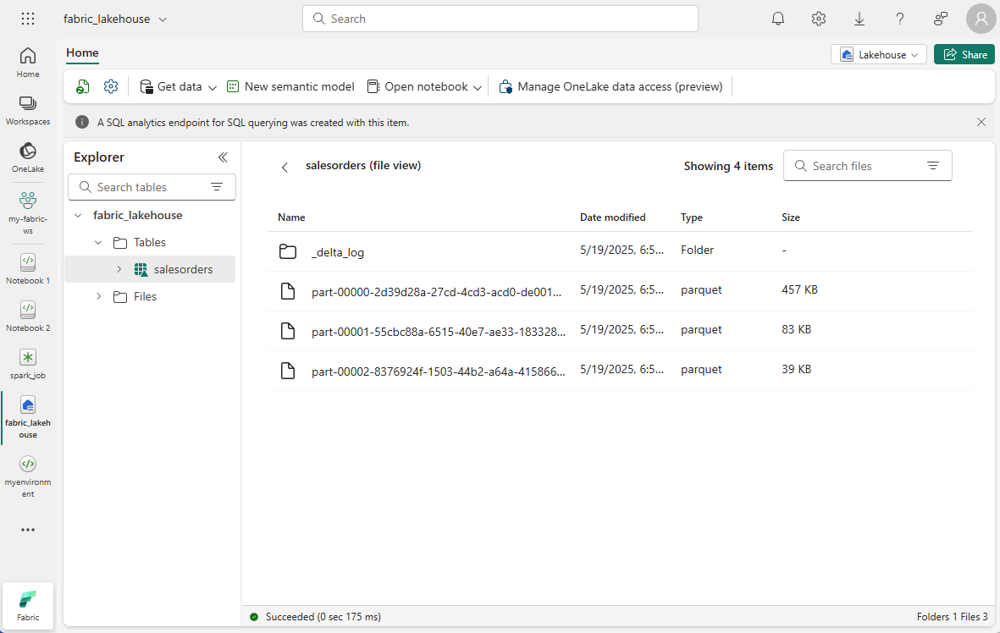

---
ms.custom:
  - build-2023
---
Delta Lake is an open-source storage layer that adds relational database semantics to Spark-based data lake processing. Tables in Microsoft Fabric lakehouses are Delta tables, which is signified by the triangular Delta (**&#9652;**) icon on tables in the lakehouse user interface.

Delta tables are schema abstractions over data files that are stored in Delta format. For each table, the lakehouse stores a folder containing *Parquet* data files and a **_delta_Log** folder in which transaction details are logged in JSON format.

The benefits of using Delta tables include:

- **Relational tables that support querying and data modification**. With Apache Spark, you can store data in Delta tables that support *CRUD* (create, read, update, and delete) operations. In other words, you can *select*, *insert*, *update*, and *delete* rows of data in the same way you would in a relational database system.
- **Support for *ACID* transactions**. Relational databases are designed to support transactional data modifications that provide *atomicity* (transactions complete as a single unit of work), *consistency* (transactions leave the database in a consistent state), *isolation* (in-process transactions can't interfere with one another), and *durability* (when a transaction completes, the changes it made are persisted). Delta Lake brings this same transactional support to Spark by implementing a transaction log and enforcing serializable isolation for concurrent operations.
- **Data versioning and *time travel***. Because all transactions are logged in the transaction log, you can track multiple versions of each table row and even use the *time travel* feature to retrieve a previous version of a row in a query.
- **Support for batch and streaming data**. While most relational databases include tables that store static data, Spark includes native support for streaming data through the Spark Structured Streaming API. Delta Lake tables can be used as both *sinks* (destinations) and *sources* for streaming data.
- **Standard formats and interoperability**. The underlying data for Delta tables is stored in Parquet format, which is commonly used in data lake ingestion pipelines. Additionally, you can use the SQL Endpoint for the Microsoft Fabric lakehouse to query Delta tables in SQL.
