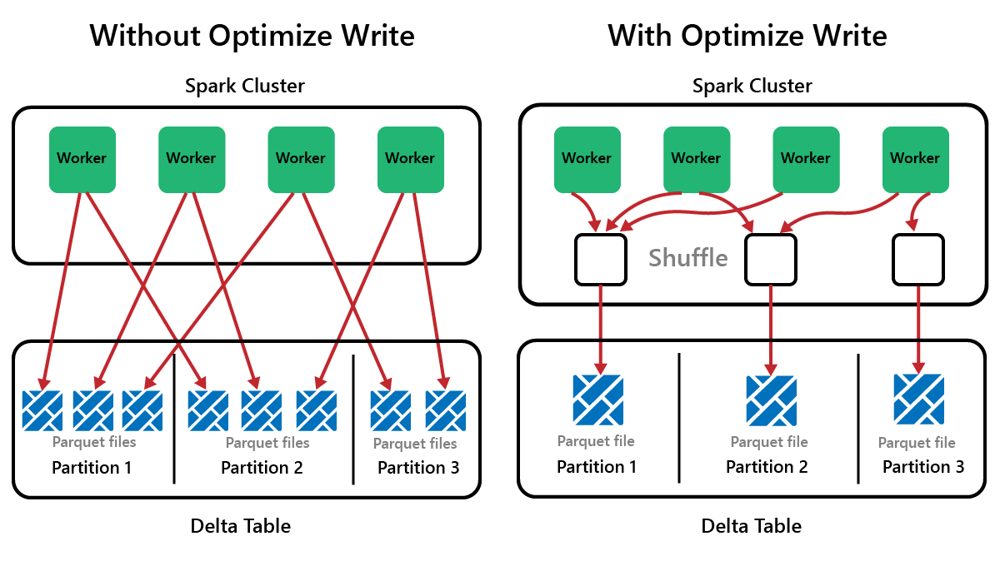
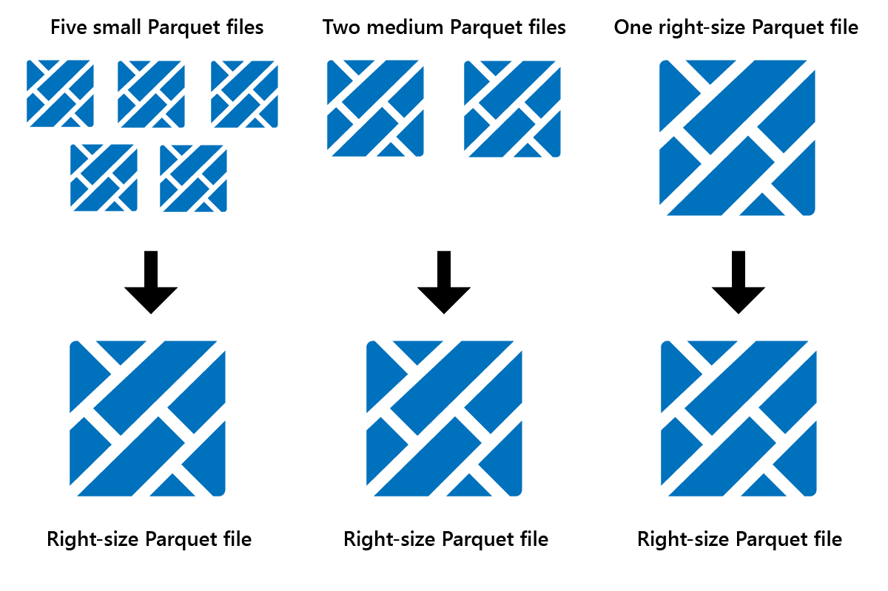
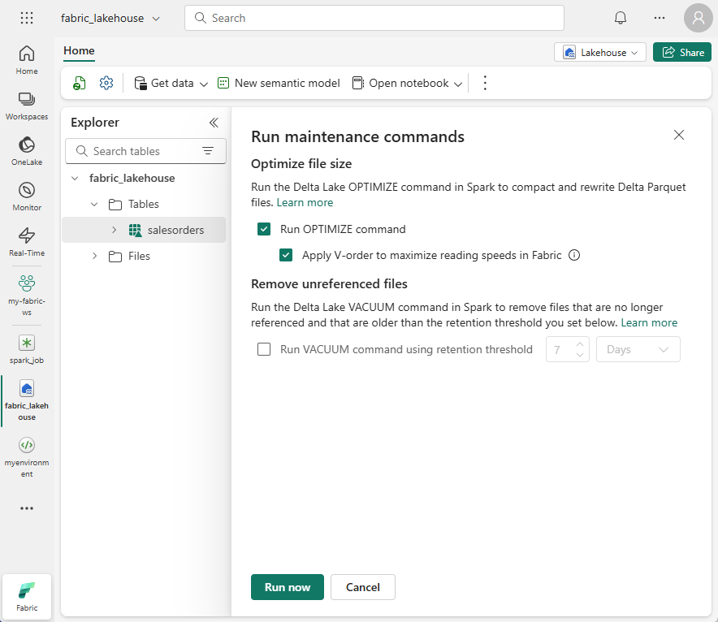
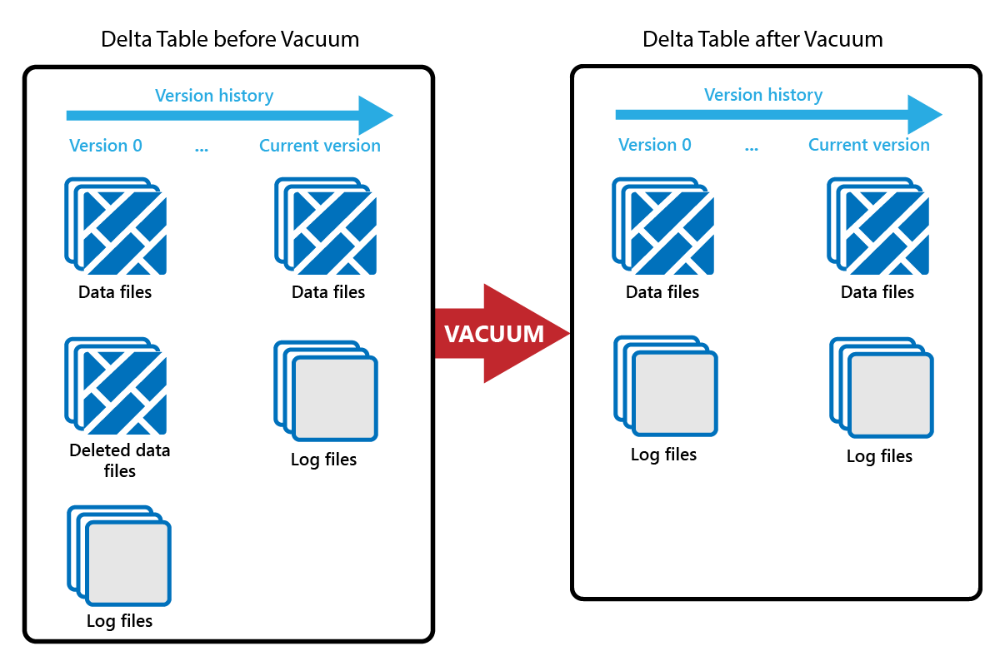
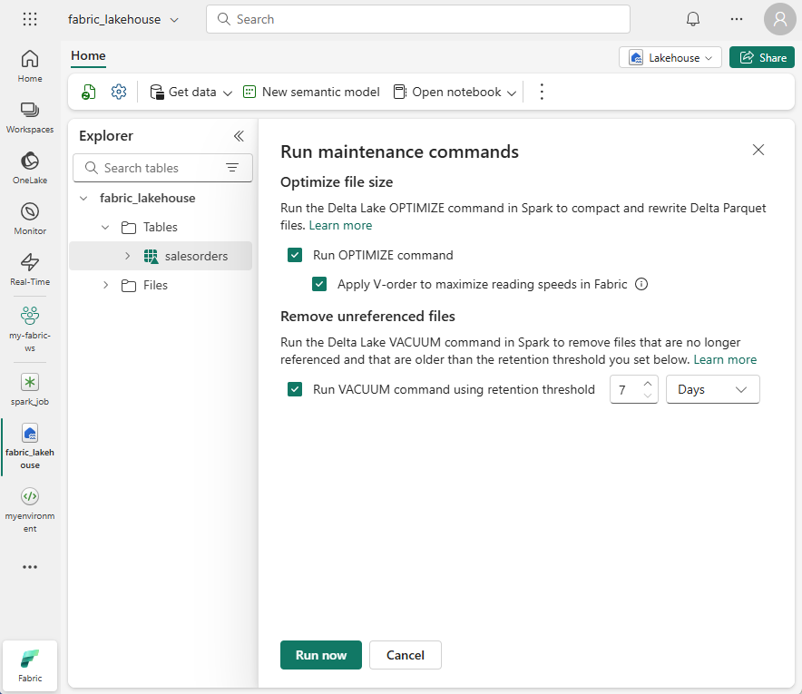
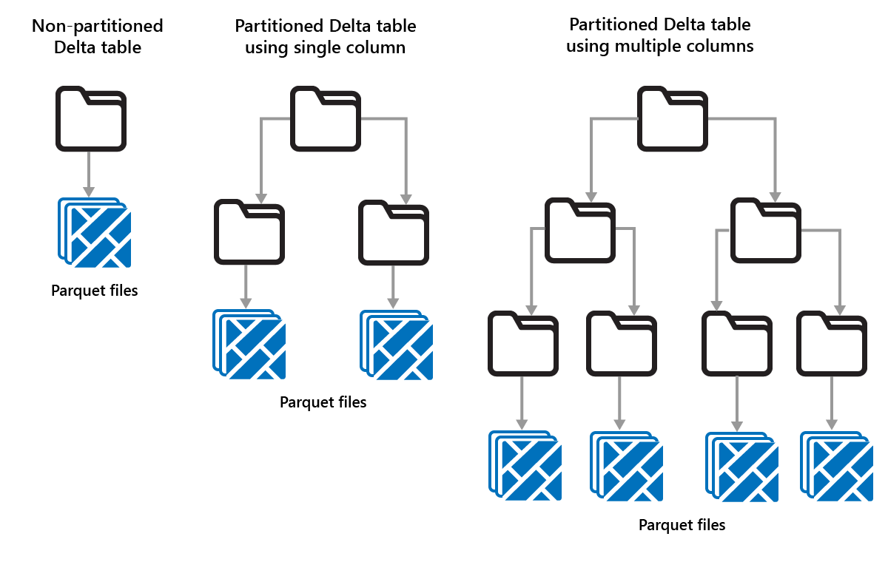
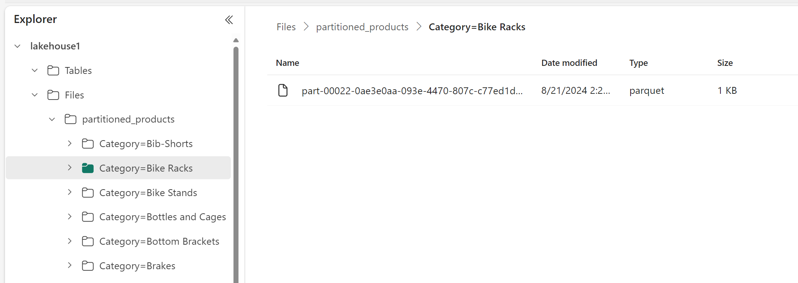

Spark is a parallel-processing framework, with data stored on one or more worker nodes. In addition, Parquet files are immutable, with new files written for every update or delete. This process can result in Spark storing data in a large number of small files, known as the *small file problem.* It means that queries over large amounts of data can run slowly, or even fail to complete.

## OptimizeWrite function

*OptimizeWrite* is a feature of Delta Lake which reduces the number of files as they're written. Instead of writing many small files, it writes fewer larger files. This helps to prevent the *small files problem* and ensure that performance isn't degraded.



In Microsoft Fabric, `OptimizeWrite` is enabled by default. You can enable or disable it at the Spark session level:

``` Python
# Disable Optimize Write at the Spark session level
spark.conf.set("spark.microsoft.delta.optimizeWrite.enabled", False)

# Enable Optimize Write at the Spark session level
spark.conf.set("spark.microsoft.delta.optimizeWrite.enabled", True)

print(spark.conf.get("spark.microsoft.delta.optimizeWrite.enabled"))
```

> [!NOTE]
> `OptimizeWrite` can also be set in Table Properties and for individual write commands.

## Optimize

Optimize is a table maintenance feature that consolidates small Parquet files into fewer large files. You might run Optimize after loading large tables, resulting in:

* fewer larger files
* better compression
* efficient data distribution across nodes



To run Optimize:

1. In **Lakehouse Explorer**, select the ... menu beside a table name and select **Maintenance**.
1. Select **Run OPTIMIZE command**.
1. Optionally, select **Apply V-order to maximize reading speeds in Fabric**.
1. Select **Run now**.

### V-Order function

When you run Optimize, you can optionally run V-Order, which is designed for the Parquet file format in Fabric. V-Order enables lightning-fast reads, with in-memory-like data access times. It also improves cost efficiency as it reduces network, disk, and CPU resources during reads.

V-Order is enabled by default in Microsoft Fabric and is applied as data is being written. It incurs a small overhead of about 15% making writes a little slower. However, V-Order enables faster reads from the Microsoft Fabric compute engines, such as Power BI, SQL, Spark, and others.

In Microsoft Fabric, the Power BI and SQL engines use Microsoft Verti-Scan technology which takes full advantage of V-Order optimization to speed up reads. Spark and other engines don't use VertiScan technology but still benefit from V-Order optimization by about 10% faster reads, sometimes up to 50%.
<!-- verti-scan or vertiscan? both are used in these sentences. -->
V-Order works by applying special sorting, row group distribution, dictionary encoding, and compression on Parquet files. It's 100% compliant to the open-source Parquet format and all Parquet engines can read it.

V-Order might not be beneficial for write-intensive scenarios such as staging data stores where data is only read once or twice. In these situations, disabling V-Order might reduce the overall processing time for data ingestion.

Apply V-Order to individual tables by using the Table Maintenance feature by running the `OPTIMIZE` command.



## Vacuum

The VACUUM command enables you to remove old data files.

Every time an update or delete is done, a new Parquet file is created and an entry is made in the transaction log. Old Parquet files are retained to enable time travel, which means that Parquet files accumulate over time.

The VACUUM command removes old Parquet data files, but not the transaction logs. When you run VACUUM, you can't time travel back earlier than the retention period.



Data files that aren't currently referenced in a transaction log and that are older than the specified retention period are permanently deleted by running VACUUM. Choose your retention period based on factors such as:

* Data retention requirements
* Data size and storage costs
* Data change frequency
* Regulatory requirements

The default retention period is 7 days (168 hours), and the system prevents you from using a shorter retention period.

You can run VACUUM on an ad-hoc basis or scheduled using Fabric notebooks.

Run VACUUM on individual tables by using the Table maintenance feature:

1. In **Lakehouse Explorer**, select the ... menu beside a table name and select **Maintenance**.
1. Select **Run VACUUM command using retention threshold** and set the retention threshold.
1. Select **Run now**.



You can also run **VACUUM** as a SQL command in a notebook:

```SQL
%%sql
VACUUM lakehouse2.products RETAIN 168 HOURS;
```

VACUUM commits to the Delta transaction log, so you can view previous runs in DESCRIBE HISTORY.

```SQL
%%sql
DESCRIBE HISTORY lakehouse2.products;
```

## Partitioning Delta tables

Delta Lake allows you to organize data into partitions. This might improve performance by enabling *data skipping*, which boosts performance by skipping over irrelevant data objects based on an object's metadata.

Consider a situation where large amounts of sales data are being stored. You could partition sales data by year. The partitions are stored in subfolders named "year=2021", "year=2022", etc. If you only want to report on sales data for 2024, then the partitions for other years can be skipped, which improves read performance.

Partitioning of small amounts of data can degrade performance, however, because it increases the number of files and can exacerbate the "small files problem."

Use partitioning when:

* You have very large amounts of data.
* Tables can be split into a few large partitions.

Don't use partitioning when:

* Data volumes are small.
* A partitioning column has high cardinality, as this creates a large number of partitions.
* A partitioning column would result in multiple levels.



Partitions are a fixed data layout and don't adapt to different query patterns. When considering how to use partitioning, think about how your data is used, and its granularity.

In this example, a DataFrame containing product data is partitioned by Category:

```python
df.write.format("delta").partitionBy("Category").saveAsTable("partitioned_products", path="abfs_path/partitioned_products")
```

In the Lakehouse Explorer, you can see the data is a partitioned table.

* There's one folder for the table, called "partitioned_products."
* There are subfolders for each category, for example "Category=Bike Racks", etc.



We can create a similar partitioned table using SQL:

```SQL
%%sql
CREATE TABLE partitioned_products (
    ProductID INTEGER,
    ProductName STRING,
    Category STRING,
    ListPrice DOUBLE
)
PARTITIONED BY (Category);
```