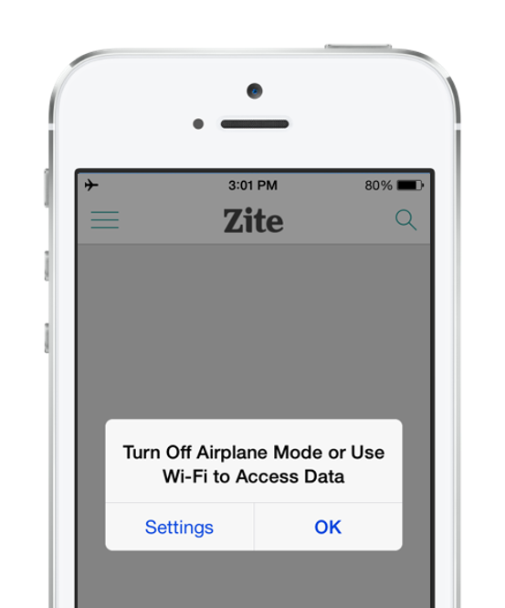

Mobile devices use Wi-Fi and cellular technologies to connect to the internet. This dependency means that your users could lose their internet connection while using your application. If you don't add code to protect against this possibility, your app could stop responding and provide your users with a bad experience.

In this unit, you protect your application by detecting when your users lose their internet connection. This information becomes important when we begin to consume REST web services.

## Why detect network connectivity on mobile applications?

Detecting if you have an internet connection on a mobile application is important because mobile devices lose their connection often. Think about some of the times where you didn't have an internet connection with your mobile device. Maybe you were in an area where your service provider didn't have much coverage. Maybe you were driving through a tunnel and had no reception.

Because mobile devices have these challenges, you must write code to protect against them. If you don't, and your application attempts to perform operations that use the internet, your application might stop responding.

You also want to provide a good user experience when your application can't connect to the internet. If your application stops working because there's no internet service, your users might be left confused. The best thing to do is to provide information to your users. Tell them that you don't have an internet connection and that your application might not perform fully without it. For example, here's a screenshot that shows a message like that:



In this example, the application developer informs the user that they don't have an internet connection and they should attempt to connect to Wi-Fi.

## Detect network connectivity

There are two ways to detect network connectivity in a Xamarin.Forms application:

* First, you can use the platform-specific APIs. Each platform has unique APIs to detect and monitor changes to the device's network connectivity. This approach works fine, but because this code is specific to the platform, you must write code for each platform that you support.

* Second, you can use the Xamarin.Essentials cross-platform library. In the Xamarin.Essentials library, there's a `Connectivity` class. `Connectivity` contains a property called `NetworkAccess` and an event called `ConnectivityChanged`. Both members are commonly used to detect changes in the network.

The `NetworkAccess` property returns an enumeration called `NetworkAccess`. The enumeration has five values: `ConstrainedInternet`, `Internet`, `Local`, `None`, and `Unknown`. If the `NetworkAccess` property returns a value of `NetworkAccess.None`, then you know you don't have a connection to the internet, and you shouldn't run networking code. Here's an example in C# code:

```csharp
if (Connectivity.NetworkAccess == NetworkAccess.None)
{
    ...
}
```

The `ConnectivityChanged` event is also used to determine if you're connected to the internet. But `ConnectivityChanged` is an event and is invoked automatically when your network status changes. For example, if you start with an active network connection and eventually lose it, `ConnectivityChanged` is invoked to inform you about the change. One of the parameters of `ConnectivityChanged` is `ConnectivityChangedEventArgs` which contains a property called `IsConnected`. You can use the `IsConnected` property to determine if you're connected to the internet. Here's an example in C# code:

```csharp
Connectivity.ConnectivityChanged += Connectivity_ConnectivityChanged;
...
void Connectivity_ConnectivityChanged(object sender, ConnectivityChangedEventArgs  e)
{
    bool stillConnected = e.IsConnected;
}
```
