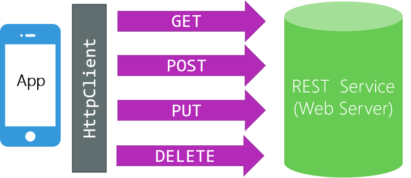

It's rare to build applications that are completely isolated and have no connection to the internet. Users expect applications to interact with each other or provide cross-device experiences. Because REST is the most common architecture used for building web services, it's likely that you'll need to consume these services in your application.

In this unit, you consume a REST web service by using `HttpClient`.

## What is HttpClient?



*HttpClient* is a built-in class that's used to send HTTP requests and receive HTTP responses from a resource identified by a URI. `HttpClient` uses a task-based API for performance and gives you access to things like headers, status codes, and message bodies.

To use `HttpClient`, first you create an instance in memory. Here's how you do that in C#:

```csharp
HttpClient client = new HttpClient();
```

You can use the default constructor, and now you can perform CRUD operations on this `client` instance.

## Perform CRUD operations with HttpClient

Before we look at how to perform CRUD operations with `HttpClient`, lets quickly review the HTTP verbs and how they map to CRUD operations.

### What are the HTTP verbs?

Remember that REST web services are modeled around the HTTP specification. When you communicate with a REST service, you must use the same message format described by the HTTP specification.

In an HTTP message, one of the required components is an HTTP verb. The job of the HTTP verb is to indicate the desired action to be performed on the resource. There are many HTTP verbs, but the four most common are `POST`, `GET`, `PUT`, and `DELETE`.

- The `POST` verb indicates that you want to create a new resource.

- The `GET` verb indicates that you want to retrieve a resource.

- The `PUT` verb indicates that you want to update a resource.

- The `DELETE` verb indicates that you want to delete a resource.

These verbs directly map to the standard CRUD operations: `POST` -> Create, `GET` -> Read, `PUT` -> Update, and `DELETE` -> Delete.

### Create a new resource with HttpClient

To create a new resource by using `HttpClient`, use the `PostAsync` method. Here's an example in C# code:

```csharp
HttpClient client = new HttpClient();

StringContent content = new StringContent(JsonConvert.SerializeObject(data),Encoding.UTF8, "application/json");

HttpResponseMessage response = await client.PostAsync("https://...", content);
```

There are a few things going on in this code, so let's go through it step by step.

First, we create an instance of `HTTPClient` called `client` that we use to issue the `POST` request.

Then we create an instance of `StringContent` called `content`. It represents the data that we send to the web service as a string. It also adds data like the encoding type and data format. In this example, we send the data in JSON format. Note that the variable `data` is just an instance of some C# object. We convert it into JSON by using the `JsonConvert` class.

Finally, we call the `PostAsync` method on `HTTPClient`. The first parameter is the URI. The second parameter is the body of the message, which contains our data in JSON format. The `PostAsync` method returns a `HttpResponseMessage` object, which contains things like the status code and our newly created object.

### Read a resource with HTTPClient

To read a resource by using `HTTPClient`, use the `GetStringAsync` method. Here's an example in C# code:

```csharp
HttpClient client = new HttpClient();

string text = await client.GetStringAsync("https://...");
```

The `GetStringAsync` method takes in a URI and returns a response as a `string`. The `string` response is the resource you requested. The format of the response data will be the default for the requested service, such as JSON or XML. You can tell the web service that you prefer a specific data format sent to you by adding the `MediaTypeWithQualityHeaderValue` header. For example, if you request JSON format sent back to you, it looks something like this:

```csharp
HttpClient client = new HttpClient();

client.DefaultRequestHeaders.Accept.Add(new MediaTypeWithQualityHeaderValue("application/json"));
```

In this example, we got the result as a string. If you want to get the entire response as a `HttpResponseMessage` object, use `GetAsync` instead. The object includes the response's headers, body, and status code.

### Update a resource with HTTPClient

To update a resource by using `HTTPClient`, use the `PutAsync` method. The code is the same as when you create a new resource except that you use the `PutAsync` method. Here's the code in C#:

```csharp
HttpClient client = new HttpClient();

StringContent content = new StringContent(JsonConvert.SerializeObject(data),Encoding.UTF8, "application/json");

HttpResponseMessage response = await client.PutAsync("https://...", content);
```

### Delete a resource with HTTPClient

To delete a resource by using `HTTPClient`, use the `DeleteAsync` method. Here's an example in C# code:

```csharp
HttpClient client = new HttpClient();

HttpResponseMessage response = await client.DeleteAsync("https://...");
```

In this example, we pass in the URI of the resource we want to delete. The response contains the headers, status code, and deleted object.
