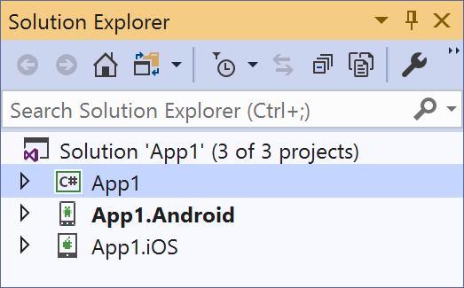

The pattern most often used for mobile app development is to develop twice. Once for Android and once for iOS. This involves dealing with not only separate SDKs, but altogether different languages and toolsets.

Xamarin.Forms allows you to work in one integrated development environment, with one language. You create your UI once, and both iOS and Android use that UI definition, including the actions and events you code. Unlike some other cross-platform solutions, Xamarin.Forms isn't rendered in a webview. Instead, internally it uses the Android SDK or the iOS SDK to create native controls for native performance.

In this unit, we'll understand how Xamarin.Forms works and how the projects are structured to allow us to write code and UI definition once and run on multiple platforms.

## What is the Xamarin.Forms technology stack?

Xamarin.Forms is incredibly easy to use, but to appreciate how it manages all it does, let's take a look at the technologies involved.

> [!VIDEO https://www.microsoft.com/en-us/videoplayer/embed/RE4LC7e]

### Operating system

Like every piece of software running on just about any type of system, programs written for mobile devices run on operating systems. Operating systems provide several services, including providing access to critical things like memory and CPU. It's possible to write a program where the only services you consume come directly from the operating system.

Crafting mobile apps this way is very unusual. It means using C, and maybe even assembly to build your whole app.

### Platform SDKs

The platforms provide us higher-level abstractions, built on top of the operating systems called SDKs (Software Development Kits). The SDKs provide all the common tooling that most developers use to build apps. They include visuals like buttons and text entry fields, as well as services like networking and voice recognition. Common mobile development languages like Java, Kotlin, and Swift target the platform SDKs.

### Xamarin.iOS and Xamarin.Android

The next layer is the first Xamarin layer. Xamarin.Android and Xamarin.iOS provide C# access to all those Platform SDKs and operating system services. So for instance, you can use C# to access a java.lang.string object or an Android text input. The same applies with iOS types.

Xamarin.Android and Xamarin.iOS also give us .NET. Including the runtime and Base Class Libraries (BCL). That's where we find things like List\<T>, HttpClient, System.String. All the types .NET developers are used to.

Xamarin also makes most platform types interact seamlessly with the .NET BCL types. For example, I can assign a .NET System.String to be displayed by an iOS UILabel, and it just works.

Using Xamarin.iOS and Xamarin.Android directly to craft mobile apps is a popular choice. It can be an excellent option and allows our Android and iOS apps to share some logic. However, we'd still need to craft the user interface for each platform separately. For example, if we wanted a screen with a button, in the Xamarin.Android project we'd need to create an android.widget.button and in the Xamarin.iOS project we'd create a UIButton.

### Xamarin.Forms

If we want to define our UI and UI behavior just once, that's where Xamarin.Forms comes in.

In a Xamarin.Forms project, we define the UI and event handler code just once and every type is interpreted based on the platform on which the app is running. If the app uses a `Xamarin.Forms.Button` and we run it on iOS -- we'll get an iOS UIButton. If we run on Android, we'll get `Android.Widget.Button`. Because Xamarin.Forms always uses the built-in platform SDK types, we get the optimal performance that goes along with that.

> [!TIP]
> We mostly talk about what Xamarin.Forms can do in terms of mobile apps on iOS and Android. Xamarin.Forms code can also run on Windows, through the Universal Windows Platform (UWP), as well as Mac and Linux desktops.

## What does Xamarin.Forms offer?

As we've seen, Xamarin.Forms makes it easy to access common controls like buttons. Other common controls, like text entry fields, labels, and date pickers are just as easy. But individual controls aren't enough to make a good platform for creating rich apps. Xamarin.Forms also gives us:

- An elaborate layout engine for designing our pages.
- Multiple page types for creating rich navigation types, like drawers.
- Support for XAML and data-binding, for more elegant and maintainable development patterns.

You can also extend Xamarin.Forms functionality in a number of ways:

- NuGet packages help you to use third-party and other Microsoft libraries in your Xamarin.Forms apps.
- Native controls. For instance, when your Xamarin.Forms app runs on Android, it might include a floating action button. Or, on iOS, you might include a UISegmentedControl.
- Custom controls. You can always make your own completely custom controls available to Xamarin.Forms. In fact, if the control already exists for Android and iOS, exposing it to Xamarin.Forms is often just a few lines of code.

We'll discuss native and custom controls more in other modules.

### Xamarin.Essentials

Core Xamarin.Forms makes the user interface easier to manage. But Xamarin.Essentials handles many of the common needs of mobile apps that *don't* have to do with the UI. That means that after you've added the Xamarin.Essentials NuGet package, you can access things like the GPS, the accelerometer, and battery and network states. There are dozens of sensors and services common to mobile development that Xamarin.Essentials gives us convenient access to.

Visual Studio's new project templates for Xamarin.Forms apps all include the Xamarin.Essentials NuGet package automatically.

## How to get started

With Visual Studio and the mobile development workload installed, we have what we need to get started building mobile apps. Even the free Community Edition of Visual Studio works.

To create a new project from Visual Studio 2019, go to the New Project dialog box, and search for "mobile". Then select the **Mobile App (Xamarin.Forms)** template. (We'll be doing exactly this during our first coding exercise.) You'll then enter a name and location for your new project. The next dialog box has a few starter app templates from which to choose. Select **Blank** because we'll be adding our own custom navigation and pages. As you'll see in our first exercise, even the blank app template comes with a starter "Hello World" type page, so it's not quite completely blank. This is also the dialog where you will pick the platforms you wish to support with your Xamarin.Forms app.

The structure of the solution looks like this:



We notice three projects are created in the solution. They all have the same root name, but two of them have a suffix (".iOS" or ".Android"). Those projects compile to executable programs, one for each platform. These are sometimes called *head projects*. The third project is used by the executables, and it's where we'll put all the code and markup we want them to have in common. In a typical Xamarin.Forms solution, almost all of our work will happen in this third project.

### Head projects

Taking a closer look at the head projects, we can see that iOS and Android have different basic constructions. For instance, iOS has a Main.cs and an AppDelegate.cs, but Android has a MainActivity.cs. The reason they're different is that the iOS project's construction uses the same building blocks as any iOS project, including Objective C or Swift projects. The Android project uses the same building blocks as a Java or Kotlin Android project. Fundamentally, these _are_ just an Android app and an iOS app (using Xamarin.iOS and Xamarin.Android, respectively, to expose their APIs as C# classes).

:::image type="complex" source="../media/2-head-projects-with-contents.png" alt-text="Screenshot showing platform-specific head projects, with project file structure and contents expanded.":::
    The Android app, App1.Android, includes an Assets folder, Resources folder, and MainActivity.cs. The iOS app, App1.iOS, includes Asset Catalogs, Native References, Resources, AppDelegate.cs, and Entitlements.plist.
:::image-end:::

If we look at the main entry point for each project type, we see that each one initializes Xamarin.Forms, and explicitly gives our Xamarin.Forms app the ability to control how the UI is created.

In iOS, we see this in the **FinishedLaunching** method of the **AppDelegate.cs** file.

```csharp
public override bool FinishedLaunching(UIApplication app, NSDictionary options)
{
    global::Xamarin.Forms.Forms.Init();
    LoadApplication(new App());
    ...
}
```

In Android, it's in the **OnCreate** method of the MainActivity.cs file.

```csharp
protected override void OnCreate(Bundle savedInstanceState)
{
    ...
    global::Xamarin.Forms.Forms.Init(this, savedInstanceState);
    LoadApplication(new App());
}
```

> [!TIP]
> If we wanted our Xamarin.Forms project to run on even more platforms, we'd add more head projects to the solution. Those would have their own ways to load and initialize Xamarin.Forms.

That call to `LoadApplication()` has a reference to `new App()` in it. That `App` class is our Xamarin.Forms app. That's where we'll be defining the UI and behavior for our application.

The **References** section in our head projects will show that each head project references the common project. The head projects, and the common project, also reference the Xamarin.Forms libraries. That's how we're able to use Xamarin.Forms functionality.
