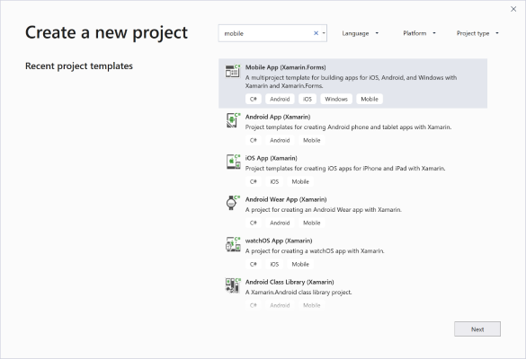
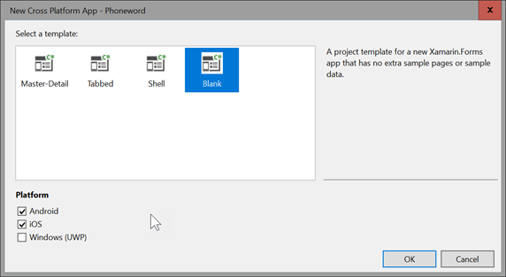
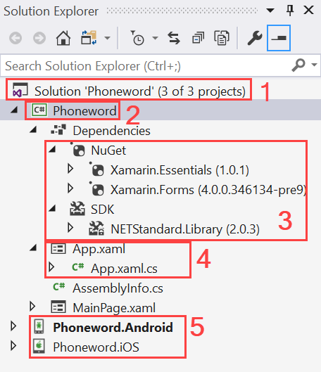
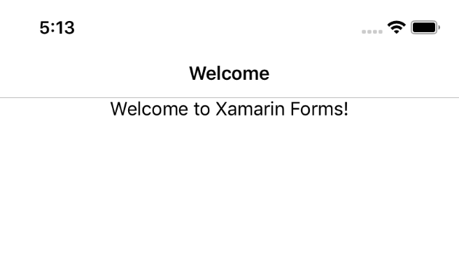

In this exercise, we'll create our first Xamarin.Forms solution. We'll add to this solution later to create our custom user interface and add functionality.

## Create a new project

Open Visual Studio and create a new solution. This opens the **New Project** wizard in Visual Studio.

1. In the **New Project** wizard, search for "mobile" and select the **Mobile App (Xamarin.Forms)** template.

    

1. Name the project **Phoneword**, and select **Create** to continue.

1. Select the **Blank App** to create an app with minimal XAML-based UI.
1. Select **OK** to create your solution.

    

## Examine the solution structure

Explore the Xamarin.Forms solution to learn each item's purpose within a Xamarin.Forms app.

1. **Solution Node** - The source code is organized within a single solution. There are multiple, related projects, including a shared project and a project for each supported platform.

2. **Shared Code** - This is the **.NET Standard** class library. It's referenced by each platform-specific project.

3. **.NET and NuGet References** - This is the list of references used by the shared library. Notice that it includes a subset of the .NET libraries.

4. **Application definition** - New Xamarin.Forms projects include a class that derives from the `Application` class. This class is responsible for presenting the UI. When you create a project in Visual Studio, this file will be named **App.xaml.cs**, and is nested under **App.xaml**.

5. **Head Projects** - These are the platform-specific projects: one for each platform we're building an app for. These projects create the actual applications you deploy, and each references the shared code and the Xamarin.Forms NuGet package. Each one will call its own `Xamarin.Forms.Init` method to create the initial app screen.

Open the MainPage.xaml and change "Welcome to Xamarin.Forms!" to any message you want.

## Select a startup project

Select the platform project you want to run in Solution Explorer. Right-click the project node, and select **Set as Startup Project**. Remember, you can't run the shared compiled project directly. You must choose one of the platform specific projects.

Depending on which platform you run on, the build will restrict the places you can deploy to. For example, iOS projects won't be able to be deployed to Android devices and vice versa. Additionally, running the project on an iOS device or simulator requires either developing in Visual Studio for Mac directly or connecting Visual Studio to a macOS build device.

## Run the application

Run the application on a device, or in a simulator or emulator, by selecting the play icon in the toolbar.

This builds, deploys, and runs the application on the selected device or emulator.

It should display a welcome message or your custom text as shown here:

If you have trouble setting a project as active, or you get deployment errors, check the build type and the solution configuration to see which projects are being built.
