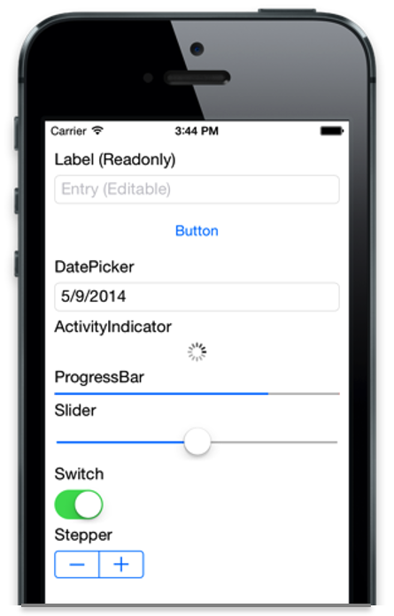
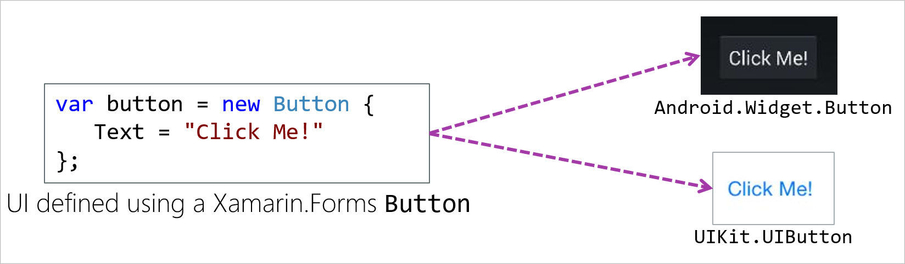
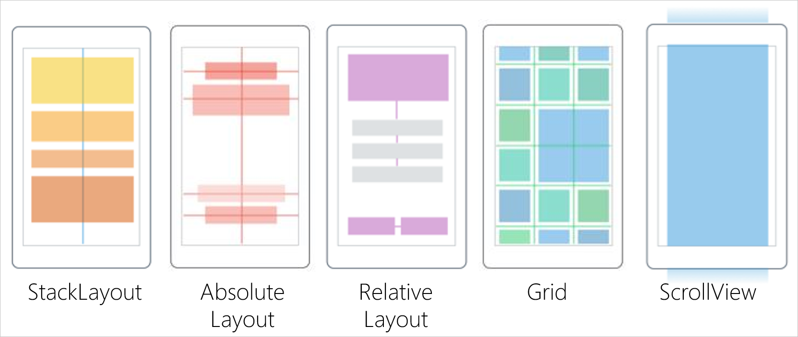

In this module, we'll learn more about the building blocks of the Xamarin.Forms application and navigation structure, and begin defining a custom UI.

## What's in a Xamarin.Forms project?

The Xamarin.Forms app that was created from our "Blank App" template started with two classes: App and MainPage. The `.cs` files for these classes are actually "tucked under" the `App.xaml` and `MainPage.xaml` file listings in Solution Explorer.

The .xaml files themselves are a useful way to define an applications user interface (UI) without using code. It's somewhat analogous to HTML--a markup language to describe UI layout. There are advantages to using XAML and advantages to creating your UI in code.

### Application class

The `App` class represents our Xamarin.Forms application as a whole and inherits from `Xamarin.Forms.Application`. We'll recall from the last unit that it's the `App` class that is instantiated and loaded by the head projects. The constructor of the `App` class will, in turn, set its own `MainPage` property. It's this property that will control the first screen the user sees.

The `App` class also has:

- Methods for handling life-cycle events, including when the app is sent to the background (that is, when it ceases to be the foreground app).
- Events to respond to changes in the modal stack (this is a type of navigation, discussed in another module).
- A property called `Properties`. This is a `PropertyBag` that automatically persists any data added to it.

### Pages

Pages are the root of the UI hierarchy in Xamarin.Forms. The solution we've seen so far included a class called `MainPage`. The `MainPage` class derives from `ContentPage`, which is the simplest and most common page type. A content page simply displays its contents. Xamarin.Forms has several other built-in page types, too, including the following:

- `FlyoutPage`: Manages two panes of information. A `Flyout` page that generally shows a list or menu, and a `Detail` page that shows a selected item from the flyout page.
- `NavigationPage`: Adds the familiar navigation bar to the top of the screen, but more importantly manages a *navigation stack*. This stack allows the user to navigate backward to previous screens.
- `TabbedPage`: The root page used for tab navigation.

As you can see, the other page types are mostly for enabling different navigation patterns in multi-screen apps. We look at these patterns in another module.

## How to build a content page

We know now that to display stuff in an app, we'll want to use a content page. So let's start to figure out how to build up our page to have the stuff we want laid out in the way we want.

### Views

Views in Xamarin.Forms are just like the controls we've used in other UI frameworks. The Xamarin.Forms docs (see the link at the end of this module) describe all the built-in controls, but a few of the most common can be seen here:



The views in Xamarin.Forms use the event handling and property setting patterns we'd see in other .NET-based UI frameworks.

For example, you can create a new button with its `.Text` property set, and a `.Clicked` event subscriber, with the following code:

```csharp
var button = new Button() {
    Text = "Click Me"
};
button.Clicked += OnClick
void OnClick (object sender, EventArgs e) { /*do something*/ }
```

Let's take a closer look at what this code produces, though. On iOS, we get a default-looking iOS button. On Android, we get an Android button.



It works this way because Xamarin.Forms doesn't draw any controls directly. Instead, there's a platform renderer for each control on each platform. So when we run on Android, the Android button renderer is invoked, and it creates a native button.

We can also control the appearance of our controls by setting properties on the Xamarin.Forms object. The platform renderer performs all the necessary type conversions and translations for us. It also sets the property on the underlying native control whenever we change a Xamarin.Forms visual property.

Not all the native properties of a control are exposed by Xamarin.Forms. But there are still ways to get all the customization we might want. We'll see those techniques in another module.

### Layouts

With pages and views defined, it might seem like we have everything we need to start creating a UI. However, let's say we add two controls to a page: an entry field and a button. In some UI frameworks, we'd assume those would flow top to bottom and left to right, and things like height, width, and line-breaks would be set with control properties.

But in Xamarin.Forms, we use a more flexible system called layouts. When you choose a layout, you're choosing the rules by which your controls will be laid out.



These illustrations show some of the built-in layout types. We'll get to know them all a lot better in future modules, but let's do a quick overview:

- StackLayout - Lays out controls in a top-to-bottom or left-to-right stack depending on an orientation property.
- AbsoluteLayout - Lets us set exact coordinates for controls.
- RelativeLayout - Lets us define relationships between multiple controls' sizes and shapes. For instance, `button1` should be 50% the size of `entry1` and should be 5 points below it.
- Grid - Lays out its controls according to a column and row location we set. We can define the column and row sizes and spans, so grid layouts don't necessarily have a "checkerboard look" to them.
- ScrollView - Technically, this isn't considered a layout, since it only holds one child directly but it's very important to screen layouts. By default, all the other layouts will actually try to squeeze their contents, if necessary, to fit on a single screen. But if those other layouts are put inside a ScrollView, then the screen can scroll and squeezing the contents isn't necessary.

We can also nest our layouts for even more flexibility.

The only layout we need for our proof-of-concept is the `StackLayout`. To work with it, we'll instantiate it, and make sure the orientation property is set as we need it to make the children flow top-to-bottom:

```csharp
var layout = new StackLayout{
    Orientation = StackOrientation.Vertical
};
```

We can then add controls to it using its Children property.

```csharp
layout.Children.Add(new Label {Text="Enter Name"});
layout.Children.Add(new Entry());
layout.Children.Add(new Button{ Text= "Ok"});
```

The `Orientation` property we set will control the flow of the stack.


By default, when we use `.Vertical` orientation, each control fills the full width of the parent.

Now that we have a `StackLayout` with controls added to it, we need to add the layout to the `.Content` property of our `ContentPage`. Within a content page, if you created the above layout, you would add this assignment to make the layout display for the content page.

```csharp
this.Content = layout;
```

This will cause `mainPage` to display the contents of the `StackLayout` using the layout rules of the `StackLayout` class and the properties we set on it.

#### Layout whitespace

A reasonably nice layout for our proof-of-concept app will also require giving our controls a little breathing room. We have a few different properties we can use to do this, depending on what we want to accomplish.

Each control has a `.Margin` property that's respected by the layouts. You can think of margin as the control pushing others away.

All the layouts have a `.Padding` property that keeps any of their children from getting close to the border of the layout. One way to think of this is that all the controls are in a box, and that box has padded walls.

The final whitespace setting relevant for our first Xamarin.Forms app is the `.Spacing` property of `StackLayout`. This is the space between all the children of the `StackLayout`. This is additive with the control's own margin, so the actual whitespace will be margin plus spacing, where both apply.
