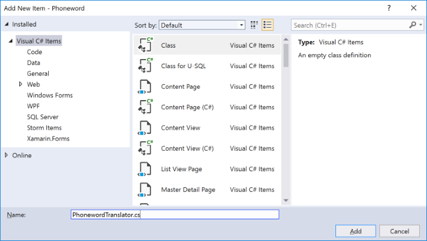
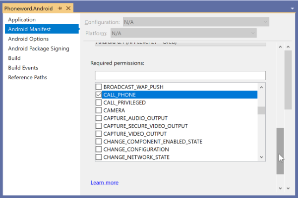
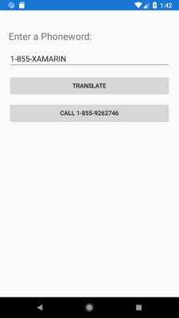

Now it's time to get our proof-of-concept working. We'll build a UI that takes advantage of not just Xamarin.Forms, but also the Xamarin.Essentials NuGet package that will dial the phone.

The app will let the user type text into an input field, and will translate that text to numeric digits. It will use the letters that show up on a telephone keypad as the basis for translation. For example, the letters "cab" translate to "222" because the digit "2" has all three letters "abc".

## Open the Phoneword solution

You'll continue with the Phoneword solution you created in the previous exercise. Open the solution in Visual Studio if you don't already have it open.

## Add a new C# source file

1. Right-click on the shared project named **Phoneword**, and select **Add** > **Class...**.
1. Name the file **PhonewordTranslator.cs**.



## Add the translation logic

Place the following static class code into the new PhonewordTranslator.cs source file. This code is a single `public static` method, which will translate the number from alphanumeric text into a regular numeric phone number.

```csharp
using System.Text;

namespace Core
{
    public static class PhonewordTranslator
    {
        public static string ToNumber(string raw)
        {
            if (string.IsNullOrWhiteSpace(raw))
                return null;

            raw = raw.ToUpperInvariant();

            var newNumber = new StringBuilder();
            foreach (var c in raw)
            {
                if (" -0123456789".Contains(c))
                    newNumber.Append(c);
                else
                {
                    var result = TranslateToNumber(c);
                    if (result != null)
                        newNumber.Append(result);
                    // Bad character?
                    else
                        return null;
                }
            }
            return newNumber.ToString();
        }

        static bool Contains(this string keyString, char c)
        {
            return keyString.IndexOf(c) >= 0;
        }

        static readonly string[] digits = {
            "ABC", "DEF", "GHI", "JKL", "MNO", "PQRS", "TUV", "WXYZ"
        };

        static int? TranslateToNumber(char c)
        {
            for (int i = 0; i < digits.Length; i++)
            {
                if (digits[i].Contains(c))
                    return 2 + i;
            }
            return null;
        }
    }
}
```

## Restructure the boilerplate code

Next, let's restructure the code a little. We'll be creating our own code-based UI, so we'll delete the generated XAML UI from the project template.

1. In Solution Explorer, right-click on the existing MainPage.xaml file, and choose **Delete**. This action also deletes the code-behind MainPage.xaml.cs file.
1. Create a new class in a new file named `MainPage`. You can use the same process as above to create the new class file.
1. Make the class derive from `ContentPage`. Add a `using Xamarin.Forms` statement, because `ContentPage` is in the `Xamarin.Forms` namespace.

    ```csharp
    using Xamarin.Forms;
    ...
    public class MainPage : ContentPage
    {
        public MainPage()
        {
        }
    }
    ```

## Create the UI for Phoneword

Next, we need to describe the user interface for Phoneword. We are using controls defined in Xamarin.Forms, which will then be rendered with native implementations in each project.

1. Working in the **MainPage.cs** constructor, do the following.
1. Set the page's `Padding` to "20" all around. Setting the margin will ensure the controls aren't against the edge of the screen.
1. Create a `StackLayout` with `Spacing = 15`.
1. Create the required controls for the Phoneword UI:
    * A [`Label`](https://docs.microsoft.com/dotnet/api/Xamarin.Forms.Label?view=xamarin-forms) with the `Text` property set to "Enter a Phoneword:".
    * An [`Entry`](https://docs.microsoft.com/dotnet/api/Xamarin.Forms.Entry?view=xamarin-forms) that allows the user to edit the phone number, which is used to collect the input from the user. It should be initialized with the `Text` "1-855-XAMARIN". The user can replace the initial text with their own; however, pre-populating it with a phoneword is convenient for testing.
    * A [`Button`](https://docs.microsoft.com/dotnet/api/Xamarin.Forms.Button?view=xamarin-forms) that runs the logic to translate the phone number. Its `Text` property should be set to "Translate".
    * A second `Button` displaying the `Text` "Call", which places the call. This `Button` should be initially disabled (use the `IsEnabled` property).
    * Store the `Entry` and the two `Button` controls in class fields, so you can interact with them later.
1. Add the controls to the `StackLayout`.
1. Assign the `StackLayout` to the `Content` property of `MainPage`.

```csharp
public class MainPage : ContentPage
{
   Entry phoneNumberText;
   Button translateButton;
   Button callButton;

   public MainPage()
   {
        this.Padding = new Thickness(20, 20, 20, 20);

        StackLayout panel = new StackLayout
        {
            Spacing = 15
        };

        panel.Children.Add(new Label {
            Text = "Enter a Phoneword:",
            FontSize = Device.GetNamedSize(NamedSize.Large, typeof(Label))
        });

        panel.Children.Add(phoneNumberText = new Entry {
            Text = "1-855-XAMARIN",
        });

        panel.Children.Add(translateButton = new Button {
            Text = "Translate"
        });

        panel.Children.Add(callButton = new Button {
            Text = "Call",
            IsEnabled = false,
        });

        this.Content = panel;
    }
}
```

## Respond to button taps

Subscribe a handler to the `Clicked` event of the **Translate** button. Use a method named `OnTranslate`. This method takes an `object` and an `EventArgs` as parameters.

Your handler should translate the entered value by using the `PhonewordTranslator.ToNumber` method. Your handler should store the result in a field named `translatedNumber`.

Here are some additional hints for the code:

* Retrieve the phone number from the `Text` property of the `Entry` control.
* The `PhonewordTranslator` class is in the `Core` namespace.
* The `PhonewordTranslator.ToNumber` method returns `null` if the number can't be translated.

When you're done, your code should resemble:

```csharp
public class MainPage : ContentPage
{
    ...
    string translatedNumber;

    public MainPage()
    {
        ...
        translateButton.Clicked += OnTranslate;
        this.Content = panel;
    }

    private void OnTranslate(object sender, EventArgs e)
    {
        string enteredNumber = phoneNumberText.Text;
        translatedNumber = Core.PhonewordTranslator.ToNumber(enteredNumber);

        if (!string.IsNullOrEmpty(translatedNumber))
        {
            // TODO:
        }
        else
        {
            // TODO:
        }
    }
}
```

## Update the UI

Next, let's add some logic to change the `Text` of the Call button to include the phone number when it's successfully translated. You can use the value you stored in the `translatedNumber` field. Also, enable and disable the button based on the successful translation. For example, if `TranslateNumber` returned `null`, disable the button, but if it was successful, enable it.

* Use the `IsEnabled` property to enable and disable the button.
* Make sure to reset the `Title` of the Call button if the number translation fails (that is, remove the phone number).

```csharp
private void OnTranslate(object sender, EventArgs e)
{
    string enteredNumber = phoneNumberText.Text;
    translatedNumber = Core.PhonewordTranslator.ToNumber(enteredNumber);

    if (!string.IsNullOrEmpty(translatedNumber))
    {
        callButton.IsEnabled = true;
        callButton.Text = "Call " + translatedNumber;
    }
    else
    {
        callButton.IsEnabled = false;
        callButton.Text = "Call";
    }
}
```

## Add an event handler to the call button

Subscribe a handler to the `Clicked` event of the **Call** `Button`. Add the handler after the current `translateButton.Clicked` handler.

```csharp
public MainPage()
{
    ...
    translateButton.Clicked += OnTranslate;
    callButton.Clicked += OnCall;
    this.Content = panel;
}

...

void OnCall(object sender, System.EventArgs e)
{

}
```

## Display an alert

The following steps add the logic to the `OnCall` method.

1. Prompt the user, by using [`Page.DisplayAlert`](https://developer.xamarin.com/api/member/Xamarin.Forms.Page.DisplayAlert/p/System.String/System.String/System.String/System.String), to ask if they'd like to dial the number.

1. The `DisplayAlert` method returns a `Task`. Add the `async` keyword to **OnCall** and `await` the call to `DisplayAlert`. `DisplayAlert` takes a title, message, and two strings used for the **Accept** and **Cancel** button text. It returns a Boolean indicating whether the **Accept** button was pressed to dismiss the dialog box.

Use the following parameters:

| Property      | Value            |
| ------------- | ---------------- |
| Title       | "Dial a Number"  |
| Message     | "Would you like to call xxxx", by using the translated number. |
| "Yes" and "No" | For the **Accept** and **Cancel** buttons. |

```csharp
async void OnCall(object sender, System.EventArgs e)
{
    if (await this.DisplayAlert(
        "Dial a Number",
        "Would you like to call " + translatedNumber + "?",
        "Yes",
        "No"))
    {
        // TODO: dial the phone
    }
}
```

## Run the application

Build and run on any platform. It should display the alert, and allow you to dismiss it with either a **Yes** or **No** response.


## Use the Xamarin.Essentials library to dial the phone

Next, we'll use a cross-platform library called Xamarin.Essentials, which abstracts several platform-specific functions through a single API. Xamarin.Essentials offers a phone dialing API to make calls on the iOS and Android platforms. This library is provided as a NuGet package that we add to each of our projects. Because it provides implementations for our platforms and the shared abstraction, we add it to all of our projects.

### Add permissions to the Android project

To make calls on Android an additional step is required. We must explicitly declare the calling permission.

1. Open the **Properties** for the Android project. (Right-click on the project name in Solution Explorer and select "Properties")
1. Select **Android Manifest**.
1. In the **Required permissions** section, select the box next to the `CALL_PHONE` permission (see below).

    

### Call the Xamarin.Essentials dialer abstraction

We can now call the dialer system in Xamarin.Essentials in our shared code.

Open MainPage.cs, and replace the `TODO` line in the `OnCall` method with the following code. Add the `using Xamarin.Essentials` statement to make the `PhoneDialer` class available.

```csharp
using Xamarin.Essentials;
...

async void OnCall(object sender, System.EventArgs e)
{
    if (await this.DisplayAlert(
        "Dial a Number",
        "Would you like to call " + translatedNumber + "?",
        "Yes",
        "No"))
    {
        try
        {
            PhoneDialer.Open(translatedNumber);
        }
        catch (ArgumentNullException)
        {
            await DisplayAlert("Unable to dial", "Phone number was not valid.", "OK");
        }
        catch (FeatureNotSupportedException)
        {
            await DisplayAlert("Unable to dial", "Phone dialing not supported.", "OK");
        }
        catch (Exception)
        {
            // Other error has occurred.
            await DisplayAlert("Unable to dial", "Phone dialing failed.", "OK");
        }
    }
}
```

## Run the application

1. Run the application by using a platform of your choice. Be sure to try both the translate and dial buttons.
1. If you have time, run the app on each supported platform, and try stepping through the program to see it jump into the platform-specific code. For some extra fun, try running on a real device!

Many emulators and simulators will not properly simulate dialing the phone. However, the Android SDK Virtual Devices are an exception. On other simulated platforms, your code might throw an exception when it tries to dial the phone. If you get an exception, you can comment out the code to dial the phone, or wrap it in a `try` / `catch` statement.



## Summary

In this exercise, you've added a custom UI to your application by using pages and views. You also added support for placing a call by using platform-specific APIs available in iOS and Android.

You can view the completed solution in the **src** > **exercise1** > **final** folder within your cloned or downloaded copy of the [!INCLUDE [module-exercise-repo](module-exercise-repo.md)].
