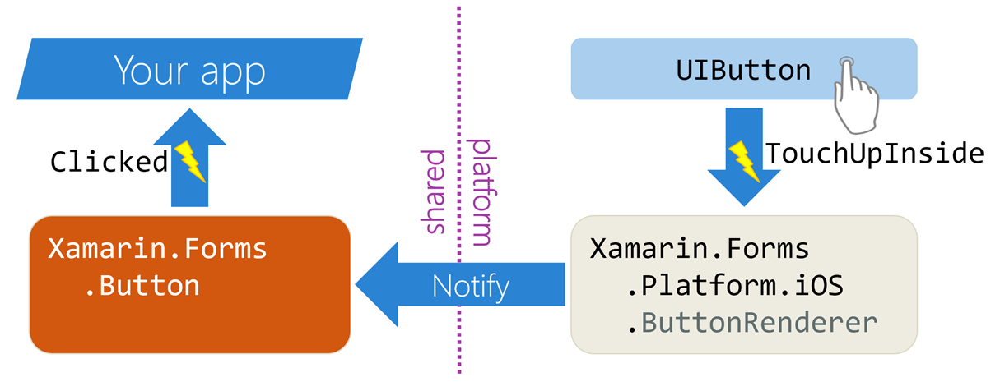

Xamarin.Forms uses renderers to make controls work on every supported platform. To change control behavior or make new controls, you have to understand how renderers do their job.

## How do Xamarin.Forms renderers work?

Xamarin.Forms is an abstraction layer. It allows app developers to declare, either via XAML or via code, that an element should be on the screen. But Xamarin.Forms has no direct way to change the pixels of the screen to display objects like buttons. Nor does it have a way to directly register a click when the screen is touched in the area of that object.

Instead, Xamarin.Forms outsources those jobs to the native APIs. When we run our Xamarin.Forms app on Android, our button is actually an `Android.Widget.Button`. When we run on iOS, it's an iOS `UIButton`.

:::image type="complex" source="../media/buttonElementWithMatchingNativeControls.png" alt-text="Diagram of a button element with corresponding native controls.":::
    Left-hand "shared" side of diagram is the source code for a Button class inheriting from Element. Right-hand "platform" side shows an Android.Widget.Button and a UIKit.UIButton.
:::image-end:::

Most user-interface platforms use the term "control" to refer to reusable items like buttons, labels, and switches. This convention is sometimes used in Xamarin.Forms as well. But that terminology can cause confusion when we're discussing low-level Xamarin.Forms features. "Control" might refer to a `Xamarin.Forms.Button` or to the underlying `Android.Widget.Button`. To avoid confusion, we'll call the Xamarin.Forms types "elements" because they all derive from `Xamarin.Forms.Element`. We'll call the native types "native controls."

Xamarin.Forms manages native controls by using objects called *renderers*. Every Xamarin.Forms element, on every platform, has its own renderer type. That means for a `Button` we have a `Xamarin.Forms.Platform.iOS.ButtonRenderer` and a `Xamarin.Forms.Platform.Android.ButtonRenderer`. If our app were targeting other platforms, like Mac or UWP, we'd need those button renderers as well. The renderer creates the native control that will do the actual painting of pixels to the screen.

:::image type="complex" source="../media/buttonElementWithRenderers.png" alt-text="Diagram of button element with platform renderers.":::
    Left-hand "shared" side is an icon for a Xamarin.Forms.Button element. The right-hand "platform" side is the Xamarin.Forms.Platform.Android.ButtonRunderer rendering to an Android button and the Xamarin.Forms.Platform.iOS.ButtonRenderer rendering to an iOS button.
:::image-end:::

The renderer also has to handle property changes on the Xamarin.Forms element. That often involves data conversion. If, for example, we set `myButton.BackgroundColor=Color.Blue`, the renderer is responsible for the following:

1. Noticing the change.
1. Converting `Xamarin.Forms.Color` to an Android or iOS color type.
1. Setting the property on the native control.

The renderer is also responsible for handling and routing events. When a user clicks the native button, the renderer handles that event and notifies `Xamarin.Forms.Button` to raise its own `Click` event. Our app code can then handle the event.

The Xamarin.Forms NuGet package includes the renderers for all the built-in elements on all supported platforms.
