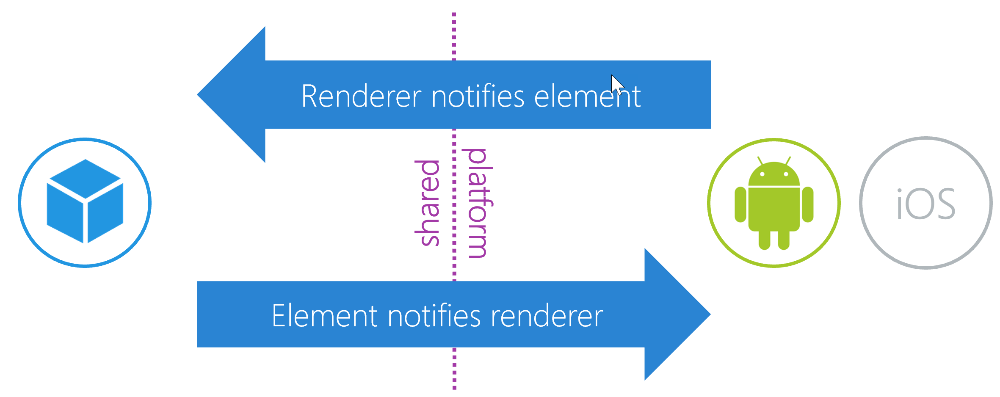

The Xamarin.Forms element and the platform renderers share the responsibility of putting the native control on the screen and managing its behavior. Part of managing behavior is making sure data and notifications flow between the element and the native control.

Earlier, we used a `BindableProperty` to allow data changes to flow from the element to the renderer and native control. But sometimes the `BindableProperty` pattern isn't appropriate because there might not be data to share or state to change. In these cases, we just want to notify other components.

Notifications can be required in both directions. Each direction needs to be handled differently.



## Renderer notifies element

Consider a Xamarin.Forms `Button`. When users activate the button, they're interacting with the native control. The native control notifies the renderer, which then needs to share the notification with the element.

Because the renderer has a reference to the element through its `Element` property, the renderer *can* call a public method on the element to notify it of the event. The method needs to be public because the renderer and the element instance are almost always in different assemblies. One is usually a .NET Standard library, and the other is a platform-specific executable.

The following code shows a renderer using a public `SendClicked` method on an element:

```csharp
public class ButtonRenderer : ...
{
    protected override void OnElementChanged(...)
    {
        ...
        Control.Tapped += Element.SendClicked();
    }
}
```

This method is functional, but it requires the element to expose some of its internal workings as public properties. So items other than the renderer have easy access to the `SendClicked` method.

> [!NOTE]
> When you design reusable controls, it's a best practice to make the public API (application programming interface) as simple as possible. Extra methods, especially those that aren't thoroughly tested for use by app code, can confuse app developers and cause unintended behavior.

This code shows a page using the `SendClicked` method, which we'd like to avoid:

```csharp
public class Button : View
{
    public void SendClicked();
}
```

```csharp
public class MainPage : ContentPage
{
    public MainPage()
    {
        ...
        var button = new Button();
        button.SendClicked(); // This method should be available to the renderer only!
    }
}
```

### Hide methods by using explicit interface implementation

One way to hide methods that we don't want to be fully public is to use *explicit interface implementation*. This technique is used by many of the built-in controls in Xamarin.Forms.

The first step is to extract the methods we want to hide into an interface:

```csharp
public interface IButtonController
{
    void SendClicked();
}
```

Next, in our element code, we'll use explicit interface implementation, meaning the method name is prefixed with the interface:

```csharp
public class Button : View, IButtonController
{
    ...
    void IButtonController.SendClicked()
    {
        // Handle notification, perhaps raise our own event
    }
}
```

When the interface is implemented in this way, the `SendClicked` method *can't be called* on a variable of type `Button`, and the method isn't visible to tools like IntelliSense. If you want to call the interface method, you need to explicitly cast the element to the interface type:

```csharp
public class ButtonRenderer : ...
{
    protected override void OnElementChanged(...)
    {
        ...
        Control.Tapped += (Element as IButtonController).SendClicked();
    }
}
```

This technique doesn't *prevent* other code from calling the explicitly implemented methods by using the same casting. But it discourages it and clearly separates these methods from the public API.

## Element notifies renderer

We also need to enable notifications to flow from the element to the renderer. For example, we want to be able to clear our `SketchView` to remove everything the user has drawn so far.

Our element will need to tell the renderer to clear the native object. The element doesn't have a reference to the renderer to make a direct method call, so we'll use a pattern called "Publish/Subscribe" (pub/sub).

There are many ways to implement pub/sub. In C#, the most common way is to use an event. When we raise an event, we're "publishing" a notification and an event consumer is "subscribing" to that notification. In the case of an element and renderer, using events could lead to memory leaks if we aren't *very* careful, because events tightly couple publisher and subscribers with object references. Xamarin.Forms provides a framework for loosely coupled notifications called `MessageCenter`. We'll use `MessageCenter` for our pub/sub.

`MessageCenter` has a static `Send` method for publishing and a `Subscribe` method. Both accept a message name parameter. In the message name and generic type arguments don't match, the message won't be delivered to the subscriber.

### Unsubscribe from notifications

It's a good practice to unsubscribe from `MessageCenter` notifications when your renderer is `disposed`. Doing so will keep `MessageCenter` performing optimally and might prevent memory leaks.
