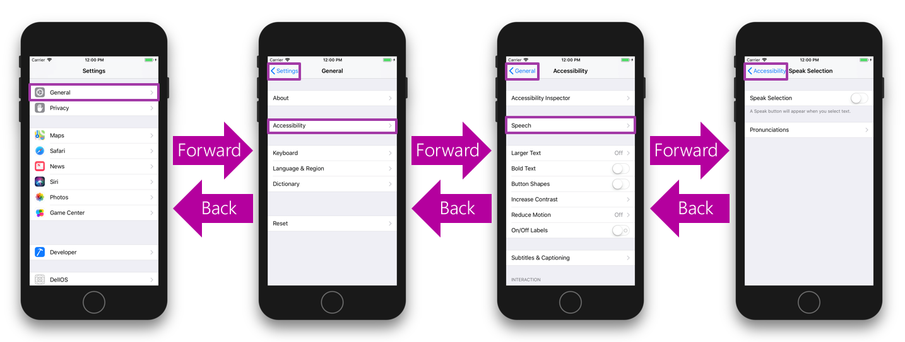
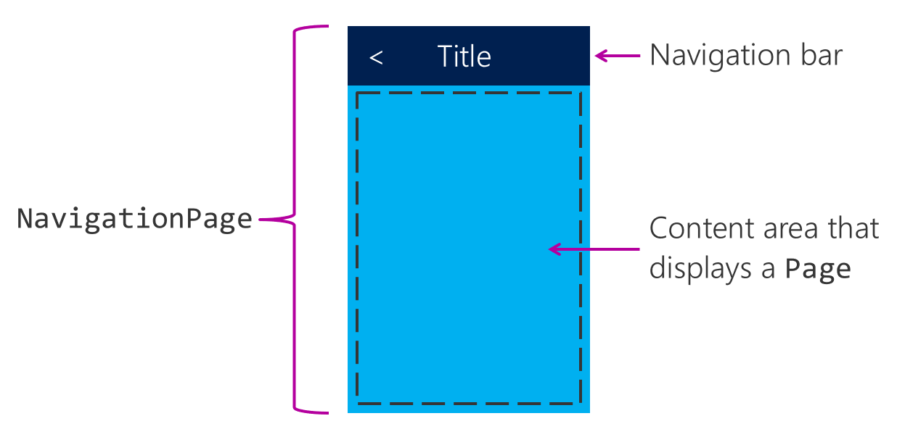
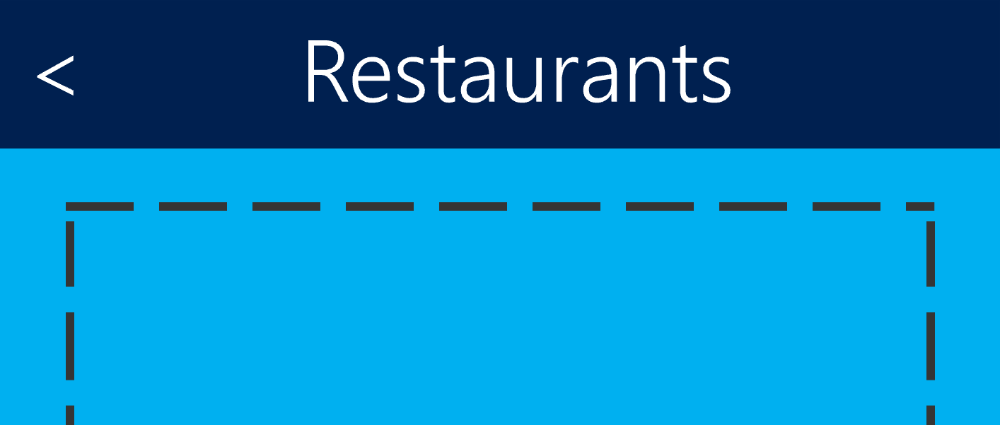

The UI of most apps is made up of multiple pages. When we use the term _navigation_, we mean the set of transitions between these pages. Navigation includes both the UI and the user actions needed to take the user from page to page.

One such navigation system is _stack navigation_. This pattern lets the user move forward to new pages and back to previous pages. The user starts at a screen, makes a selection, and moves to a new screen. Some form of "back" button is provided to return to previous choices. The following screenshots show the use of stack navigation in the iOS settings page.



Stack navigation works well for a linear path through a hierarchy of pages. It's especially useful when the pages progress from general to specific. For example, in a conference app, you might have a root page along with separate pages for speakers, sessions, and local venues. You could then move from general to specific through those pages. The following illustration shows the hierarchy of pages in the conference app.

:::image type="complex" source="../media/2-stack-navigation-general-to-specific.png" alt-text="Illustration of a fictitious conference app's page structure tree with one navigation path highlighted.":::
    Navigation tree goes from a general home page to more specific pages. The highlighted navigation path includes four pages of increasing detail: Home, Food, Restaurants, and Restaurant Details.
:::image-end:::

Stack navigation uses a _stack_ data structure to store the sequence of pages. Moving to a new page will _push_ that page onto the navigation stack. When you go back, it will _pop_ the current page off of the stack to reveal the previous page.

## Use NavigationPage for stack navigation

In Xamarin.Forms, stack navigation is accomplished by using a `NavigationPage`. A `NavigationPage` manages its own stack for holding the pages it has presented to the user. It displays a navigation bar and has a content area for the currently displayed page, the top of its navigation stack. The following illustration shows the UI areas provided by `NavigationPage`.



You must have a `NavigationPage` instance in your app's visual tree to use the navigation stack. Typically, the `NavigationPage` is used as a top-level page.

You're also required to have at least one page on the navigation stack. The `NavigationPage` class offers a constructor that takes an initial, or root, page parameter for the stack. In this code, we're passing an instance of the `HomePage` class as the initial page to be shown, and then setting our new `NavigationPage` as the initial page of our app.

```csharp
public partial class App : Application
{
    public App()
    {
        ...
        var homePage = new HomePage();
        var navPage = new NavigationPage(homePage);
        this.MainPage = navPage;
        ...
    }
}
```

## Move between stack pages

When we have a `NavigationPage` in place, the `NavigationPage` class provides methods for adding and removing pages from the stack. This is how we change what page the user is seeing. Here are the methods available.

```csharp
public class NavigationPage : ...
{
    ...
    Task PushAsync(Page page, bool animated);
    Task PushAsync(Page page); // 'animated' is true

    Task<Page> PopAsync(bool animated);
    Task<Page> PopAsync(); // 'animated' is true
}
```

Most navigation operations are asynchronous. These methods are all task-returning async methods, and you should await their completion.

## Move to a new page by using stack navigation

From a `NavigationPage` instance, we call `PushAsync` to add a new page to the stack. This new page will become the top page of the stack and will then be visible to the user.

The overloads of `PushAsync` let us control whether a platform-specific navigation animation will run during the page transition. The first method takes the `Page` to be moved to, and a Boolean to control animation. The animation runs when the Boolean is true. The second overload, without the Boolean parameter, always shows the animation.

## Return to a previous page by using stack navigation

We have similar methods to remove pages from the stack. Calling `PopAsync` will remove the top page from the stack, and show the user the previous page. The overloads let us control the animation.

## Handle back button navigation

The navigation bar shown at the top of your `NavigationPage` UI includes a back button that automatically pops the current page of the navigation stack. The following illustration shows a conceptual example of the back button that's built in to `NavigationPage`.



Back navigation can also be handled automatically by device back-buttons and navigation gestures.

## Access the current stack for navigation methods

To access these stack navigation methods from within your app's various pages, use the `Navigation` property found on all Xamarin.Forms `Page` classes. Xamarin.Forms sets the `Navigation` property to refer to the current `NavigationPage` in use. From this reference, you can call the `PushAsync` and `PopAsync` navigation methods.

```csharp
public partial class FoodPage : ContentPage
{
    async void OnRestaurantsClicked(object sender, EventArgs e)
    {
        var destination = new RestaurantsPage(...);
        await this.Navigation.PushAsync(destination);
        ...
    }
    ...
    async void OnCancelClicked(object sender, EventArgs e)
    {
        ...
        await this.Navigation.PopAsync();
    }
}
```