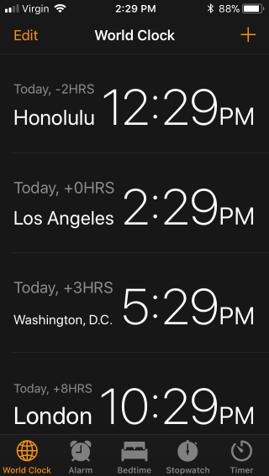
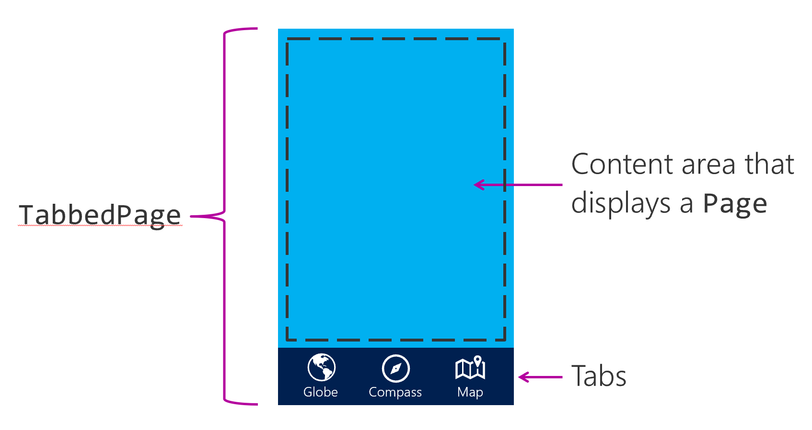

Tab navigation is a navigation pattern where a tab strip (a row of touchable controls) is permanently displayed at the top or bottom of the screen. Each tab represents a specific section or page of the app. Users select tabs within the tab strip to move between content in the application. The following illustration shows the use of tab navigation in the iOS Clock app.



Because the tab strip is always visible, tab navigation allows users to quickly switch between content in an application. Tab navigation is ideal when an application has several sections that a user is likely to use frequently. Clock applications are an excellent example. The clock, alarm, and stopwatch sections are likely to be frequently used.

On mobile devices, the tab strip typically has a limited amount of space and can display only a fixed number of tabs, depending on the device size and orientation. Xamarin.Forms recommends using only three to four tabs. If you include more tabs, you're not guaranteed to have enough space to show all of the tabs on all devices. The operating systems supported by Xamarin.Forms do allow for an overflow area. This area provides additional UI to access tabs that don't fit on screen. However, navigating to these overflow tabs requires additional steps by the user. These sections are less discoverable.

If you need more than four tabs, consider using another navigation pattern, like master-detail or drawer navigation.

## Tab navigation in Xamarin.Forms

`TabbedPage` implements tab navigation in Xamarin.Forms. This class displays a set of tabs and automatically switches the displayed content when the user selects a tab. The following illustration shows the UI areas provided by `TabbedPage`.



To use it, you first create an instance of `TabbedPage`, and then assign it to the App class' `MainPage` property. The `TabbedPage` instance holds child pages in its `Children` property. A tab is automatically displayed for each child page.

> [!WARNING]
> `TabbedPage` should be the root page in your application. Don't nest a `TabbedPage` inside another page.

## Create a TabbedPage

For example, create a `TabbedPage` instance in the constructor of the App class. Next, you instantiate the child pages and add them to the `Children` collection. Then, you assign your populated `TabbedPage` to `MainPage`. Typically, you populate all of the children at application startup. This approach differs from stack navigation, where you instantiate pages as they're needed.

```csharp
public partial class App : Application
{
    public App()
    {
        var tabbedPage = new TabbedPage();

        tabbedPage.Children.Add(new GlobePage());
        tabbedPage.Children.Add(new CompassPage());
        tabbedPage.Children.Add(new MapPage());

        MainPage = tabbedPage;
    }
}
```

Optionally, you can create a class that inherits from `TabbedPage`, and assign the child pages in XAML. You would then use this page as your app's `MainPage`.

```xaml
<?xml version="1.0" encoding="utf-8" ?>
<TabbedPage ...
    x:Class="WorldTraveler.HomePage">
    <TabbedPage.Children>
        <local:GlobePage ... />
        <local:CompassPage ... />
        <local:MapPage ... />
    </TabbedPage.Children>
</TabbedPage>
```

## Customize your tabs

Tabs are automatically created for each child page. The text on the tab is the page's **Title**. Optionally, you can add an `Icon` to the tabs. Tab icons are used on platforms that support them. The icons must be stored in the appropriate head-project: the **drawables** folders for Android, and the **Resources** or root of your iOS project.

```xaml
<TabbedPage.Children>
    <local:GlobePage Title="Globe" Icon="globe.png" />
    <local:CompassPage Title="Compass" Icon="compass.png" />
    <local:MapPage Title="Map" Icon="map.png" />
</TabbedPage.Children>
```

You can also customize the colors used for your tab strip by using the `BarBackgroundColor` and `BarTextColor` properties of your `TabbedPage`.

```xaml
<TabbedPage
   ...
   BarBackgroundColor="Blue"
   BarTextColor="White">
   ...
</TabbedPage>
```
