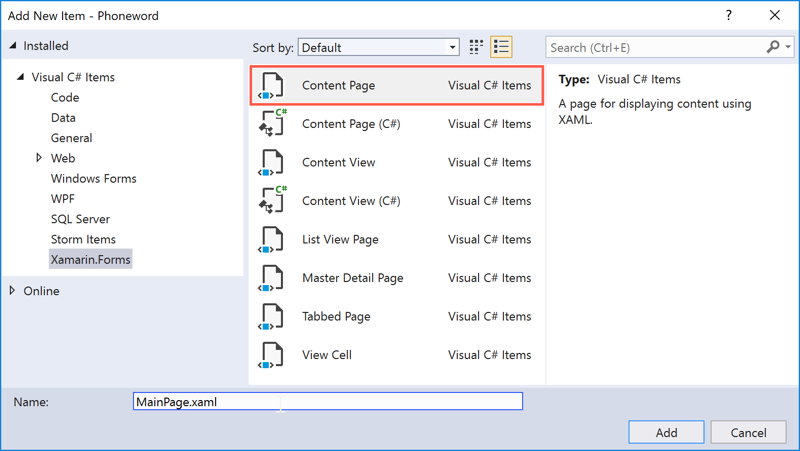

This exercise converts the UI definition of an existing Xamarin.Forms app from C# to XAML.

In this exercise, you start with an app that displays an alpha numeric telephone number. The app does a simple translation and dials the number. In the starter solution, the UI is defined entirely in C#, as you've done up to this point. Our goal is to convert this UI to XAML. You'll create a standard Xamarin.Forms app that has a .NET Standard library for the shared UI and logic. The app has platform-specific projects for iOS and Android.

## Replace the existing MainPage with a XAML version

1. Open the **Phoneword** solution in the **exercise1** > **start** folder in your copy of the cloned or downloaded [!INCLUDE [module-exercise-repo](module-exercise-repo.md)]. Verify that the app builds and runs in your environment (any platform is fine).

    [!include[](../../../includes/android-windows-path-length-warning.md)]

2. Open the `MainPage.cs` file. The file is the existing UI definition, which is in C# code.

3. First, rename this class. Later, you'll create a duplicate of this file that's defined in XAML. Right-click the `MainPage` class name, and then select **Rename**. Or, you can use the <kbd>Ctrl</kbd>+<kbd>R</kbd>,<kbd>R</kbd> keyboard shortcut while the cursor is on the class name. Name the file whatever you like; the exercise assumes you name it `OldMainPage`.

4. Compile the app and make sure it builds. You don't need to run the app, just make sure nothing is broken before you continue.

5. Add a new XAML page where you'll put the new UI definition:
    1. Add a new file to the shared project.
    1. Select the **Visual C#** > **Xamarin.Forms** > **Content Page XAML** template.
    1. Name the new file **MainPage** as shown in the following screenshot.



## Re-create the UI

Use the following images as guidance for the layout we'll create. We'll use a `StackLayout` to lay out the required controls.


1. Open **MainPage.xaml**. The file is the markup file we'll use to describe our UI.

2. Add a `StackLayout` as the first child tag in the `ContentPage`. If there's an existing `StackLayout` with a `Label`, you can delete the `Label` and start with the existing `StackLayout`.

    > [!NOTE]
    > Depending on the version of the IDE you're using, it might have a tag named `ContentPage.Content` as the first child tag, or it might be a `Label`. The default child property for the `ContentPage` is `Content`, which means you can place the child right into the `ContentPage` and omit the `ContentPage.Content` value. The following code block has removed the tag, but it's okay to leave it in place. Just make sure your `StackLayout` is in between the open and close tags of the `ContentPage`.

    ```xml
    <?xml version="1.0" encoding="UTF-8"?>
    <ContentPage xmlns="http://xamarin.com/schemas/2014/forms"
                 xmlns:x="http://schemas.microsoft.com/winfx/2009/xaml"
                 x:Class="Phoneword.MainPage">
        <StackLayout>
        </StackLayout>
    </ContentPage>
    ```

3. Add a `Label` to the `StackLayout` and set the `Text` property of the label equal to `Enter a Phoneword:`.

4. Set the `FontSize` property to `Large`. Note how you use the `NamedSize` enumeration, which has four built-in options. The string value is converted into the correct enumeration type using a built-in value converter. Xamarin.Forms chooses the best size for each platform based on this value.

    ```xml
    ...
    <StackLayout>
         <Label Text="Enter a Phoneword:" FontSize="Large" />
    </StackLayout>
    ...
    ```

5. Add an `Entry` to the `StackLayout` and set the `Text` property of the entry equal to `1-855-XAMARIN`.

6. Because you'll want to access the value captured in the `Text` property in code-behind, set the element's `x:Name` as `phoneNumberText`. Remember, a private field is created in the code-behind when you set the element's name.

    ```xml
    ...
    <StackLayout>
        <Label Text="Enter a Phoneword:" FontSize="Large" />
        <Entry x:Name="phoneNumberText" Text="1-855-XAMARIN" />
    </StackLayout>
    ...
    ```

7. Add a `Button` to the `StackLayout` and set the `Text` property of the button equal to `Translate`.

8. Set the button's name to `translateButton`:

    ```xml
    ...
    <StackLayout>
        <Label Text="Enter a Phoneword:" FontSize="Large" />
        <Entry x:Name="phoneNumberText" Text="1-855-XAMARIN" />
        <Button x:Name="translateButton" Text="Translate" />
    </StackLayout>
    ...
    ```

9. Add a second `Button` to the `StackLayout` and set the `Text` property of the button equal to `Call`.

10. Set the button's name to `callButton` and make sure to set the `IsEnabled` property to `false`;

    ```xml
    ...
    <StackLayout>
        <Label Text="Enter a Phoneword:" FontSize="Large" />
        <Entry x:Name="phoneNumberText" Text="1-855-XAMARIN" />
        <Button x:Name="translateButton" Text="Translate" />
        <Button x:Name="callButton" Text="Call" IsEnabled="false"/>
    </StackLayout>
    ...
    ```

## Update App.xaml.cs

1. Open **App.xaml.cs** in the .NET Standard project.

2. Instantiate a new instance of `MainPage` in the constructor and assign it to the `MainPage` property. The instance should replace the existing `OldMainPage` instantiation.

    ```csharp
    public class App : Application
    {
        public App()
        {
            MainPage = new MainPage();
        }
        ...
    }
    ```

3. **Run the app** and make sure it displays the Phoneword UI. The app won't be functional yet, since you've not wired up any behavior. However, it should look identical to how you started.

    > [!NOTE]
    > If you're getting compile errors, open your **MainPage.xaml.cs** file and make sure that the only code in the constructor of the class is a call to `InitializeComponent`.

    ```csharp
    ...
    public MainPage()
    {
        InitializeComponent();
    }
    ```

## Rename the old MainPage.cs file

* In the Solution Explorer pad, rename the original **MainPage.cs** file to `OldMainPage.cs` to make it obvious which file is no longer being used. You'll continue using this file for reference in a later exercise.
