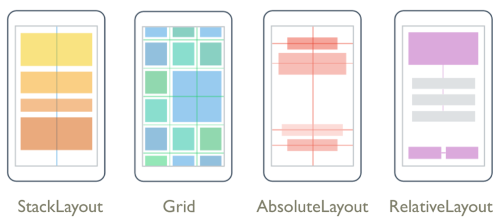
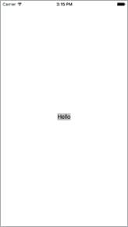
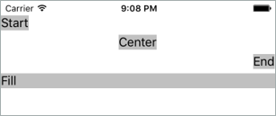

Designing a user interface that's consistent across multiple devices is difficult because devices can be different sizes and have different pixel densities. Think about the different devices that are available: mobile, tablet, desktop, TV, and so on. How do we create a user interface that looks similar on each?

Xamarin.Forms provides layout panels to help us build consistent user interfaces. The layout panel is responsible for sizing and positioning its children views. In this unit, we'll learn how the layout system works in Xamarin.Forms. We'll look at how views are sized by default and how to request a specific size and position for a view at runtime.

## What is a layout panel?

A *layout panel* is a Xamarin.Forms container that holds a collection of child views and determines their size and position. The layout panels automatically recalculate when the app size changes; for example, when the user rotates the device.

Xamarin.Forms has multiple layout panels that you can choose from. Each panel manages its child views differently. Your job is to choose the best panel for the user interface that you want. The following illustration shows a conceptual overview of the options.



- `StackLayout`: arranges its children in a single row or column.
- `Grid`: arranges its children in cells that are created by rows and columns
- `AbsoluteLayout`: arranges its children by using *x* and *y* coordinates.
- `RelativeLayout`: arranges its children relative to the layout or nearby views.

The typical process for building a Xamarin.Forms page is to create a layout panel and then add child views to it. When you add a view to a layout, you can influence the size and position of it. However, the panel has the final say based on its internal layout algorithms.

Before we look at how we can request a specific size for a view, let's see how the layout system sizes views by default.

## Default size of a view

If you don't specify the size of a view, it will automatically grow to be exactly large enough to fit around its content. For example, consider this XAML:

```xaml
<Label
    Text="Hello"
    BackgroundColor="Silver"
    VerticalOptions="Center"
    HorizontalOptions="Center" />
```

We're defining a label to display the word `Hello` on a `Silver` background. Because we're not specifying the size of the label, it will automatically be sized so it fits around the word `Hello`. Here's what the label would look like rendered on an iOS device:



> [!NOTE]
> We set the background color of the label to help us determine how large it is at runtime. This is a good debugging technique to keep in mind as you build your UI.

## Specify the size of a view

When you build a UI, it's common to want to control the size of a view. For example, imagine you're building a sign-in page and you want the sign-in button to be exactly half the width of the screen. If you used the default sizing for a view, your button would only be the size of the text *Sign in*. That size wouldn't be large enough for your goal, so you'd want to specify the size yourself.

The `View` base class defines two properties that influence the size of a view: `WidthRequest` and `HeightRequest`. `WidthRequest` lets you specify the width, and `HeightRequest` lets you specify the height. Both properties are of type `double`.

Here's an example that shows how to specify a label's width and height in XAML:

```xaml
<Label
    Text="Hello"
    WidthRequest="100"
    HeightRequest="300"
    BackgroundColor="Silver" />
```

One thing that's worth noting is the names of these properties. Both properties contain the word *request*. This word means the layout panel might not respect them at runtime. The layout panel reads these values during its sizing calculations and tries to accommodate the requests if it can. If there's not enough space, the layout panel is allowed to ignore the values.

### Size units

When we set `WidthRequest` and `HeightRequest`, we use literal values like `100`. At the Xamarin.Forms level, these values don't have units. They're not points or pixels. They're just values of type `double`. Xamarin.Forms passes these values to the underlying operating system at runtime. It's the operating system that provides the context needed to determine what the numbers mean:

- On iOS, the values are called _points_
- On Android, they're _density-independent pixels_.

## Rendered size of a view

Because it's up to the layout panel to determine the size of a view, you can't use `WidthRequest` and `HeightRequest` to tell you the actual size at runtime. For example, imagine you set `WidthRequest` to `100` for your label but the panel doesn't have enough space to satisfy the request. Instead, the panel gives your label a width of `80`. At this point, if you check the value of the `WidthRequest` property, it will say `100` even though the rendered value is `80`.

To solve this problem, the `View` base class defines two additional properties called `Width` and `Height`. These properties are of type `double` and represent the rendered width and height of a view. You should use the `Width` and `Height` properties whenever you retrieve the size of a view.

## Specify the position of a view

You also need to set the position of a view. For example, recall that in our sign-in page example we wanted to size the sign-in button to be half the width of the screen. Because the sign-in button isn't the full width of the screen, we have some space available to move it around. We could position it on the left side, on the right side, or in the center of the screen.

The `View` base class has two properties that you use to set the position of a view: `VerticalOptions` and `HorizontalOptions`. These settings influence how the view is positioned within the rectangle allocated for it by the layout panel. You can specify that you want the view to align to one of the four edges of the rectangle or that you want it to occupy the entire rectangle.

Specifying a value for `VerticalOptions` or `HorizontalOptions` is more challenging than setting the size because they're of type `LayoutOptions`.

## What is LayoutOptions?

`LayoutOptions` is a C# type that encapsulates two layout preferences, `Alignment` and `Expands`. Both properties are related to positioning, but they're not related to each other. Here's what the definition of the type looks like:

```csharp
public struct LayoutOptions
{
    public LayoutAlignment Alignment { get; set; }
    public bool Expands { get; set; }
    ...
}
```

We'll look at `Alignment` here because it's the most common and intuitive.

### What is LayoutAlignment?

`LayoutAlignment` is an enumeration that contains four values: `Start`, `Center`, `End`, and `Fill`. You can use these values to control how the child view is positioned within the rectangle given to it by its layout panel. For example, consider the following code and iOS screenshot:

```xaml
<StackLayout>
    <Label Text="Start" HorizontalOptions="Start" BackgroundColor="Silver" />
    <Label Text="Center" HorizontalOptions="Center" BackgroundColor="Silver" />
    <Label Text="End" HorizontalOptions="End" BackgroundColor="Silver" />
    <Label Text="Fill" HorizontalOptions="Fill" BackgroundColor="Silver" />
</StackLayout>
```



We're using a vertical `StackLayout` so each child view is given a row. `HorizontalOptions` determines the view's position within its row.

### What is Expands?

The second property of the `LayoutOptions` struct is `Expands`. The `Expands` property is a `bool` that allows a view in a `StackLayout` to request extra space if any is available. We'll explore the `Expands` property in more detail when we discuss `StackLayout`.
