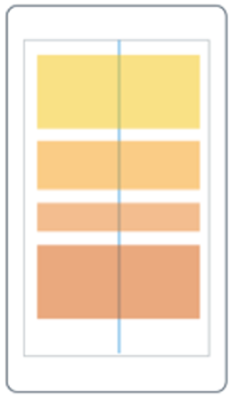
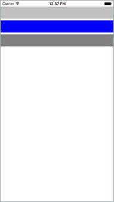
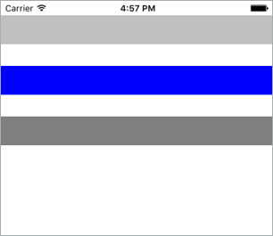
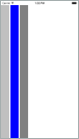
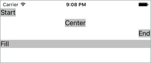
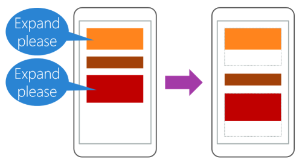
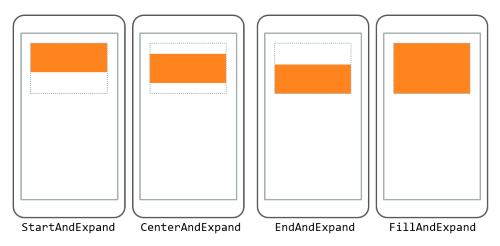

Stacking views in a vertical or horizontal list is a common design for user interfaces. Think about some common pages in applications. Examples include sign-in, register, and settings pages. All these pages typically contain stacked content. In this unit, we'll learn how to arrange views in a vertical or horizontal list by using `StackLayout`.

## What is a StackLayout?

`StackLayout` is a layout container that organizes its children left-to-right or top-to-bottom. The direction is based on its `Orientation` property, and the default value is top-to-bottom. The following illustration shows a conceptual view of a vertical `StackLayout`.



`StackLayout` has a list of `Children` that it inherits from its base class `Layout<T>`. The list stores views, which is good because most UI elements you'll work with in Xamarin.Forms derive from `View`. Layout panels are also derived from `View`, which means you can nest panels if you need to.

## How to add views to a StackLayout

In Xamarin.Forms, you can add views to a `StackLayout` in C# code or in XAML. Here's an example of three views added using code:

```csharp
var a = new BoxView() { BackgroundColor = Color.Silver };
var b = new BoxView() { BackgroundColor = Color.Blue };
var c = new BoxView() { BackgroundColor = Color.Gray };

stack.Children.Add(a);
stack.Children.Add(b);
stack.Children.Add(c);
```

We add the views to the `Children` collection and `StackLayout` automatically sizes and positions the views in a vertical list. Here's what it will look like on an iOS device:



Now let's look at how we would do the same thing in XAML. Here's an example of the same three views being added to a `StackLayout` in XAML:

```xaml
<StackLayout>
    <BoxView Color="Silver" />
    <BoxView Color="Blue" />
    <BoxView Color="Gray" />
</StackLayout>
```

Notice how in XAML we simply nest the children inside the `StackLayout` tags. The XAML parser adds the nested views to the `Children` collection automatically because `Children` is the `ContentProperty` for all layout panels.

### How views are ordered in a StackLayout

The order of the views in the `Children` collection determines their layout order when they're rendered. For views added in XAML, the textual order is used. For children added in code, the layout order is determined by the order in which you called the `Add` method.

### How to change the space between views in a StackLayout

It's common to want some space between the children of a `StackLayout`. `StackLayout` automatically adds a bit of room between each child, but you can control the space by using the `Spacing` property. The default value is six units, but you can set it to whatever looks good to you. Here's an example of setting the `Spacing` property to `30` in XAML:

```xaml
<StackLayout Spacing="30">
    <BoxView Color="Silver" />
    <BoxView Color="Blue" />
    <BoxView Color="Gray" />
</StackLayout>
```

The following screenshot shows how the UI would render on iOS:



### How to set the orientation of a StackLayout

`StackLayout` lets you arrange children in either a column or a row. You control this behavior by setting its `Orientation` property. So far, we've been showing only a vertical `StackLayout`.

`Vertical` is the default. Whether you explicitly set the `Orientation` to `Vertical` is up to you. Some programmers prefer an explicit setting to make the code more self-documenting.

Here's an example of setting the `Orientation` to `Horizontal` in XAML:

```xaml
<StackLayout Orientation="Horizontal">
    <BoxView Color="Silver" />
    <BoxView Color="Blue" />
    <BoxView Color="Gray" />
</StackLayout>
```

The following screenshot shows how the UI would render on iOS:



## Set a view's LayoutOptions in a StackLayout

Now that we've seen how to add views to a `StackLayout`, we need to look at how `StackLayout` handles a view's `LayoutOptions`. Recall that every view has a `VerticalOptions` and `HorizontalOptions` property. You use these properties to set the position of the view within the rectangle the layout panel gave it.

With `StackLayout`, the behavior of the `LayoutOptions` properties depends on the `Orientation` property of the `StackLayout`. `StackLayout` uses the `LayoutOptions` property in the direction opposite to its `Orientation`. For example, if the `StackLayout` `Orientation` property is set to vertical, only the view's `HorizontalOptions` property is respected. If the `StackLayout`'s `Orientation` property is set to horizontal, only the view's `VerticalOptions` property is respected.

Let's look at two examples to illustrate this point. In this first example, we have a `StackLayout` with a vertical `Orientation` where all the children use `HorizontalOptions`. Because horizontal is the opposite of vertical, the `StackLayout` will respect these settings.

```xaml
<StackLayout Orientation="Vertical">
    <Label ... HorizontalOptions="Start" />
    <Label ... HorizontalOptions="Center" />
    <Label ... HorizontalOptions="End" />
    <Label ... HorizontalOptions="Fill" />
</StackLayout>
```

Here's how the rendered iOS screen would look:



For the second example, look at this code:

```xaml
<StackLayout Orientation="Vertical">
    <Label ... VerticalOptions="Start" />
    <Label ... VerticalOptions="Center" />
    <Label ... VerticalOptions="End" />
    <Label ... VerticalOptions="Fill" />
</StackLayout>
```

Notice that the `StackLayout`'s `Orientation` property is set to vertical and its child views are using `VerticalOptions`. By default, an element in a stack layout will not be allocated any additional space in the same direction as the `Orientation` of the stack layout. Assigning a position for that direction in this default case will not change the rendering of the element. There is a change in the rendering, though, when position is combined with expansion.

## What is expansion?

Recall from an earlier unit that the `LayoutOptions` struct contains a `bool` property called `Expands`. This property is designed specifically for `StackLayout` and allows a child view to request extra space if there's any available. Here's an example of how the `Expands` property works:



Notice that there's extra space available in the `StackLayout`. The extra space will be divided evenly among all views that request additional space.

### How to request additional space

Remember that every view has two `LayoutOptions` properties called `VerticalOptions` and `HorizontalOptions`. So far, we've talked about four values for these properties: `Start`, `Center`, `End`, and `Fill`. If you want to request additional space, you replace the `LayoutOptions` value with one of these values: `StartAndExpand`, `CenterAndExpand`, `EndAndExpand`, or `FillAndExpand`.

Here's how each of these values works:



The orange box is the view and the gray rectangle represents the extra space given to it by the `Expands` property. The view fills the extra space only when you use the `FillAndExpand` value. When you use the other values, the extra space remains empty, but it can't be used by other views in the `StackLayout`.
