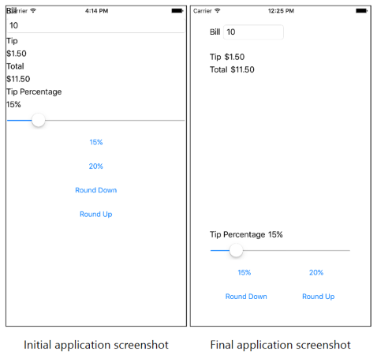

In this exercise, you'll use nested `StackLayout` containers to arrange the views in your UI. The first screenshot shows the starter project, and the second one shows the completed project. Your job is to use `StackLayout` containers and `LayoutOptions` to turn the starter project into the completed version.



## Explore the starter solution

The starter solution contains a fully functional tip calculator app. Let's explore the code and UI to learn how it works.

1. Open the **TipCalculator** project from the **exercise2** > **start** folder in your cloned or downloaded [!INCLUDE [module-exercise-repo](module-exercise-repo.md)].

1. Open the solution from the **start** folder.

1. Run the app on either iOS or Android.

1. Enter a number into the text box and use the app to see how it works.

1. Stop the app.

1. Open **MainPage.xaml**. Notice that all the views are placed into one vertical `StackLayout`.

## Fix the UI

Now that you've seen the app run, let's make it look better by adding `StackLayout` containers. The goal is to make the app look like the preceding screenshot.

1. Open **MainPage.xaml**.

1. Add `40` units of padding to the `ContentPage` to avoid overlap of the UI and the iOS status bar:

    ```xaml
    <ContentPage ... Padding="40">
    ```

1. Use a horizontal `StackLayout` to group the `Label` that says **Bill** with the `Entry` field below it:

    ```xaml
    <StackLayout Orientation="Horizontal">
        <Label Text="Bill" ... />
        <Entry ... />
    </StackLayout>
    ```

1. Use a horizontal `StackLayout` to group the `Label` that says **Tip** with the `Label` named **tipOutput**.

1. Set a `Margin` on the `StackLayout` that you just added. The top should be `20` units and the left, right, and bottom values should be `0`:

    ```xaml
    <StackLayout Orientation="Horizontal" Margin="0,20,0,0">
    ...
    </StackLayout>
    ```

1. Use a horizontal `StackLayout` to group the `Label` that says **Total** with the `Label` named **totalOutput**.

1. Use a horizontal `StackLayout` to group the `Label` that says **Tip Percentage** with the `Label` named **tipPercent**.

1. Set the `VerticalOptions` value to `EndAndExpand` on the `StackLayout` that you just added:

    ```xaml
    <StackLayout Orientation="Horizontal" VerticalOptions="EndAndExpand">
    ...
    </StackLayout>
    ```

1. Use a horizontal `StackLayout` to group the `Button` that says **15%** with the `Button` that says **20%.**

1. Use a horizontal `StackLayout` to group the `Button` that says, **Round Down** with the `Button` that says, **Round Up.**

1. Set a `HorizontalOptions` value of `CenterAndExpand` on all four of the `Button` controls:

    ```xaml
    <Button HorizontalOptions="CenterAndExpand" ...>
    ```

## Examine the results

Run the app again and look at the differences in the UI. You used nested `StackLayout` containers to improve the aesthetics of an existing UI. `StackLayout` is the simplest layout panel, but it's powerful enough to produce a reasonable UI.
