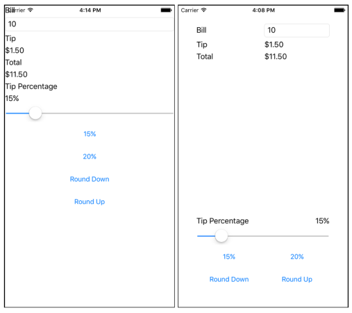
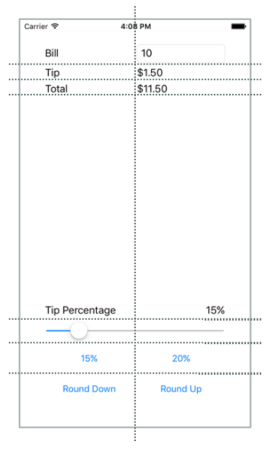

In this exercise, you'll use a `Grid` to arrange the views in your UI. The first screenshot shows the starter project, and the second one shows the completed project. Your job is to use a `Grid` to turn the starter project into the completed version.



## Open the starter solution

The starter solution contains a fully functional tip calculator app.

1. Open the **TipCalculator** project from the **exercise3** > **start** folder in your cloned or downloaded [!INCLUDE [module-exercise-repo](module-exercise-repo.md)].

1. Open **MainPage.xaml**. Notice that all the views are in one vertical `StackLayout`.

## Create a Grid layout

Let's create a `Grid` to hold our views.

1. Add `40` units of padding to the `ContentPage` to avoid overlap of the UI and the iOS status bar.

    > ```xaml
    > <ContentPage ... Padding="40">
    >  ```

1. Change the layout panel from `StackLayout` to `Grid`.

1. Define seven rows and two columns for the `Grid`. Make all the rows `Auto` size except the fourth row. The fourth row should use `Star` so it will get all the extra space. Use `Star` sizing for both columns.

    > ```xaml
    > <Grid.RowDefinitions>
    >   <RowDefinition Height="Auto" />
    >   <RowDefinition Height="Auto" />
    >   <RowDefinition Height="Auto" />
    >   <RowDefinition Height="*" />
    >   <RowDefinition Height="Auto" />
    >   <RowDefinition Height="Auto" />
    >   <RowDefinition Height="Auto" />
    > </Grid.RowDefinitions>
    >
    > <Grid.ColumnDefinitions>
    >   <ColumnDefinition Width="*" />
    >   <ColumnDefinition Width="*" />
    > </Grid.ColumnDefinitions>
    >  ```

## Position the views in the cells

We've defined the `Grid` structure. Now we need to add our views to the `Grid`. We'll do that by using the `Grid.Row` and `Grid.Column` attached properties.

1. Add settings for `Grid.Row` and `Grid.Column` to each of the views to assign them to the appropriate cell in the `Grid`. Use the following screenshot to help you determine where each view should be placed:

    

1. Align the **Bill** `Label` and `Entry` by setting `VerticalOptions` to `Center` on the **Label**.

1. Add a setting for `Grid.ColumnSpan` to the `Slider` so it spans two columns:

    > ```xaml
    > <Slider ... Grid.ColumnSpan="2" ... />
    >  ```

1. Locate the `Label` with text **Tip Percentage**. Set it so it will occupy the lower-left position in its rectangle:

    > ```xaml
    > <Label Text="Tip Percentage" VerticalOptions="End" HorizontalOptions="Start" ... />
    >  ```

1. Locate the `Label` named **tipPercent**. Set it so it will occupy the lower-right position in its rectangle:

    > ```xaml
    > <Label x:Name="tipPercent" VerticalOptions="End" HorizontalOptions="End" ... />
    >  ```

## Examine the results

Run the application and look at the differences in the UI. You used a `Grid` to improve the aesthetics of an existing UI. `Grid` is more powerful than `StackLayout`. In particular, `Grid` makes it easy to align views across rows.
