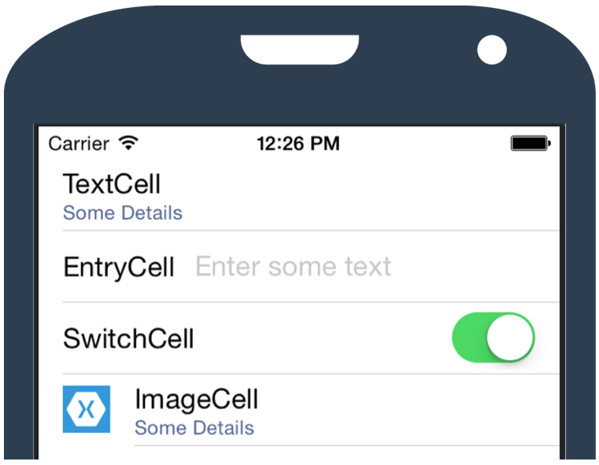

The simplest `ListView` implementations have only a single `Label` in each row. You can give them a slightly more purpose-driven layout by using one of the built-in cell types with static layouts: `TextCell`, `EntryCell`, `SwitchCell`, or `ImageCell`.



Both approaches are described in another module. But many apps will require cells that are custom designed for the app. In our scenario of a smart home management app, if we use custom rows for each smart device type, we can create an easier user experience. For example, we could allow users to cancel a smoke alarm or speak to someone at their doorbell directly from the `ListView` screen.

In this unit, we'll create a custom `ListView` row by using the `ViewCell` cell type.

## Use a ViewCell

In Xamarin.Forms, we use a `ViewCell` to create a custom user interface for a row. `ViewCell` is used in the same way as the other built-in cells:

```xaml
<ListView>
    <ListView.ItemTemplate>
        <DataTemplate>
            <ViewCell>
                ...
            </ViewCell>
        </DataTemplate>
    </ListView.ItemTemplate>
    ...
</ListView>
```

The main difference between a `ViewCell` and the other built-in cell types is that, for the `ViewCell`, instead of using existing properties like `Image` and `Text`, we'll define the entire layout as content of the `ViewCell`:

```xaml
...
<ViewCell>
    <StackLayout Padding="5">
        <Label FontSize="20" TextColor="Black" Text="{Binding Name}" />
        <Label FontSize="14" TextColor="Blue" Text="{Binding Email}" />
    </StackLayout>
</ViewCell>
...
```

### BindingContext in a ViewCell

As with any other cell type in a `ListView`, the `BindingContext` for a `ViewCell` will be a single instance of whatever collection is in the `ListView.ItemsSource`. So, for instance, if our `ListView.ItemsSource` was set to something like `ContactRepository.AllContacts`, the previous XAML with bindings to `Name` and `Email` would refer to `Contact.Name` and `Contact.Email`.

### Inherit from ViewCell

You'll often want to create a custom class that derives from `ViewCell`, either for code organization or for code reuse. By doing so, you can keep your page's XAML simpler, so that it looks similar to this:

```xaml
<ListView>
    <ListView.ItemTemplate>
        <DataTemplate>
            <ContactViewCell />
        </DataTemplate>
    </ListView.ItemTemplate>
    ...
</ListView>
```

Notice that `ContactViewCell` doesn't have additional layout in its content.

To define `ContactViewCell`, we can use a XAML file plus code-behind, similar to how we define a page. The bindings can be embedded in our XAML file and still work as if the layout were defined in-line in the page. Here's the content of the XAML file, nearly identical to what was in-line in the earlier example:

```xaml
<?xml version="1.0" encoding="UTF-8"?>
<ViewCell
xmlns="http://xamarin.com/schemas/2014/forms"
xmlns:x="http://schemas.microsoft.com/winfx/2009xaml"
x:Class="ContactViewCell">
    <StackLayout Padding="5">
        <Label FontSize="20" TextColor="Black" Text="{Binding Name}" />
        <Label FontSize="14" TextColor="Blue" Text="{Binding Email}" />
    </StackLayout>
</ViewCell>
```

> [!TIP]
> If you need to pass custom properties in to your custom view cell, you can declare them in the code-behind as normal C# properties or bindable properties.