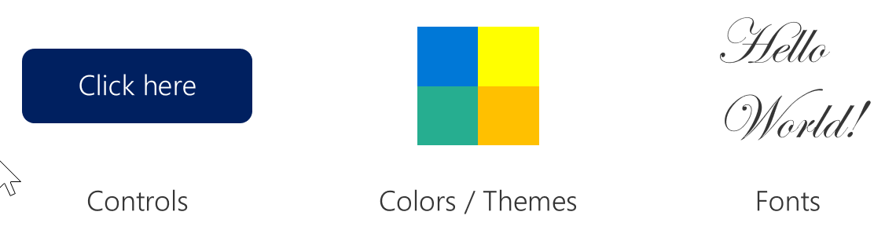
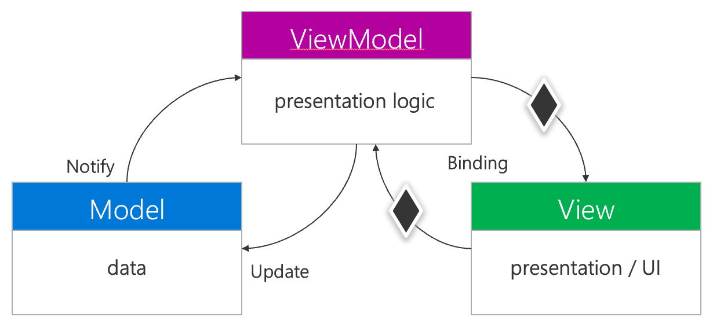

Xamarin.Forms apps that don't use MVVM generally have more code in their *code-behind* files. The code-behind files follow this pattern: *{something}.xaml.cs*. Most code in the code-behind file usually controls the user interface (UI) behavior. *UI behavior* can include anything that happens *to* the UI, like changing a color or some text. And it can include anything that happens *because of* the UI, including button click handlers.

One problem with this approach is that it's hard to write unit tests against code-behind files. Code-behind files in a Xamarin.Forms app derive from a Xamarin.Forms framework type. They often assume an application state that's created by parsing XAML or even created by other pages. These conditions are difficult to handle in a unit test runner that might not even be running on a mobile device, let alone with a user interface. So, unit tests are rarely able to test the UI behaviors in these files.

When used correctly, the MVVM pattern solves these problems by moving most UI behavior logic to unit-testable classes that are called *viewmodels*. The MVVM pattern is most commonly used with frameworks that support data-binding. That's because with Xamarin.Forms, you can data-bind each UI element to a viewmodel and eliminate or nearly eliminate code in a view or code-behind.

## What are the parts of an MVVM application?

While the viewmodel is the unique part of the MVVM pattern, the pattern also defines a "model" part and a "view" part. The definitions of these parts are consistent with some other common patterns, such a Model-View-Controller (MVC).

### What's a model?

In an MVVM application, the *model* refers to your business data and business logic. The model doesn't concern how the app is presented to the user.

A good guideline for defining what code goes in the model is that you could port your application from mobile app to the web or to a command-line program and use the same *model* in all three places. It has nothing to do with presentation to the user.

When you think about the HR application from our scenario, the model might include an `Employee` class and a `Department` class that hold data and logic about those entities. The model could also include things like an `EmployeeRepository` class that holds persistence logic. Some other software-design patterns would consider things like *repositories* as separate from the model. But in the context of MVVM, we often refer to any business logic or business data as part of the model.

Here are two examples of a model in C#:

```csharp
public class Employee
{
    public int Id { get; }
    public string Name { get; set; }
    public Employee Supervisor { get; set; }
    public DateTime HireDate { get; set; }
    public void ClockIn() { ... }
}

public class EmployeeRepository
{
    public IList<Employee> QueryEmployees() { ... }
    ...
}
```

### What's a view?

The *view* code controls things that directly interact with the user. Usually that means changing pixels on the screen and receiving clicks and taps. View items include controls like buttons and entry fields, as well as any other purely visual elements like themes, styles, and fonts.



In many Xamarin.Forms apps, you don't need to write any C# code for views yourself. Instead, your views are often defined by your *.xaml* files. Of course, there are situations that call for a custom user control. In those cases, you can create your own view code. Check out the Xamarin.Forms renderer module to create custom Xamarin.Forms controls.

### What's a viewmodel?

That brings us back to the *viewmodel*. The viewmodel is the intermediary between our business logic and our views.



Before we go deeper, let's think about what a viewmodel might do for us. Consider in our HR application a modal page that displays an employee's available vacation time. We want our screen to show vacation balance as a string in the format: "2 weeks, 3 days, 4 hours." But our business logic calculates that same value as 13.5 days. Our structure might look like this:

- Model: The `Employee` class, which includes a method:

    ```csharp
    public decimal GetVacationBalanceInDays()
    {
        //Some math that calculates current vacation balance.
        ...
    }
    ```

- ViewModel: An `EmployeeViewModel` class that has a property like this:

    ```csharp
    public class EmployeeViewModel
    {
        private Employee _model;
        ...
        public string FormattedVacationBalance
        {
            get
            {
                decimal vacationBalance = _model.GetVacationBalanceInDays();
                ... // Some logic to format and return the string
            }
        }
    }
    ```

- View: A XAML page that contains a single label and a close button. The label has a binding to our viewmodel's property:

    ```xml
    <Label Text="{Binding FormattedVacationBalance}" />
    ```

    We'd then just need the `BindingContext` for the page set to an instance of `EmployeeViewModel`.

In this example, our model does the *business logic*. This logic isn't bound to Xamarin.Forms or mobile or even visual display. You could use the same logic for a telephony application. The view knows nothing of our business logic. Labels know how to put pixels on screen but don't care if you display a vacation balance or a random string. The viewmodel knows a _little_ of both worlds, so it can act as an intermediary.

What's interesting is how the viewmodel accomplishes being an intermediary: It exposes properties to which a view can bind. Public properties are the *only* way a viewmodel provides data. This brings us to why it's *called* a "viewmodel." The "model" in MVVM represents the structure, data, and logic of the business processes, the "viewmodel" represents the structure, data, and logic that the view requires.
