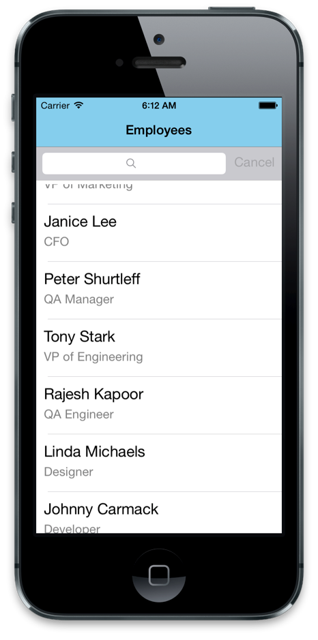

You've learned the definition of the MVVM components. The model and the view were easier to define than the viewmodel, so let's explore how to use the viewmodel.

## Expose properties to the user interface

As in the previous example, viewmodels usually rely on models for most of their data and any business logic. But it's the viewmodel that formats, converts, and enriches the data in whatever way the current view requires.

### Format by using a viewmodel

You already saw an example of formatting with vacation time. Date formatting, character encoding, and serialization are all examples of how the viewmodel might format data from the model.

### Convert by using a viewmodel

Often, the model provides information in indirect ways. But the viewmodel can fix that. For example, suppose you want to show on screen whether an employee is a supervisor. But our `Employee` model doesn't tell us that directly. Instead we have to infer this fact based on whether the person has others reporting to them. Assume that the model has this property:

```csharp
public IList<Employee> DirectReports
{
    get
    {
        ...
    }
}

```

If the list is empty, we infer that this `Employee` isn't a supervisor. In this case, our `EmployeeViewModel` includes a property `IsSupervisor` that provides the logic that we need:

```csharp
public bool IsSupervisor => _model.DirectReports.Any();
```

### Enrich by using a viewmodel

Sometimes a model might only provide an ID for related data. Or you might need to go to several model classes to correlate the data that's required for a single screen. The viewmodel provides an ideal place to perform these tasks as well. Suppose you want to show all the projects that an employee is currently running. This data isn't part of the `Employee` model class. It can be accessed by looking at the `CompanyProjects` model class. Our `EmployeeViewModel`, as always, exposes its work as a public property:

```csharp
public IEnumerable<string> ActiveProjects => CompanyProjects.All
    .Where(p => p.Owner == _model.Id && p.IsActive)
    .Select(p => p.Name);
```

### Use pass-through properties with a viewmodel

Frequently a viewmodel needs *exactly* the property that the model provides. For those properties, the viewmodel just passes the data through:

```csharp
public string Name
{
    get => _model.Name;
    set => _model.Name = value;
}
```

Even in pass-through cases, the viewmodel might add value, if you need to raise the PropertyChanged event of INotifyPropertyChanged:

```csharp
public string Name
{
    get {...}
    set
    {
        _model.Name = value;
        OnPropertyChanged(nameof(Name))
    }
}
...
public void OnPropertyChanged(string propertyName)
{
    ... // raise event
}
```

## Set the scope for the viewmodel

You can use a viewmodel at any level where there's a view. A page usually *has* a viewmodel, but so might subviews of the page. One common reason for nested viewmodels is when there's a `ListView` on the page. The list page itself has a viewmodel `EmployeeListViewModel`, which has a collection that the ListView uses as `ItemSource`. Each element in the collection can be an `EmployeeViewModel` and provide data to the rows of the `ListView`.


It's also common to have a top-level viewmodel that holds data and state for the entire application but isn't associated with any particular page. Such a viewmodel is commonly used for maintaining the "active" item. Consider the ListView example that we just described. When the user selects an employee row, that employee represents the *current item*. If the user navigates to a detail page or selects a toolbar button while that row is selected, the action or display should be for that employee. An elegant way of handling this scenario is to have the `ListView.SelectItem` data-bound to a property that the toolbar or detail page can also access. Putting that property on a central viewmodel works well.

### Identify when to reuse viewmodels with views

How you define the relationship between the viewmodel and model and between the viewmodel and view is dictated more by app requirements than by rules. The viewmodel's purpose is to provide to the view the structure and data that it needs. That should guide decisions about "how big" to scope a viewmodel.

Viewmodels often closely reflect the structure of a model class, and they have a one-to-one relationship with that class. You saw an example earlier with the `EmployeeViewModel` that wrapped and augmented a single `Employee` instance. But it isn't always a one-to-one relationship. If you design viewmodels to provide what the view needs, you might instead end up with something like `HRDashboardViewModel`, which has no explicit relationship with any model but can use data from *any* model class.

Similarly, you might find that viewmodels and *views* often have a one-to-one relationship. But this also isn't necessarily the case. Let's again think about a `ListView` that shows a row for each employee. When you select one of the rows, you go to an employee-detail page.



 The list page has its viewmodel with a collection. As suggested earlier, that collection *could* be a collection of `EmployeeViewModel` objects. And when the user selects a row, the `EmployeeViewModel` instance *could* be passed to the `EmployeeDetailPage`. And the detail page *could* use that `EmployeeViewModel` as its `BindingContext`.

This scenario *might* be an excellent opportunity for viewmodel reuse. But keep in mind that viewmodels are intended to provide what the view needs. In some cases, you might want separate viewmodels, even if they're all based on the same model class. In this example, the `ListView` rows are likely to need much less information than the full detail page. If retrieving the data that the detail page involves much overhead, you might want to instead have an `EmployeeListRowViewModel` and a `EmployeeDetailViewModel` that service these respective views.
