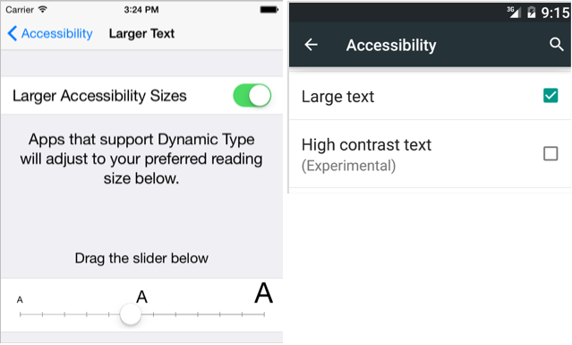

Operating systems let users choose some device-wide preferences. The most common setting is text size. The following screenshots show how the user would adjust their preferences on iOS and Android.



Your applications should respect the user's device-wide preferences for appearance and accessibility. Ideally you'll update the application's UI immediately when the user's settings change. In this unit, we'll discuss how to use built-in styles to incorporate the user's device settings into your app's UI.

## What are built-in styles?

Xamarin.Forms maps the user's device-wide preferences to styles called _built-in styles_. It keeps those styles updated as the user changes their settings. If the user changes their device-wide preferences, all the elements in your application that use the built-in styles will also change.

Built-in styles target the `Label` class. The main goal is to let your application incorporate the user's choice for text size.

The styles are designed around specific use cases. For example, there's a built-in style intended for use with your titles, another one for body text, and so on. The following screenshot shows several labels with various built-in styles applied. The screenshot uses the name of the built-in style as the label text.


## How to apply a built-in style

Xamarin.Forms defines one string to identify each of the built-in styles. For convenience, the strings are gathered together as symbolic constants in the `Device.Styles` class. The following code shows the `Styles` class and the string constants.

```csharp
public static class Styles
{
    ...
    public static readonly string BodyStyleKey = "BodyStyle";
    public static readonly string CaptionStyleKey = "CaptionStyle";
    public static readonly string ListItemDetailTextStyleKey = "ListItemDetailTextStyle";
    public static readonly string ListItemTextStyleKey = "ListItemTextStyle";
    public static readonly string SubtitleStyleKey = "SubtitleStyle";
    public static readonly string TitleStyleKey = "TitleStyle";
}
```

You use these strings in your code to apply one of the built-in styles. Here's an example for a label that displays a title.

```xml
<Label Text="Welcome" Style="{DynamicResource TitleStyle}" />
```

You must use `DynamicResource` to apply a built-in style. These styles are generated via code, so they might not be available immediately at startup. They can also change at runtime if the user changes their preferences. Using `StaticResource` to attempt to access a built-in style will cause a runtime exception.

## How to use a built-in style as a base

`BaseResourceKey` is an alternative way to set the `BasedOn` property of a style. `BaseResourceKey` lets you use a built-in style as a base. It does a dynamic lookup that keeps the property values synchronized to the user's preferences. 

The functionality of `BaseResourceKey` is analogous to `DynamicResource`. A link is maintained to the underlying style. When the style changes, the change propagates through to your derived style.

The use of `BaseResourceKey` isn't exclusive to built-in styles. You can use it with your own styles if needed. For example, suppose your base style was dynamically generated and it wasn't available at startup. Using `BasedOn` won't work, because `BasedOn` supports only `StaticResource`. 

Another example is if you want your base style to change dynamically. Using `BaseResourceKey` will let you write code to remove or replace the base style in the dictionary. Your style will be updated automatically to use the new base.