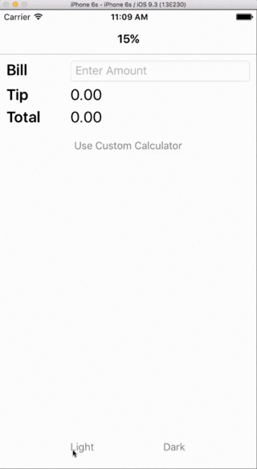

In this exercise, you'll use `DynamicResource` to update the **TipCalculator** UI when resource values change.

This exercise is a continuation of the previous exercise. Use your existing solution as the starting point for these steps.

## Update resources from code

You'll start by writing code that updates a few resources stored in a page's resource dictionary.

1. Open the **TipCalculator** project.

1. Open **StandardTipPage.xaml.cs**.

1. Locate the `OnLight` method and remove all the existing code inside it. Add two new lines of code so the method sets the `fgColor` resource in the page's resource dictionary to `#606060` and sets the `bgColor` resource to `#C0C0C0`. The static `Color.FromHex` method makes it easy to convert a hexadecimal string to a color.

    ```csharp
    Resources["fgColor"] = Color.FromHex("#606060");
    Resources["bgColor"] = Color.FromHex("#C0C0C0");
    ```

1. Repeat the previous step for the `OnDark` method but reverse the colors. That is, set `fgColor` to `#C0C0C0` and `bgColor` to `#606060`.

    ```csharp
    void OnDark(object sender, EventArgs e)
    {
        Resources["fgColor"] = Color.FromHex("#C0C0C0");
        Resources["bgColor"] = Color.FromHex("#606060");
    }
    ```

1. Run the app on a platform of your choice. Select the **Dark** and **Light** buttons. The UI doesn't change. Even though the code changes the resource values in the dictionary, the new value isn't being propagated to the UI. The issue is that you're using `StaticResource` to set the values.

## Update the UI dynamically

Let's fix the problem. You'll modify your XAML so updated resource values are loaded into your UI.

1. Open **StandardTipPage.xaml**.

1. Locate all of the places where you assign colors from resource values. Replace the use of the `StaticResource` markup extension with `DynamicResource`.

    ```xml
    ...
    <Label x:Name="billLabel" Text="Bill" TextColor="{DynamicResource fgColor}" ... />
    <Label x:Name="tipLabel" Text="Tip" TextColor="{DynamicResource fgColor}" ... />
    <Label x:Name="totalLabel" Text="Total" TextColor="{DynamicResource fgColor}" ... />
    ...
    ```

## Run the application

Run the app on a platform of your choice. Select the **Dark** and **Light** buttons. The UI now changes correctly. The following animation shows the expected behavior.


