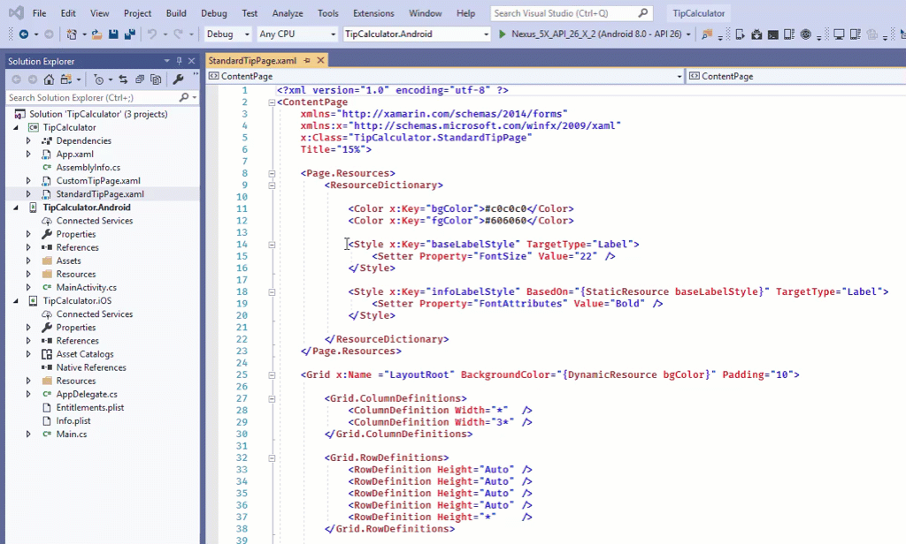

The goal of this exercise is to make resources available across multiple pages by moving them to a resource dictionary in the **Tip Calculator** `Application` class.

This exercise is a continuation of the previous exercise. Use your existing solution as the starting point for these steps.

## Verify page-level resources

Let's verify that resources defined on one page aren't available on another page. Your app won't run correctly at the end of this section. However, you'll fix it in the next section.

1. Open the **TipCalculator** project.

1. Open the **CustomTipPage.xaml** file.

1. Set the `infoLabelStyle` resource as the style of `billLabel`.

    ```xml
    <Label x:Name="billLabel" Text="Bill" Style="{StaticResource infoLabelStyle}" Grid.Row="0" Grid.Column="0" />
    ```

1. Open the **App.xaml.cs** file. Set `MainPage` to `CustomTipPage`.

    ```csharp
    public App()
    {
        InitializeComponent();
        MainPage = new NavigationPage(new CustomTipPage());
    }
    ```

1. Run the app on a platform of your choice. The app should fail with a message that says the resource lookup failed. The dictionary in **StandardTipPage.xaml** isn't searched for resources used in **CustomTipPage.xaml**.

> [!NOTE]
> If you have extra time, you can apply the appropriate style to the other labels on the page. But it isn't necessary.

## Create a dictionary for application-level resources

Let's create an application-wide resource dictionary to hold resources to use on multiple pages.

1. Open **App.xaml** and replace the contents with the following code:

   ```xml
    <Application
        xmlns="http://xamarin.com/schemas/2014/forms"
        xmlns:x="http://schemas.microsoft.com/winfx/2009/xaml"
        x:Class="TipCalculator.App">

        <Application.Resources>
        </Application.Resources>
    </Application>
   ```

## Move the styles

Remember, your styles are currently defined in the **StandardTipPage.xaml** file. You'll need to move the styles to the **App.xaml** file.

1. Move your two styles from **StandardTipPage.xaml** to **App.xaml**.

    

1. Run the app on a platform of your choice.

1. Go to **CustomTipPage** and verify that the app now works correctly.