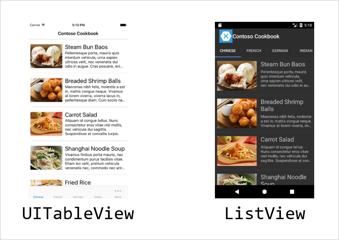

In this unit, we'll create a Xamarin.Forms `ListView` control and populate it with string values. We'll also see how to get notified when a user interacts with a row.

## What is a ListView control?

`ListView` is a Xamarin.Forms control that presents a collection of data in a scrollable list. Xamarin.Forms will create the correct platform-specific control to present that data to the user. For example, when you create a Xamarin.Forms `ListView`, the runtime will create a `UITableView` control on iOS and a `ListView` control on Android.

> [!NOTE]
> The `ListView` control created on Android is a native control. It's different than the Xamarin.Forms `ListView`.

The following screenshots show a Xamarin.Forms `ListView` that's rendered by using native controls on iOS and Android:



## Provide data to a ListView control

You load data into a `ListView` control all at once by giving it an `IEnumerable` data source. Assign `IEnumerable` to the `ItemsSource` property of the `ListView` control. You can do the assignment in either code or XAML. Here's how you might set the assignment in XAML with data binding.

```xml
<ListView ItemsSource="{Binding ListOfRecipes}" ... />
```

The `ListView` control then takes each element in its `ItemsSource` property and generates a row to represent it. By default, when a `ListView` control displays content in a row, it calls `ToString` on each item and displays the resulting string in a `Label` view. For most applications, you don't want to display a string. We'll discuss how you can customize the display later in this module.

`ListView` has some nice efficiency optimizations that are automatic:

* It generates rows only for elements that are visible to the user.

* It reuses views like `Label` and `Image` as the user scrolls. That is, it pulls new data from `ItemsSource` and loads it into existing views instead of creating new views. This recycling saves time and reduces pressure on the garbage collector.

## How does ListView provide interactivity?

`ListView` lets the user interact with the data it presents. Consider two interaction concepts: *tapped* and *selected*.

### Detect row taps

Let's start with *tapped*. This behavior could work well for a cooking app. Each recipe would be represented by a row in the `ListView` control. When the user taps a row, the app presents a new page to show the details of that recipe. `ListView` even highlights the row briefly during the tap.

`ListView` gives you an `ItemTapped` event to let you implement this type of interaction. Your event handler for `ItemTapped` will receive `ItemTappedEventArgs`. This parameter has the actual object from your `IEnumerable` collection assigned to the row that the user tapped. The following code shows a sample handler you might use with the recipes app. Notice how the method retrieves the `Recipe` object from the event argument.

```C#
void OnItemTapped(object sender, ItemTappedEventArgs e)
{
    var tappedRecipe = (Recipe)e.Item;
    ...
}
```

### Detect row selection

`ListView` also supports the concept of *selection*. Intuitively, the selected row is the one the user interacted with most recently. `ListView` remembers which row is currently selected and automatically highlights that row. The control supports only single selection. It provides no multiselect option.

A music player is a good example of an app that would need selection. For example, you might use a `ListView` control to show the songs in an album. If the user taps one of the songs, the app shouldn't present a new page. It should highlight that row and play that song. The selection features in `ListView` are perfect to help you implement this pattern.

A row can be selected in two ways:

* The user taps it. The user of the music player would rely on this behavior to choose the song they want to play.

* You programmatically set the selection. The music player app could use this technique to switch to the next song. That is, when the current song ends, your code would change the selection to the song that's starting.

`ListView` supports selection with its `ItemSelected` event and its `SelectedItem` property. The selection behavior is on by default, but you can disable it by setting `SelectionMode` to `None`.

Data binding is commonly used to control and monitor selection. For example, this snippet of XAML binds the `SelectedItem` property:

```xaml
<ListView SelectedItem="{Binding CurrentSong, Mode=TwoWay}">
```

Using this approach, you'll know when the selection changes because the setter in your `CurrentSong` property will run. The following code shows part of the property definition. Notice that the `value` instance passed to the setter will be the data from the selected row.

```C#
public Song CurrentSong
{
    get { ... }
    set
    {
        Song selectedSong = value;
        ...
    }
}
```
