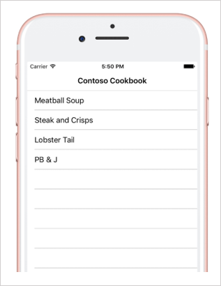
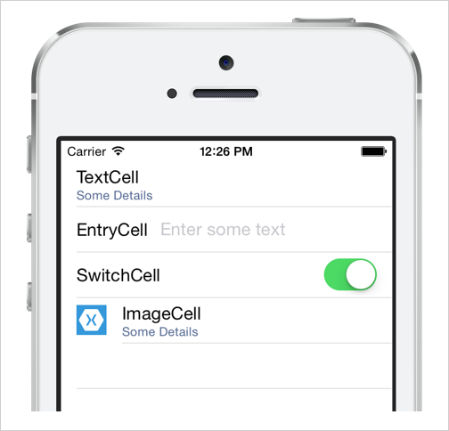

When you display a list of content to your users, you'll rarely want to display only a single string value. Most applications display multiple pieces of information in each row. For example, the rows of a Twitter feed display the author's username and profile picture, the date, and the contents of the tweet.

In this unit, you'll see how to customize the appearance of your `ListView` rows by including multiple controls.

## How are rows visually represented by default?

Recall that by default, `ListView` calls `ToString` on each item in its collection to visualize the item on the screen. For example, the following screenshot shows what the visualization might look like for the cooking app:



This style isn't ideal. You'll typically want to display multiple things, customize the position of the text, or choose specific colors.

The default visualization also presents a problem with changes. `ListView` can't detect changes to the underlying data even if you're using property notification changes. `ListView` calls `ToString` only once when it first displays the row. It doesn't realize it needs to call `ToString` every time the underlying data changes.

To fix these problems, you need to control how the row presents your data.

## Alter the visual representation of a row

To alter the visual representation of a row, you need to supply an *item template*. An item template is a set of visual instructions for a nonvisual piece of data. You set the item template by using the `ListView` property called `ItemTemplate`.

### What is DataTemplate?

`DataTemplate` is an item template that's used to specify the appearance of data. You can think of it as instructions for how to display a row.

You define `DataTemplate` and load it into the `ItemTemplate` property of your `ListView` control. `ListView` repeats the `DataTemplate` instructions once for each row. The following code shows how you would create `DataTemplate` in XAML and assign it to your `ListView` control:

```xaml
<ListView ...>
   <ListView.ItemTemplate>
      <DataTemplate>
         ...
      </DataTemplate>
   </ListView.ItemTemplate>
</ListView>
```

`ListView` expects the `DataTemplate` you give it to create something that's of the abstract type `Cell`. Xamarin.Forms provides built-in `Cell` types that you can use for most scenarios. These `Cell` types include predefined views and offer only a few options for customization.

- `TextCell`: A row that has a main text label and a details text label
- `EntryCell`: A row that has a label and an editable entry
- `SwitchCell`: A row that has a label and a switch
- `ImageCell`: A row that has an image on the left and two labels

This screenshot shows an example of the four predefined cell types.



If none of the prebuilt cells work for your data, you can build an entirely custom visualization. You'd start with `ViewCell` inside your `DataTemplate` and add a layout panel with all the controls you need.

### Provide data to a cell

You use data binding to provide data to a cell. The `ListView` control will automatically set `BindingContext` for a cell to the data item from the `ItemsSource*` instance that the row needs to display. The following XAML shows how to use `TextCell` to display a recipe.

```xaml
<ListView.ItemTemplate>
   <DataTemplate>
        <TextCell Text="{Binding Name}" Detail="{Binding PrepTime}" DetailColor="Gray" />
    </DataTemplate>
</ListView.ItemTemplate>
```

In this example, we start by setting our `DataTemplate` to a `TextCell` instance. A `TextCell` instance has two labels: one named `Text` and the other named `Detail`. We use data binding to pull values from the recipe object to show in these labels. The XAML also shows how `TextCell` gives you some control over the appearance by providing the `DetailColor` property.