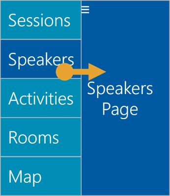

The terms *drawer navigation* and *master-detail navigation* are often used interchangeably. They're related, but are different things that have specific uses. Let's see when to use each one and decide which style is appropriate for our application.

## What is drawer navigation?

*Drawer navigation* is a navigation pattern that uses a slide-out drawer to host a menu of pages. It has a separate content area to display the user's selected page.



This pattern consists of an off-screen piece of UI called the *drawer*. Typically, the drawer opens when a user presses a menu button. Most apps use a menu button that consists of three horizontal lines stacked vertically (commonly referred to as a "hamburger icon"). When the user selects an item from the drawer, the drawer is dismissed and the relevant page is shown in the content area.

## What is master-detail navigation?

*Master-detail navigation* is a way of displaying a collection of homogenous data by using two views. The *master* view shows an overview of the entire collection. The *detail* view shows an expanded view of a single item. The master UI is shown as list of items on the left side of the screen (for left-to-right languages). When the user selects an item from this list, details about the selected item are shown on the right.


## What is MasterDetailPage?

`MasterDetailPage` is a Xamarin.Forms page that displays a master page and a detail page and coordinates the synchronization between them. Xamarin.Forms uses this same class for both drawer navigation and master-detail navigation.

`MasterDetailPage` has two properties named `Master` and `Detail` that host the two logical parts of each pattern. These properties can hold `Page`-derived types. In most apps, you'll use types derived from `ContentPage` for your master and detail pages.

## MasterBehavior and split vs. pop-over

You can request to display your master view in two ways:

* `split` means that the master is always visible.
* `popover` displays the master view in a slide-out drawer.

You influence the display by using the `MasterBehavior` property of `MasterDetailPage`. The `MasterBehavior` property is an enum type of the same name. For example, you can request pop-over behavior for your master by using the following code.

```csharp
var md = new MasterDetailPage();
md.MasterBehavior = MasterBehavior.Popover;
```

## Factors that determine master behavior

In Xamarin.Forms, there are three factors that determine the UI presentation of your master view:

* Your setting for the `MasterBehavior` property
* The device type
* The orientation of the device (portrait or landscape)

On phones, `MasterDetailPage` always uses pop-over behavior and ignores your `MasterBehavior` setting. This behavior is true for all phones, regardless of size and current orientation.

On devices other than phones, the behavior is determined by `MasterBehavior` and device orientation. The following table summarizes the cases.

| **MasterBehavior** value | Portrait | Landscape | Analysis |
|---|----------|-----------| --- |
| `Default` | pop-over | split | This behavior tries to make intelligent use of screen space, picking the right style based on the available horizontal screen space. |
| `pop over` | pop-over | pop-over | The master is always displayed as a drawer. |
| `Split` | split | split | The master is always displayed in a split view. |
| `SplitOnLandscape` | pop-over | split | Same as `Default`. |
| `SplitOnPortrait` | split | pop-over | This setting uses split in portrait orientation (when horizontal space is limited) and pop-over in landscape orientation (where there's more horizontal space). This value is provided for completeness and is rarely needed in practice. |

## Which behavior should you choose?

If your goal is drawer navigation, choose `popover`. For master-detail, `Split` or `SplitOnLandscape` is typically the best choice. Keep in mind that you'll always have pop-over behavior on phones regardless of your choice.
