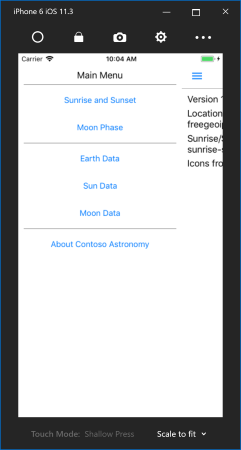

You'll be developing the navigation for a planetarium's **Astronomy** app. There's some starter code to get you going. Your job is to add drawer navigation by using `MasterDetailPage` to let the user switch between several pages quickly while limiting the UI space consumed for navigation.



## Open the starter solution

1. Clone or download the [!INCLUDE [module-exercise-repo](module-exercise-repo.md)] from GitHub.

    [!include[](../../../includes/android-windows-path-length-warning.md)]

1. Open the starter solution from the **exercise1** > **start** folder by using **Visual Studio**.

## Add a master page

You'll add a `ContentPage` instance that will contain the UI that the user will use to move between the pages in your app.

1. Open the shared **Astronomy** project.

1. Add a new XAML `ContentPage` instance named `AstronomyMasterPage`.

1. Open **AstronomyMasterPage.xaml**.

1. Add six `Button` instances, one for each content page. Name them `btnSunrise`, `btnMoonPhase`, `btnEarth`, `btnSun`, `btnMoon`, and `btnAbout`, and give them appropriate text. One possible layout is shown in the next step.

1. Make sure you set `Title` for your page, or you'll get an exception.

```xml
<?xml version="1.0" encoding="utf-8" ?>
<ContentPage xmlns="http://xamarin.com/schemas/2014/forms"
                xmlns:x="http://schemas.microsoft.com/winfx/2009/xaml"
                x:Class="Astronomy.AstronomyMasterPage"
                Title="Menu">
    <ContentPage.Content>
        <StackLayout Margin="10">
            <Label Text="Main Menu" FontSize="Medium" HorizontalTextAlignment="Center" />

            <BoxView BackgroundColor="Gray" HeightRequest="1" />

            <Button x:Name="btnSunrise" Text="Sunrise and Sunset" />
            <Button x:Name="btnMoonPhase" Text="Moon Phase" />

            <BoxView BackgroundColor="Gray" HeightRequest="1" />

            <Button x:Name="btnEarth" Text="Earth Data" />
            <Button x:Name="btnSun" Text="Sun Data" />
            <Button x:Name="btnMoon" Text="Moon Data" />

            <BoxView BackgroundColor="Gray" HeightRequest="1" />

            <Button x:Name="btnAbout" Text="About Contoso Astronomy" />
        </StackLayout>
    </ContentPage.Content>
</ContentPage>
```

## Add a MasterDetailPage instance

1. Open the shared **Astronomy** project.

1. Add a new class named `AstronomyMasterDetailPage`.

1. Open **AstronomyMasterDetailPage.cs**.

1. Include `using Xamarin.Forms;` to resolve the Xamarin.Forms types that you'll add.

1. Update the class signature to derive from `MasterDetailPage`.

1. Ensure that the class has a default constructor.

```csharp
namespace Astronomy
{
    public class AstronomyMasterDetailPage : MasterDetailPage
    {
        public AstronomyMasterDetailPage()
        {
        }
    }
}
```

## Assign the master and detail pages

Before you can use your master-detail page, you need to assign both the `Master` page and a default `Detail` page.

1. In the constructor, create a new instance of `AstronomyMasterPage` and assign it to the `Master` property for `AstronomyMasterDetailPage`.

1. Include `using Astronomy.Pages;` to resolve the page types that you'll add.

1. Instantiate any one of the pages in the **Pages** folder and assign it to the `Detail` property. Remember to surround it with a `new NavigationPage(...)` statement.

1. Set the master behavior to `MasterBehavior.Popover`.

    ```csharp
    public AstronomyMasterDetailPage()
    {
        var master = new AstronomyMasterPage();

        this.Master = master;

        this.Detail = new NavigationPage(new AboutPage());

        this.MasterBehavior = MasterBehavior.Popover;
    }
    ```

1. Open **App.xaml.cs**.

1. Change the `MainPage` assignment to an instance of `AstronomyMasterDetailPage`.

    ```csharp
    public App()
    {
        InitializeComponent();

        MainPage = new AstronomyMasterDetailPage();
    }
    ```

## Add an iOS menu icon

iOS doesn't include a menu icon. You'll need to add a menu-image resource to the iOS head project.

1. Open the **Astronomy.iOS** project and find the **Resources** folder.

1. In the downloaded materials, open the **exercise1/Assets/iOS/Resources** folder.

1. Add the provided **nav-menu-icon** PNGs to the iOS head project (drag and drop).

1. Open **AstronomyMasterDetailPage.cs** in the shared project and find the constructor.

1. If you haven't already, store the master page instance in a local variable (name it `master`).

1. Load **nav-menu-icon.png** by using the static `ImageSource.FromFile` method and assign it to `master.Icon`. You'll need a cast to `FileImageSource`.

1. Guard the assignment with an if statement: assign the icon only if the app is running on iOS by checking `Device.RuntimePlatform`.

    ```csharp
    public AstronomyMasterDetailPage()
    {
        var master = new AstronomyMasterPage();

        if (Device.RuntimePlatform == Device.iOS)
        {
            master.IconImageSource = ImageSource.FromFile("nav-menu-icon.png");
        }

        this.Master = master;

        ...
    }
    ```

1. Run the application. If possible, run it on an iOS phone simulator and verify that the menu icon is shown.

> [!NOTE]
> You haven't connected the buttons to your master-detail navigation, so you won't be able to perform any navigation yet.
