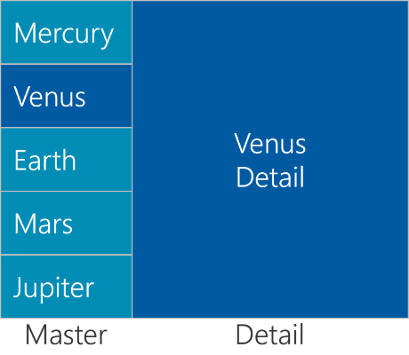
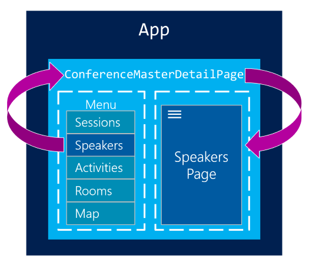

Apps often need to display a collection of homogenous data and let the user examine the details of each item. Ideally, the user can quickly switch between items in the collection. Contacts and email programs are great examples of this navigation pattern. In our astronomy app, we might want a list of the planets where the user can pick one and see that planet's detailed information.

## What is master-detail (or split) UI?

*Master-detail* (also known as *split*) UI is a presentation pattern optimized for browsing through a collection of data. We typically use a list for the master, because we're browsing through a collection where the number of items in the collection is unknown until runtime.



Because we're browsing through a collection of items of the same type, we need to define only a single detail page. The same page can be used to represent any item in the collection.

## Implement master-detail navigation

We derive from `MasterDetailPage` to implement master-detail navigation. The master page hosts a list of items and notifies `MasterDetailPage` when the user selects one. `MasterDetailPage` shows the selected item in the detail area.



## Build master-detail navigation

It's common to publish an event on the master page to indicate when the user makes a selection. The event can send the index or the unique identifier of the selected item. The subscriber to the event knows which item the user wants to see.

Several steps are required to assemble the master-detail navigation UI. Let's see how they would apply to our astronomy app that shows the planets.

1. Create the master UI. The master page is a `ContentPage` instance that displays a collection of data and allows the user to make a selection. `ListView` is an ideal control type for use in your master page.

    ```xaml
    <?xml version="1.0" encoding="utf-8" ?>
    <ContentPage ...
                 x:Class="Minutes.PlanetsMasterPage"
                 Title="Planets">
        <ListView x:Name="masterList" />
    </ContentPage>
    ```

    > [!TIP]
    > The preceding code assigned `Title` on the master page. Xamarin.Forms requires the title, or it will throw an exception at runtime.

1. Define an event that's raised when the user makes a selection. This event will pass an integer that represents the selected item's ID. We then subscribe to the `ListView` instance's `ItemTapped` event and raise our own event.

    In our `ItemTapped` handler, we raise our public `MasterItemSelected` event, passing in the ID of the selected item.

    ```csharp
    public partial class PlanetsMasterPage : ContentPage
    {
        public event EventHandler<int> MasterItemSelected;

        public PlanetsMasterPage()
        {
            ...
            masterList.ItemsSource = PlanetData.Planets;
            masterList.ItemTapped += OnMasterItemTapped;
        }

        void OnMasterItemTapped(object sender, ItemTappedEventArgs e)
        {
            MasterItemSelected?.Invoke(this, ((Planet)e.Item).Id);
        }
    }
    ```

1. Create the detail UI by using a derived type of `ContentPage`. It's entirely up to you to design the UI for the details. Here we're using `StackLayout` and two `Label` instances, but you can include any Xamarin.Forms elements you like.

    ```xaml
    <?xml version="1.0" encoding="utf-8" ?>
    <ContentPage ...
                 x:Class="Minutes.PlanetsDetailPage">
        <StackLayout>
            <Label x:Name="nameLabel" />
            <Label x:Name="diameterLabel" />
        </StackLayout>
    </ContentPage>
    ```

1. Code the detail data-loading. Because the detail page will be used for all items in our data collection, we need a way to tell the detail page what data to display.

    A good pattern is to pass in the ID of the data that you need to visualize. Then your page or view model will access your business layer and retrieve the model for the ID.

    Here you can see a call to the static `GetById` method on the `PlanetData` class to get the planet model object.

    ```csharp
    public partial class PlanetsDetailPage : ContentPage
    {
        public PlanetsDetailPage(int id)
        {
            ...
            var planet = PlanetData.GetById(id);

            nameLabel.Text = planet.Name;
            diameterLabel.Text = planet.Diameter + " km";
        }
    }
    ```

1. Create a class that inherits from `MasterDetailPage`, and assign an instance of your master and detail pages. We're assigning our detail page to the `Detail` property. We're passing in an ID of 0 to load the first item.

    Additionally, we're subscribing to the master page's `MasterItemSelected` event. When it's raised, we update the detail page by using the ID that the event provides.

    ```csharp
    class PlanetsMasterDetailPage : MasterDetailPage
    {
       public PlanetsMasterDetailPage()
       {
          var master = new PlanetsMasterPage();
          master.MasterItemSelected += OnMasterItemSelected;

          this.Master = master;
          this.Detail = new PlanetsDetailPage(0);

          this.MasterBehavior = MasterBehavior.Split;
       }

       void OnMasterItemSelected(object sender, int id)
       {
          this.Detail = new PlanetsDetailPage(id);
       }
    }
    ```

1. Choose one of the split options for your master-detail display. For master-detail navigation, `Split` and `SplitOnLandscape` are the most common choices.

    | Split options | Portrait | Landscape |
    |---|----------|-----------|
    | `Default` | pop-over | split |
    | `Popover` | pop-over | pop-over |
    | `Split` | split | split |
    | `SplitOnLandscape` | pop-over | split |
    | `SplitOnPortrait` | split | pop-over |

1. Assign an instance of `MasterDetailPage` to our app's `MainPage` property to add it to the visual tree.

    ```csharp
    public partial class App : Application
    {
        public App()
        {
            ...
            MainPage = new PlanetsMasterDetailPage();
        }
    }
    ```

    > [!TIP]
    > Don't nest `MasterDetailPage` inside another page. It should be your app's root page.
