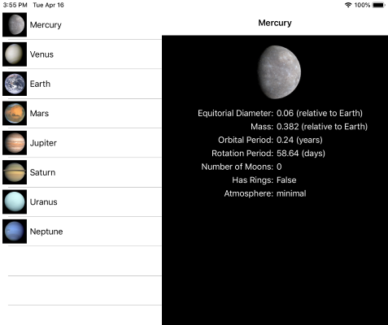

For this exercise, you'll start from a different version of the **Astronomy** app. There's a new starter solution for you to work with. You'll use `MasterDetailPage` to display a homogeneous collection of data in a split view.



## Open the starter solution

1. Clone or download the [!INCLUDE [module-exercise-repo](module-exercise-repo.md)] from GitHub.

1. Open the starter solution from the **exercise3** > **start** folder by using **Visual Studio**.

## Raise a selection event

We'll create an event on the master page so we can be notified when the user makes a selection.

1. Open **PlanetsMasterPage.xaml.cs** in the shared project.

1. Create a new event named `MasterItemSelected` that takes an `int` parameter. This integer will be the index of the selected item from the list.

1. Inspect the constructor. Notice that we're subscribed to the `ListView` instance's `ItemSelected` event with a named method.

1. In `MenuItemsListViewItemsSelected`, create a local `Planet` variable named `planet`.

1. Cast and assign `e.SelectedItem` to the local `planet` variable.

1. Raise the `MasterItemSelected` event, passing in `Id` from the planet model object.

```csharp
public partial class PlanetsMasterPage : ContentPage
{
    public event EventHandler<int> MasterItemSelected;

    public PlanetsMasterPage()
    {
        ...

        MenuItemsListView.ItemSelected += MenuItemsListViewItemSelected;
    }

    void MenuItemsListViewItemSelected(object sender, SelectedItemChangedEventArgs e)
    {
        Planet planet = ((Planet)e.SelectedItem);
        MasterItemSelected?.Invoke(sender, planet.Id);
    }
}
```

## Populate the detail data

Your detail page currently doesn't present any content. You'll update the constructor to accept a planet model object and use it as the binding context.

1. Open **PlanetsDetailsPage.xaml** in the shared project. Notice that the labels' `Text` properties are already configured for data binding.

1. Open **PlanetsDetailPage.xaml.cs**.

1. Update the constructor to accept an `int` instance named `id`.

1. Create a local `Planet` variable named `planet`.

1. Use the static `PlanetDataRepository.GetPlanetFromId` method to assign `planet`.

1. Assign `planet` as the binding context of the detail page.

```csharp
public PlanetsDetailPage(int id)
{
    InitializeComponent();

    var planet = PlanetDataRepository.GetPlanetFromId(id);

    BindingContext = planet;
}
```

## Create a MasterDetailPage instance

1. Create a new class named `PlanetsMasterDetail` in the shared project.

1. Include `using Xamarin.Forms;` to resolve the Xamarin.Forms types you'll add.

1. Update the class signature to derive from `MasterDetailPage`.

1. Add a default constructor.

1. In the constructor, create a local instance of `PlanetsMasterPage` named `master`.

1. Assign `master` to the `Master` property.

1. Set `MasterBehavior` to `Split`.

1. Subscribe to the `master` instance's `MasterItemSelected` event by using a method named `MasterItemSelected`.

1. Call `MasterItemSelected` from the constructor with a default value of `0`. We'll use this call in a moment to assign a default detail page.

    ```csharp
    public class PlanetsMasterDetail : MasterDetailPage
    {
        public PlanetsMasterDetail()
        {
            MasterBehavior = MasterBehavior.Split;

            var master = new PlanetsMasterPage();

            Master = master;

            master.MasterItemSelected += MasterItemSelected;

            MasterItemSelected(this, 0);
        }

        void MasterItemSelected(object sender, int id)
        {

        }
    }
    ```

1. Open **App.xaml.cs** and change the `MainPage` assignment to an instance of your `PlanetsMasterDetail` page.

    ```csharp
    public App()
    {
        InitializeComponent();

        MainPage = new PlanetsMasterDetail();
    }
    ```

## Update the detail page

1. Open **PlanetsMasterDetail.cs** in the shared project.

1. In `MasterItemSelected`, assign the `Detail` property with an instance of `PlanetsDetailPage`. Pass `id` to the constructor.

1. To ensure that your app displays a menu icon on Android phones, wrap the `PlanetsDetailPage` instance in `NavigationPage` before the `Detail` assignment.

1. To ensure that your app behaves correctly on all phones, set `IsPresented` to `false` when it's running on a phone. You can also choose to wrap the assignment in a try/catch and avoid the text for the phone device type.

1. Run the app to verify that your details are updated when you pick a new item from the master list.

```csharp
void MasterItemSelected(object sender, int id)
{
    Detail = new NavigationPage(new PlanetsDetailPage(id));

    if (Device.Idiom == TargetIdiom.Phone)
    {
        IsPresented = false;
    }
}
```
