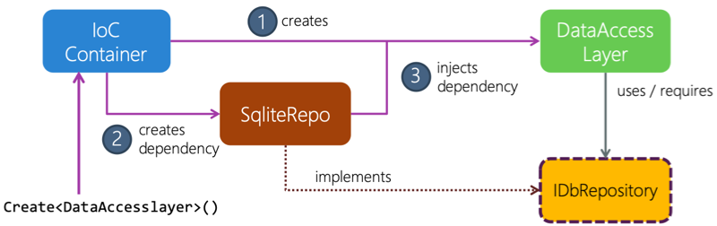

The last pattern we'll look at is the *dependency injection* pattern. 

Service locators work nicely for smaller projects. But they can be unwieldy when you try to reuse things across applications or when you have many interconnected services. Service locators tend to be fragile because missing dependencies can't be detected until they're requested at runtime.

## Dependency injection

*Dependency injection* (DI) is a design pattern that allows you to design loosely coupled code. Both the factory pattern and the service-locator pattern let you create classes that are, to a degree, decoupled from their dependencies. Remember, the classes don't know how to instantiate their dependencies. Also, the classes have to take on additional dependencies on a factory or a service locator to instantiate or locate required dependencies.

However, both patterns hide dependencies. The DI pattern relies on three strategies to make a class's dependencies discoverable. Let's look at each of the three options.

### Use constructor injection

The first option is *constructor injection*. With constructor injection, you rely on the container to create the dependencies specified in the constructor. Then you instantiate the object with the dependencies passed in.

Let's assume you've created a `DataAccessLayer` class to manage high-level interactions with a data repository. In our example, your `DataAccessLayer` class has a dependency on a repository and your custom dialog box. You decide not to use the factory pattern or the service-locator pattern because both patterns hide the required dependencies. You want whoever implements the class to know that the class can't function without the dependencies. The easiest way to highlight the dependencies for this class is to list them as constructor parameters.

Here's how your `DataAccessLayer` class might look.

```csharp
public class DataAccessLayer
{
    public DataAccessLayer(
        IDbRepository db,
        IMessageDialog message)
    {
        ...
    }
    ...
}
```

You'll have to create the two required dependencies first and then set them as constructor parameters before you instantiate the `DataAccessLayer` object.

### Use property injection

The second option is *property injection*. You'll use property injection if the class has an optional dependency.

Let's assume your class includes a logger property that allows the data layer to log or report data interactions. In this case, the logger functionality is optional and can be swapped out as needed.

```csharp
public class DataAccessLayer
{
    public DataAccessLayer(
        IDbRepository db,
        IMessageDialog message)
    {
        ...
    }

    public ILogger Logger {get; set;}
    ...
}
```

### Use method-parameter injection

The third option is *method-parameter injection*. You'll use method-parameter injection when only a single method from a class needs access to a dependency.

Let's assume your class includes a logger method. In this case, only the method will need access to the logger functionality.

```csharp
public class DataAccessLayer
{
    public DataAccessLayer(
        IDbRepository db,
        IMessageDialog message)
    {
        ...
    }

    public void Log (ILogger logger)
    {
        logger.LogStatus();
    }
}
```

## Using dependency injection

The downside of using DI is that you've moved the responsibility of identifying the dependencies to the object's caller or creator.

For example, to create `DataAccessLayer`, you need the concrete implementations of each of the abstractions.

```csharp
public DataAccessLayer CreateDataLayer()
{
    var dataAccessLayer = new DataAccessLayer(
        new SqliteRepository_iOS(),                               // IDbRepository
        new MessageDialog_iOS());                                 // IAlertService
        dataAccessLayer.Logger = new AzureLogger(AzureToken);     // ILogger

   return dataAccessLayer
}
```

These implementations are platform-specific and known only to the platform code. To make these dependencies known to your shared code, you have two options:

- Use one of the two techniques we've already discussed.
- Move the creation of the `DataAccessLayer` object into the platform-specific code, as the previous example shows.

However, neither of these solutions leads to loosely coupled code. You need to minimize the knowledge of a class's dependencies to itself.

When you use DI, you rely on another class called a *container*. The container creates objects for you and automatically supplies known dependencies. In this way, you register all your dependencies in one place. Your client code doesn't need to directly know where the dependency is coming from.

## Inversion-of-control containers

The *inversion-of-control (IOC) container* is a dependency manager. It has two specific purposes:

- It acts as a *dependency registry*. As with the service locator, you register abstractions and services with the container. Internally, the IoC container uses a service locator to know about any dependencies that your application might use.

- It locates the client's dependencies. This function is the main difference between the IoC container and the service locator. When you're using the service locator, the client requests the dependencies. When you're using the IoC container, the container creates all your objects and injects the dependencies as properties or constructor parameters.

To create an object, the IoC container examines the object's type and invokes one of its constructors. Then the IoC container passes the constructor any required dependencies based on known registered abstractions. If these dependencies require any objects, the constructor can create them as needed. As a rule, containers can instantiate dependencies recursively.

> [!NOTE]
> IoC containers often rely on reflection at runtime. But some IoC containers use different mechanisms to identify dependencies to inject into the object being created. For example, some IoC containers use .NET attributes and others use naming conventions.

## How an IoC container works

Adding an IoC container to your code can make dealing with dependencies confusing. Let's have a look at how a container works conceptually.



With this diagram in mind, let's see how the IoC container will process your `DataAccessLayer` class.

```csharp
public class DataAccessLayer
{
    public DataAccessLayer(
        IDbRepository db,
        IMessageDialog message)
    {
        ...
    }

    public ILogger Logger {get; set;}
    ...
}
```

Let's say your client code needs a `DataAccessLayer`. It goes to the container to create one.

1. The container examines the `DataAccessLayer` type and identifies the appropriate constructor. It determines all the dependency that it knows about.

1. In this case, your data access layer requires an `IDbRepository` object to be passed on the constructor. When the container sees this dependency, it looks in its list of known objects. 

1. The container either supplies an existing implementation or creates a new object that can fulfill the required dependency. Notice the dependency, _SqliteRepository_. Keep in mind that you could switch the repository out to be an XML provider or a web service provider by registering a different dependency with the container. The ability to switch dependencies is a significant advantage of decoupling your application into abstractions. The IoC container can also create dependencies registered as a real class and not just abstractions.

1. The container invokes the constructor to create the data access layer, getting an instance. It then scans all the properties of the created object and looks for additional dependencies that it might know about. It sets these dependencies to specific registered values. This behavior is often specific to the container. You don't want to set every property, only specific ones. Most containers use attributes or markers to indicate which properties the container should supply.

## How to use an IoC container

Let's look at an example that uses the container to inject dependencies.

Remember that you required your `DataAccessLayer` class to take `IDbRepository` and `IMessageDialog` as constructor parameters. You'll have to make sure that these abstractions are registered with the container. Registering abstractions is normally part of the initialization of the application. This process ensures the types are available for use.

Let's assume you want to register your abstractions for iOS. You'll typically use the `UIApplication` delegate class as you did for the service-locator registration process. We're going to assume your container's name is `MyContainer`.

```csharp
public partial class AppDelegate : global::Xamarin.Forms.Platform.iOS.FormsApplicationDelegate
{
    MyContainer container = new MyContainer();

    public override bool FinishedLaunching(UIApplication application, NSDictionary launchOptions)
    {
        ...
        container.Register<IDbRepository,SqliteRepository>();
        container.Register<IMessageDialog,MessageDialog_iOS>();
        container.Register<ILogger>(new AzureLogger(AzureToken));
        ...
    }
}
```

The first step is to create or get access to your IoC container. You'll then register each known abstraction with the IoC container.

Notice that the IoC container allows for different types of registrations. You can associate interfaces to specific types where the IoC container creates the object. Or you can create the instance yourself and use a specific constructor like `AzureLogger`.

In your code where you need an instance of `DataAccessLayer`, you'll then use the IoC container to create the object.

```csharp
var dataLayer = container.Create<DataAccessLayer>();
```

Recall that you're working in platform-specific code in this step. The IoC container instantiates platform-specific types and has a list of registered abstractions. It will create the `DataAccessLayer` object and pass it to the repository and dialog box automatically.

You'll often find that types that are instantiated by an IoC container, like your `DataAccessLayer` class, are configured as singletons. After the static object is instantiated, you can use it in any part of your application.

> [!WARNING]
> Pay attention to the lifetime of your objects. Static objects are alive for the lifetime of your application. You might run into problems with memory allocation in your application if these objects hold onto large object graphs. Consider instantiating objects just in time. Then deallocate these objects when you no longer need them.

Here's the same configuration for an Android application.

```csharp
public class MainActivity : global::Xamarin.Forms.Platform.Android.FormsAppCompatActivity
{
    MyContainer container = new MyContainer();

    protected override void OnCreate(Bundle savedInstanceState)
    {
        ...
        container.Register<IDbRepository,SqliteRepository>();
        container.Register<IMessageDialog,MessageDialog_Android>();
        container.Register<ILogger>(new AzureLogger(AzureToken));
        ...
    }
}
```

## DI and IoC container advantages

DI and IoC containers provide the following key benefits:

- Your client code only needs real dependencies. No container reference is necessary.
- Using DI, you can easily identify the dependencies being used. Dependencies are often passed to constructors or filled in properties.

## DI and IoC container disadvantages

DI and IoC containers have the following drawbacks:

- The pattern involves a bit of magic. The big picture can be hard to understand.
- The pattern often requires some form of reflection. Reflection often doesn't affect performance, but it could. For example, some containers can scan assemblies at application startup and automatically register dependencies. Do not use the startup scan feature from the container you’re using. Startup scans it will affect your application's performance in a negative way.
