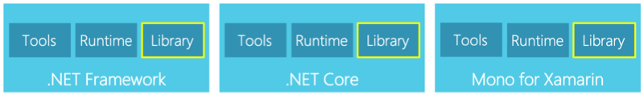
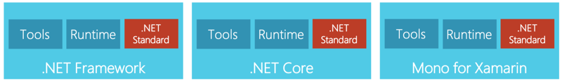
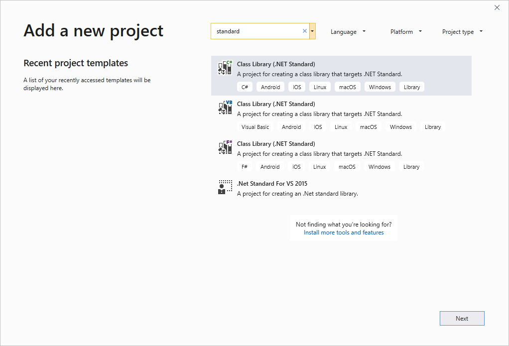
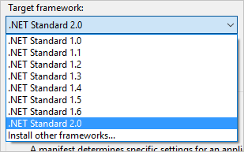
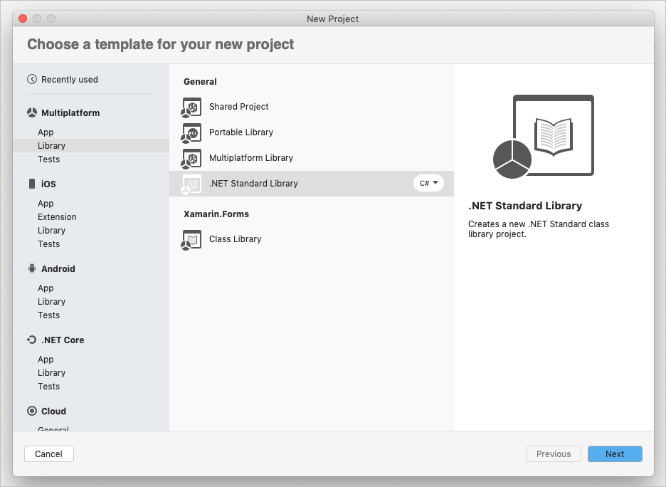
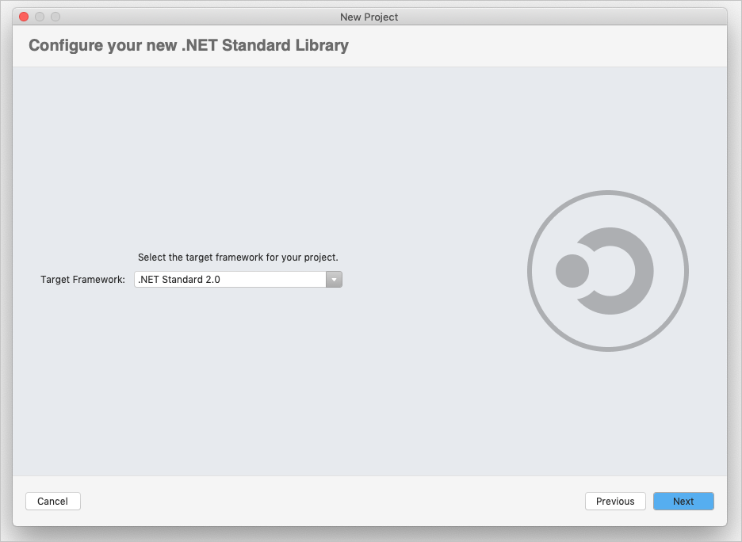
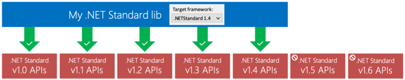

Let's say you've created a Xamarin application that lets your users read quotations from famous people. You currently use a device-specific storage location to store data on each platform. But you've realized that you're repeating code in each platform project. Now you want to consider options for sharing code.

In this unit, you'll see how to share code in Xamarin.Forms by using a .NET Standard library.

## Platforms

A platform describes a set of components. With these components, you can build and execute an application on a set of target operating systems.

You'll likely come across three common .NET platforms. They each let you run apps on a large variety of devices and operating systems.

Each platform includes tools, a runtime, and libraries. When you create applications, you'll want to share code across platform libraries.

## Library variation

The various .NET platforms include libraries developed by different teams, often with a focus on their specific operating systems. But they don't provide the exact same surface area to code against.

Let's assume you want to use an API that's the same in both .NET Framework and .NET Core. You want to use the same API in Mono, but you realize the API is different. How could you use this API to write a single library? The answer is .NET Standard.

## .NET Standard

The goal of .NET Standard is to help with the inconsistencies that can exist between APIs.

The .NET Standard is a specification. It's not an implementation but rather a *standard* for a platform library to implement.

For example, these three platforms offer .NET Standard implementations of that standard API surface. The standard makes it easier to write a single library that runs on all three platforms.

But the standard doesn't imply the platforms will implement .NET Standard the same way. The implementation might vary behind the APIs.

## .NET Standard versions

.NET Standard isn't just a single release. It's available in several versions and continues to grow.

Each version is a superset of the previous version's APIs. New APIs are added, but APIs aren't removed. If an API is available in version 1.1, it will also exist in version 2.0 and beyond. Your libraries will continue to be compatible with new releases of .NET Standard.

## Creating a .NET Standard library

Both Visual Studio 2019 and Visual Studio for Mac offer templates for creating .NET Standard libraries.

In **Visual Studio 2019**, one of the easiest ways to find the template in the **New Project** dialog box is to search for _standard_.

No wizard is available to set the .NET Standard version. You can change the version you're targeting from the project properties.

In **Visual Studio for Mac**, you can find the option to create a .NET Standard library under **Multiplatform** > **Library**.

Visual Studio for Mac provides a wizard that lets you choose the .NET Standard version when you create the project.

## Available APIs

In early versions of .NET Standard, APIs focused on what was available in common Portable Class Library profiles. Starting with the APIs that the most basic .NET libraries needed, elements like collections, new methods, and classes were added to increase the compatibility level.

Today, all the basic libraries, from dictionaries and networking to threading and cryptography, are present in .NET Standard.

For more information, see [Portable Class Libraries](https://docs.microsoft.com/xamarin/cross-platform/app-fundamentals/pcl?tabs=windows).

## Using .NET Standard APIs

The target .NET Standard version you pick determines which APIs you can use. Let's assume you pick version 1.4 as the target version. Version 1.4 lets you use all the APIs that were added between versions 1.0 and 1.4.

However, you can't use the APIs added in any later versions. For example, you can't use APIs in version 1.5, 1.6, or later. When you pick your version, make sure it includes all the APIs you need to implement your library.