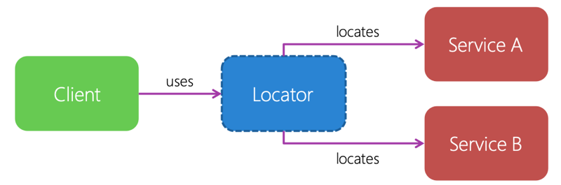

The second pattern we'll look at is the *service-locator pattern*. The service-locator pattern involves a piece of code that maintains a list of known dependencies. Typically, you'll create and register your dependencies in your platform-specific code. When any of your components needs a dependency, it consults the service locator, which then returns the registered instance.



## Service-locator example definition

The implementation of a service locator often involves some kind of dictionary or hash table that maps the abstraction to the concrete implementation.

Here's an example definition:

```csharp
public sealed class ServiceLocator
{
    public static ServiceLocator Instance { get; set; }

    public void Add(Type contractType, object value);
    public void Add(Type contractType, Type serviceType);
    public object Resolve(Type contractType);
    public T Resolve<T>();
}
```

In this example, you use the `Add` methods to register your abstractions. In both cases, you specify the abstraction's type. Then you either provide an instance of the concrete object or specify the type of the concrete object. By specifying the concrete type, you allow the service locator to instantiate the object as needed.

The complement `Resolve` methods are used to look up a dependency, using the abstraction's type as the key.

Notice the coupling of a second pattern here. The `ServiceLocator` class has a *static* property named `Instance` that returns an instantiated `ServiceLocator` object. Remember the static property that we used with the factory pattern? Here you're using the static concept again. But your intent is slightly different because you want to create a singleton.

## The singleton pattern

The *singleton pattern* lets you create an object with increased responsibility. Normally an object is responsible for doing its own work on its own properties. But some objects have increased responsibility and other objects that rely on them. Objects that have more responsibility will take on a specific role. As a result, you normally want only one of these objects per type instantiated. The singleton pattern allows you to make sure there's only one object of a specific type at any time.

When you design your singleton class, clients can't directly instantiate the class. To create a singleton class, you first create a private class constructor. Then you allow clients to request an instance of the object through a static property.

Let's bring this back to the service locator. The singleton pattern provides you with an easy way to find the service locator itself. In your example `ServiceLocator` class, requests are made through the `Instance` property. Any code that needs to use the service locator can access it through the static property on the class.

## Registering a dependency with the service locator

The concrete implementations of your abstractions will be platform-specific code. You'll add the implementations to the service locator by registering the abstraction with the implementation. This registration will store the abstraction type and the concrete implementation's type in the dictionary.

Let's look at an example that registers the `IMessageDialog` interface from earlier and the `MessageDialog_iOS` class for iOS:

```csharp
public partial class AppDelegate
{
   ...
    public override void FinishedLaunching(UIApplication application)
    {
        ...
        ServiceLocator.Instance.Add<IMessageDialog,MessageDialog_iOS>();
    }
}
```

## Using the service locator

To use the locator, you use the service locator's singleton property and request the abstraction. In this case, the abstraction is the `IMessageDialog` interface. Let's assume each platform-specific project has registered an implementation of that interface with the same service locator.

Now let's use the example `IMessageDialog` interface to show a dialog box:

```csharp
public void ShowMessage(string title, string message, string buttonText)
{
    var messageDialog = ServiceLocator.Instance.Resolve<IMessageDialog>();
    if (!messageDialog.ShowMessage("About",
        "Using the Service Locator Pattern to show this message", "Ok"))
    {
        ...
    }
}
```

## Service locator advantages

The service locator has the following advantages:

- The service-locator pattern is easy to use and understand. You don't need to understand how the service locator works internally to use it. You register dependencies and request dependencies as needed.
- Your client code can just-in-time request services. You decide when you want the dependency instantiated, and you request the instance as needed.
- You can use the service-locator pattern with any client.

## Service locator disadvantages

The service locator has the following disadvantages:

- Clients must all have access to the service locator. This fact is considered a primary disadvantage of the service-locator pattern. The service locator is a global dependency that all your code needs access to.
- The service-locator pattern is sometimes seen as a bad programming practice because it makes these tasks difficult:

    - Identify dependencies in code.
    - Detect missing dependencies before runtime.

But the pattern has specific use cases that make it invaluable. Inversion of control (IoC) containers is one of these use cases. You'll explore IoC containers later in this module.