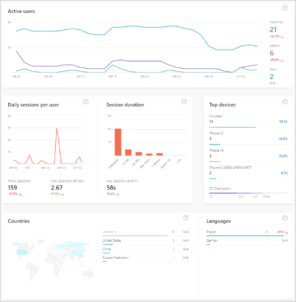

Knowing how your users interact with your app can help you improve your app. You might discover places where new features might improve user workflow, or places where your app isn't delivering an ideal experience. By collecting, analyzing, and executing on your app's usage data, you can improve your app experience. Improving the experience might mean streamlining a checkout process in a retail app to improve the conversion rate and revenue, or it might mean adjusting a primary user interaction in your app to increase user engagement. You could find places to fix barriers to success in your app that lead to improved app ratings.

## What is analytics?

Analytics is the analysis of data, often looking for patterns. For app analytics, you are collecting data on the usage of your app to discover your users' behavior when they are using your app and its features.

For App Center, you will collect these data by integrating the App Center SDK for your app platform. With the SDK in place in your app, you start to immediately gather user insights. You can also start to collect custom data to analyze the usage of every part of your app.

## Collect key metrics

With the App Center SDK collecting data in your app, you will start to see what devices and operating systems your users have. You can see what languages are used. You can also track the adoption of new releases of your app.

App Center presents this data in the Analytics **Overview** page. You can also view active user numbers and trends, session durations, popular devices, and geographic distribution of your app. You can see the distribution of users across versions of your app as well.

## Collect custom event data

App Center Events are actions taken by the user. Tracking events allows you to learn how your users interact with your app. For example, you could track events that follow users' progress through the app from launch to completing a primary use case. You can then use this information to see where users are leaving that progression, which could potentially indicate a place to improve the usability of your app. You can also see what areas of your app are the most popular, allowing you to grow those areas or improve the presentation of that information in other parts of the app.

While tracking events, you can also attach properties to your events. For example, you might be tracking an event for when your user uploads a file. Attaching properties about the file type (image, text, etc.) would enable you to see the most popular file types. If you discover that your users are frequently uploading images, but your app currently doesn't offer a way to preview images, that might be a feature users would find useful in a future release.

Event tracking also establishes a history that can help diagnose crashes that you discover in the diagnostics information on App Center. You could examine the specific steps a user took before they encountered an unexpected error or before the app crashed entirely. These points in their usage history might speed up the discovery of a bug in your code, or a specific edge case in the usage of your app that is causing problems. Being able to fix these issues quickly will keep your users more successful while they use your app, potentially preventing low ratings that might prevent new users from adopting your app.

## Export collected analytics data

As with diagnostic data, App Center stores analytics data from your app for 90 days by default. If you want, you can shorten duration to 28 days to better align with any data retention policies you might have.

> [!NOTE]
> Currently you can only configure the data retention period for 90 days or 28 days.

To retain data for longer periods, you can configure App Center to continually export data to Azure Blob Storage or Application Insights. By continually exporting older data, you can maintain as much historical data as you wish for later reporting use. You can also merge your data with other company analytics for a more unified view of your users.
